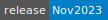

# AlmaLinux Xfce

:::: {tab-set}

::: {tab-item} Nov2023

[](https://cloud.sdu.dk/app/jobs/create?app=almalinux-xfce&version=Nov2023)


* **Operating System:** 
* **Terminal:**  
* **Shell:**   
* **Editor:**   
* **Package Manager:**     
* **Programming Language:**    
* **Utility:**  

:::

::: {tab-item} Oct2023

[](https://cloud.sdu.dk/app/jobs/create?app=almalinux-xfce&version=Oct2023)


* **Operating System:** 
* **Terminal:**  
* **Shell:**   
* **Editor:**   
* **Package Manager:**     
* **Programming Language:**    
* **Utility:**  

:::

::: {tab-item} Sep2023

[](https://cloud.sdu.dk/app/jobs/create?app=almalinux-xfce&version=Sep2023)


* **Operating System:** 
* **Terminal:**  
* **Shell:**   
* **Editor:**   
* **Package Manager:**     
* **Programming Language:**    
* **Utility:**  

:::

::: {tab-item} Aug2023

[](https://cloud.sdu.dk/app/jobs/create?app=almalinux-xfce&version=Aug2023)


* **Operating System:** 
* **Terminal:**  
* **Shell:**   
* **Editor:**   
* **Package Manager:**     
* **Programming Language:**    
* **Utility:**  

:::

::: {tab-item} Jul2023

[](https://cloud.sdu.dk/app/jobs/create?app=almalinux-xfce&version=Jul2023)


* **Operating System:** 
* **Terminal:**  
* **Shell:**   
* **Editor:**   
* **Package Manager:**     
* **Programming Language:**   
* **Utility:**  

:::

::: {tab-item} Jun2023

[](https://cloud.sdu.dk/app/jobs/create?app=almalinux-xfce&version=Jun2023)


* **Operating System:** 
* **Terminal:**  
* **Shell:**   
* **Editor:**   
* **Package Manager:**     
* **Programming Language:**   
* **Utility:**  

:::

::: {tab-item} May2023

[](https://cloud.sdu.dk/app/jobs/create?app=almalinux-xfce&version=May2023)


* **Operating System:** 
* **Terminal:**  
* **Shell:**   
* **Editor:**   
* **Package Manager:**     
* **Programming Language:**   
* **Utility:**  

:::

::::

Interactive AlmaLinux virtual desktop environment, terminal and browsers.

## Initialization

For information on how to use the *Initialization* parameter, please refer to the [Initialization - Bash script](../hands-on/init-sh.md) section of the documentation.

## Configure SSH access

The app provides optional [support for SSH access](general_settings.md#configure-ssh-access) from an external client. An SSH *public key* must be uploaded using the corresponding panel in *Resources* section of the UCloud side menu.

By checking on *Enable SSH server* a random port is opened for connection. The connection command is shown in the job progress view page.

## Additional software

New software applications can be installed and accessed as separate modules using EasyBuild, a build and installation framework for the deployment and management of scientific applications/tools on HPC systems.
A brief introduction to EasyBuild is available [here](terminal.md#easybuild).

New software modules should be installed in a directory accessible from the _default working tree_, e.g. `/work/sandbox`. As a result, the `sandbox` software stack will be available in the UCloud workspace once the job is completed. The user should mount this folder as a data volume inside the app and make the new modules available from the command-line interface:

```console
$ module use /work/sandbox/modules/all/
```

To check all available modules, use the command:

```console
$ module avail
```

More commands are listed [here](terminal.md#environment-modules).

``` {note}
Environment modules are loaded automatically when the ``sandbox`` folder is mounted using the optional *Modules path* parameter.
```
