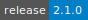

# Cell Ranger ATAC

[](https://cloud.sdu.dk/app/applications?tag=Cell%20Ranger&itemsPerPage=25&page=0)


* **Operating System:** 
* **Shell:** 
* **Editor:**   
* **Package Manager:**  
* **Programming Language:**  

Cell Ranger ATAC is a toolset of analysis pipelines from 10X Genomics that process Chromium single-cell RNA-seq output to align reads, generate feature-barcode matrices and perform clustering and gene expression analysis.

For more information, check [here](https://support.10xgenomics.com/single-cell-atac/software/pipelines/latest/what-is-cell-ranger-atac).

<details>
<summary><b>Cell Ranger ATAC Utilities</b></summary>

- [](https://cloud.sdu.dk/app/jobs/create?app=cellranger-atac-aggr&version=2.1.0-1)
- [](https://cloud.sdu.dk/app/jobs/create?app=cellranger-atac-count&version=2.1.0-1)
- [](https://cloud.sdu.dk/app/jobs/create?app=cellranger-atac-mkfastq&version=2.1.0-1)
- [](https://cloud.sdu.dk/app/jobs/create?app=cellranger-atac-mkref&version=2.1.0-1)
- [](https://cloud.sdu.dk/app/jobs/create?app=cellranger-atac-reanalyze&version=2.1.0-1)
- [](https://cloud.sdu.dk/app/jobs/create?app=cellranger-atac-terminal&version=2.1.0-1)
</details>

## Terminal session

The _Cell Ranger ATAC: terminal_ utility allows the user run the different Cell Ranger ATAC pipelines via command line by clicking

{{ btn_open_terminal }}

## User interface

When available, the `--uiport=3600` option enables the pipeline's visual user interface (UI), accessible through the button

{{ btn_open_interface }}

``` {note}
The UI port must be ``3600``.
```
