# ColabFold

:::: {tab-set}

::: {tab-item} 1.5.2

[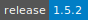](https://cloud.sdu.dk/app/jobs/create?app=colabfold&version=1.5.2)

* **Operating System:** 
* **Terminal:**  
* **Shell:**   
* **Editor:**  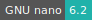 
* **Package Manager:**    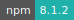 
* **Programming Language:**   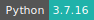
* **Database:** 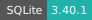
* **NVIDIA Libraries:**  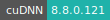 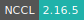
* **Extension:** 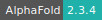

:::

::: {tab-item} 1.4.0

[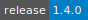](https://cloud.sdu.dk/app/jobs/create?app=colabfold&version=1.3.0)

* **Operating System:** 
* **Terminal:**  
* **Shell:** 
* **Editor:**   
* **Package Manager:**     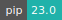
* **Programming Language:** 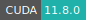  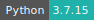
* **NVIDIA Libraries:**  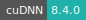
* **Extension:** 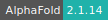

:::

::::
---

ColabFold is an emerging protein folding prediction tool based on Google DeepMind’s [AlphaFold](https://github.com/deepmind/alphafold).

ColabFold offers accelerated prediction of protein structures and complexes by combining the fast homology search of [MMseqs2](https://github.com/soedinglab/MMseqs2) with [AlphaFold](https://github.com/deepmind/alphafold) or[ RoseTTAFold](https://github.com/RosettaCommons/RoseTTAFold).

For more information check [here](https://github.com/sokrypton/ColabFold).

For basic usage of the Notebook environment, check the [JupyterLab](jupyter-lab.md) application.
