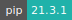

# COMSOL

:::: {tab-set}

::: {tab-item} 6.1

* **Operating System:** 
* **Terminal:** 
* **Shell:** 
* **Editor:**  
* **Package Manager:**   
* **Programming Language:**   

:::

::: {tab-item} 6.0

* **Operating System:** 
* **Terminal:** 
* **Shell:** 
* **Editor:**  
* **Package Manager:**    
* **Programming Language:**   

:::

::: {tab-item} 5.6

* **Operating System:** 
* **Shell:** 
* **Editor:**   
* **Package Manager:**   
* **Programming Language:**   
* **Database:** 

:::

::: {tab-item} 5.5

* **Operating System:** 
* **Shell:** 
* **Editor:**   
* **Package Manager:**   
* **Programming Language:**   
* **Database:** 

:::

::: {tab-item} 5.4

* **Operating System:** 
* **Shell:** 
* **Editor:**   
* **Package Manager:**   
* **Programming Language:**   
* **Database:** 

:::

::::

COMSOL Multiphysics is a cross-platform finite element analysis, solver and multiphysics simulation software. It allows conventional physics-based user interfaces and coupled systems of partial differential equations. COMSOL provides an IDE and unified workflow for electrical, mechanical, fluid, acoustics and chemical applications.

For more information, check [here](https://www.comsol.dk/).

## License server

_A software license_ is required in order to run this app within a project workspace. Project admins can add one of the available licenses to the active project by means of a [grant application](../guide/resources-grant.md).
