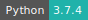

# Dash

:::: {tab-set}

::: {tab-item} 2.14.1

[](https://cloud.sdu.dk/app/jobs/create?app=dash&version=2.14.1)


* **Operating System:** 
* **Terminal:**  
* **Shell:**   
* **Editor:**   
* **Package Manager:**     
* **Programming Language:**   
* **Utility:**  
* **Extension:** 

:::

::: {tab-item} 2.13.0

[](https://cloud.sdu.dk/app/jobs/create?app=dash&version=2.13.0)


* **Operating System:** 
* **Terminal:**  
* **Shell:**   
* **Editor:**   
* **Package Manager:**     
* **Programming Language:**   
* **Utility:**  
* **Extension:** 

:::

::: {tab-item} 2.12.1

[](https://cloud.sdu.dk/app/jobs/create?app=dash&version=2.12.1)


* **Operating System:** 
* **Terminal:**  
* **Shell:**   
* **Editor:**   
* **Package Manager:**     
* **Programming Language:**    
* **Utility:** 
* **Extension:** 

:::

::: {tab-item} 2.11.1

[](https://cloud.sdu.dk/app/jobs/create?app=dash&version=2.11.1)


* **Operating System:** 
* **Terminal:**  
* **Shell:**   
* **Editor:**   
* **Package Manager:**     
* **Programming Language:**   
* **Utility:** 
* **Extension:** 

:::

::: {tab-item} 2.10.2

[](https://cloud.sdu.dk/app/jobs/create?app=dash&version=2.10.2)


* **Operating System:** 
* **Shell:** 
* **Package Manager:**    
* **Programming Language:**  

:::

::: {tab-item} 2.9.3

[](https://cloud.sdu.dk/app/jobs/create?app=dash&version=2.9.3)


* **Operating System:** 
* **Shell:** 
* **Package Manager:**    
* **Programming Language:**  

:::

::: {tab-item} 2.6.0

[](https://cloud.sdu.dk/app/jobs/create?app=dash&version=2.6.0)


* **Operating System:** 
* **Shell:** 
* **Package Manager:**    
* **Programming Language:**  
* **Database:** 

:::

::: {tab-item} 1.20.0

[](https://cloud.sdu.dk/app/jobs/create?app=dash&version=1.20.0)


* **Operating System:** 
* **Shell:** 
* **Package Manager:**    
* **Programming Language:**   
* **Database:** 

:::

::: {tab-item} 1.18.0

[](https://cloud.sdu.dk/app/jobs/create?app=dash&version=1.18.0)


* **Operating System:** 
* **Shell:** 
* **Package Manager:**    
* **Programming Language:**   
* **Database:** 

:::

::: {tab-item} 1.8.0

[](https://cloud.sdu.dk/app/jobs/create?app=dash&version=1.8.0)


* **Operating System:** 
* **Shell:** 
* **Package Manager:**    
* **Programming Language:**   
* **Database:** 

:::

::::

[Dash](https://dash.plotly.com/) is the original low-code framework for rapidly building data apps in Python.

## Select input parameters

The app receives two mandatory parameters:

- *Input file:* the directory with the data and the source code
- *App:* the main source file for the app, usually denoted `app.py`

::: {note}

The app must be deployed on the Dash standard port, as shown in the following code snippet:
```python
if __name__ == "__main__":
    app.run_server(host='0.0.0.0',port='8050')
```

:::

## Initialization

For information on how to use the *Initialization* parameter, please refer to the [Initialization - Bash script](../hands-on/init-sh.md), [Initialization - Conda packages](../hands-on/init-conda.md), and [Initialization - pip packages](../hands-on/init-pip.md) section of the documentation.
