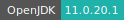
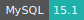
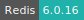
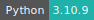
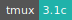
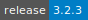
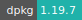
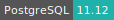

# Django

:::: {tab-set}

::: {tab-item} 4.2.7

[](https://cloud.sdu.dk/app/jobs/create?app=django&version=4.2.7)


* **Operating System:** 
* **Terminal:**  
* **Shell:**   
* **Editor:**   
* **Package Manager:**     
* **Programming Language:**   
* **Database:**     
* **Utility:**  
* **Extension:** 

:::

::: {tab-item} 4.2.2

[](https://cloud.sdu.dk/app/jobs/create?app=django&version=4.2.2)


* **Operating System:** 
* **Terminal:**  
* **Shell:**   
* **Editor:**   
* **Package Manager:**     
* **Programming Language:**    
* **Database:**    
* **Utility:** 
* **Extension:** 

:::

::: {tab-item} 4.1.7

[](https://cloud.sdu.dk/app/jobs/create?app=django&version=4.1.7)


* **Operating System:** 
* **Terminal:** 
* **Shell:** 
* **Editor:**   
* **Package Manager:**    
* **Programming Language:**  
* **Database:**    

:::

::: {tab-item} 4.1.2

[](https://cloud.sdu.dk/app/jobs/create?app=django&version=4.1.2)


* **Operating System:** 
* **Terminal:** 
* **Shell:** 
* **Editor:**   
* **Package Manager:**    
* **Programming Language:**  
* **Database:**    

:::

::: {tab-item} 3.2.3

[](https://cloud.sdu.dk/app/jobs/create?app=django&version=3.2.3)


* **Operating System:** 
* **Shell:** 
* **Editor:**   
* **Package Manager:**    
* **Programming Language:**   
* **Database:**    

:::

::::

Django is a Python-based web framework whose primary goal is to ease the creation of complex, database-driven websites.

For more information, check the official documentation [here](https://docs.djangoproject.com/en/4.1/).

The Django applications comes with the following options:

- *Project directory* (mandatory), points to the Django project directory. In the case of a new project, an empty directory can be pointed to.
- *Initialization*, allows to execute a Bash script when the job starts. The script can be used to install additional software and set up the workspace environment. This parameter can also accept a \*.txt file with a list of Python packages to be installed.
- *Port*, allows to change port to be exposed (default: 8000).
- *Deployment*, run in deployment mode. This parameter takes a bash script including a startup command for the Django application.
- *Configure custom links to your application*, expose the Django application to a public link.

The application by default starts in development mode, namely the *Deployment* parameter is not used and the server needs to be deployed from the terminal interface.

## Create new Django application

In development mode, a new Django project can be initiated by running the following command from the app [terminal interface](../guide/submitting.md#job-running):

```console
$ django-admin startproject my_project
```

which will create a *new* directory called `my_project`.
This folder contains a collection of settings for an instance of Django, including database configuration, Django-specific options and application-specific settings.
The structure of the folder is:

```text
my_project
├── my_project
│   ├── urls.py
│   ├── wsgi.py
│   ├── __init__.py
│   ├── settings.py
│   ├── asgi.py
│   └── file4
└── manage.py
```

where the inner `my_project` folder contains the actual Python package for the project.
The project configuration is defined in the module `settings.py`.
The module `manage.py` provides a set of Django command-line utilities.

## Running the Django server

In development mode, the server can be deployed directly via the terminal interface.
Within the Django project folder (e.g., `my_project`), this is accomplished using the command:

```console
$ python manage.py runserver
```

``` {tip}
<br>
Watching for file changes with StatReloader
<br>
Performing system checks...
<br>
<br>
System check identified no issues (0 silenced).
<br>
June 10, 2021 - 08:32:54
<br>
Django version 3.2.4, using settings 'my_project.settings'
<br>
Starting development server at http://127.0.0.1:8000/
<br>
Quit the server with CONTROL-C.
```

In deployment mode, the user can pass a Bash script via the *Deployment* parameter, which will start the web interface soon after the job is submitted.
For example:

```shell
#!/usr/bin/env bash

set -eux

python manage.py runserver
```

To access the Django application interface, the host address need to be added to `ALLOWED_HOSTS` in the `settings.py` file, e.g.

```python
ALLOWED_HOSTS = ["LINK_TO_DJANGO_APP"]
```

The script will be executed within the Django project directory.
Afterwards, the web interface will be accessible by clicking on

{{ btn_open_interface }}

``` {important}
If the Django Applications should be accessible to other people, then the Django UCloud App should be launched using the *Configure custom links to your application* parameter.
```

## Change the server's port

By default, the web server is deployed on port `8000`.
The port can be changed either by including these lines of code in the module `manage.py`:

```python
from django.core.management.commands.runserver import Command as runserver

runserver.default_port = "3000"
```

or by adding the new port via command-line utility `runserver`:

```console
$ python manage.py runserver 3000
```

``` {important}
The new server's port must be also specified via the *Port* parameter, before submitting the job.
```

## Initialization

For information on how to use the *Initialization* parameter, please refer to the [Initialization - Bash script](../hands-on/init-sh.md) and [Initialization - pip packages](../hands-on/init-pip.md) section of the documentation.
