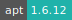

# GROMACS

:::: {tab-set}

::: {tab-item} 2020.6

[](https://cloud.sdu.dk/app/jobs/create?app=gromacs-te&version=2020.6b)
[](interactive_apps.md)

* **Operating System:** 
* **Terminal:**   
* **Shell:**   
* **Editor:**   
* **Package Manager:**   
* **Programming Language:**    
* **Executable:** `gmx`, `gmx_mpi`, `gmx_gpu`, `gmx_gpu_mpi`

:::

::: {tab-item} 2020.4

[](https://cloud.sdu.dk/app/jobs/create?app=gromacs-te&version=2020.4b)
[](interactive_apps.md)

* **Operating System:** 
* **Terminal:**   
* **Shell:**   
* **Editor:**   
* **Package Manager:**   
* **Programming Language:**    

:::

::: {tab-item} 2020.2

[](https://cloud.sdu.dk/app/jobs/create?app=gromacs-te&version=2020.2)
[](interactive_apps.md)

* **Operating System:** 
* **Terminal:**   
* **Shell:**   
* **Editor:**   
* **Package Manager:**   
* **Programming Language:**   

:::

::: {tab-item} 2019.6

[](https://cloud.sdu.dk/app/jobs/create?app=gromacs-te&version=2019.6)
[](interactive_apps.md)

* **Operating System:** 
* **Terminal:**   
* **Shell:**   
* **Editor:**   
* **Package Manager:**   
* **Programming Language:**   

:::

::: {tab-item} 2018.8

[](https://cloud.sdu.dk/app/jobs/create?app=gromacs-te&version=2018.8)
[](interactive_apps.md)

* **Operating System:** 
* **Terminal:**   
* **Shell:**   
* **Editor:**   
* **Package Manager:**   
* **Programming Language:**   

:::

::::

**GRO**ningen **MA**chine for **C**hemical **S**imulations (**GROMACS**) is a molecular dynamics package mainly designed for simulations of proteins, lipids, and nucleic acids.

For basic usage of the console environment, check the [Terminal](terminal.md) application.

## Batch mode

Use this option to submit a Bash script (`*.sh`) which will execute GROMACS commands after the job starts.


In order to close the job after the execution of the program, add the following line at the end of the script:

```console
ps -ef | grep '/usr/local/bin/start-container' | grep -v grep | awk '{print $2}' | xargs -r kill -9
```
