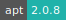

# HABITUS

* **Operating System:** 
* **Terminal:** 
* **Shell:** 
* **Editor:**   
* **Package Manager:**  
* **Programming Language:**   

[HABITUS](https://www.sdu.dk/en/om_sdu/institutter_centre/iob_idraet_og_biomekanik/forskning/forskningsenheder/active_living/forskningsprojekter/habitus/about) - Human Activity Behavior Identification Tool and data Unification System - is an online service for processing physical activity behavior data collected with wearable devices. Its main function is to merge and process time-stamped data from accelerometer and global positioning system (GPS) devices and providing output files dividing physical activity levels into different contexts or domains.

HABITUS builds on existing software tools: [GGIR](https://cran.r-project.org/web/packages/GGIR/vignettes/GGIR.html), [PALMSpy](https://github.com/emolinaro/PALMSpy), and [PALMSplus](https://thets.github.io/palmsplusr/).
