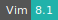

# Intertext

* **Operating System:** 
* **Shell:** 
* **Editor:** 
* **Package Manager:**     
* **Programming Language:**   
* **Database:** 
---

Intertext combines machine learning with interactive data visualizations to surface intertextual patterns in large text collections. The text processing is based on min-hashing vectorized strings, and the web viewer is based on interactive React components.

For more information, check [here](https://github.com/YaleDHLab/intertext).

## Input database folder

The app receives a mandatory parameter, *database dir*, namely the directory in which the app backend MongoDB database will store data. By selecting the database directory it is possible to detect reuse in the included sample documents and visualize the results by starting the job.

## Using custom text files

To discover text reuse in your own text files, it is necessary to select the optional parameters *infiles* and *metadata* and specify the directory with your text files and the metadata directory which contains the metadata file. The new text files and the metadata files have to be in the same format as the sample files (see https://github.com/YaleDHLab/intertext).

Additional optional parameters allow to control the way Intertext discovers text reuse in a text corpus.

Additional packages can be installed inside the application container using the *Additional dependencies* parameter,
by loading a Bash script (`*.sh`) with the list of shell commands to be used for the installation.

## Configure custom public links

In order to share a public link of the running app with non-registered users it is necessary to deploy the app with a [public URL](general_settings.md#configure-custom-links).
In addition it is important to select the option *Enable public link* and write exactly the same string used to identify the public link in the *Configure custom links* field, e.g.:
 

 
and
 

