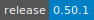
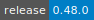

# Kallisto

:::: {tab-set}

::: {tab-item} 0.50.1

* **Operating System:** 
* **Terminal:**  
* **Shell:**   
* **Editor:**   
* **Package Manager:**     
* **Programming Language:**   
* **Utility:**  
* **Extension:** 

:::

::: {tab-item} 0.48.0

* **Operating System:** 
* **Terminal:**  
* **Shell:**   
* **Editor:**   
* **Package Manager:**     
* **Programming Language:**    
* **Utility:** 
* **Extension:** 

:::

::::

Kallisto is a tool for quantifying abundances of transcripts from bulk and single-cell RNA-Seq data, or more generally of target sequences using high-throughput sequencing reads.

For more information, check [here](https://pachterlab.github.io/kallisto/manual).

Kallisto utilities

- 
- 
- 
- 
- 
- 
- 

