# KNIME

:::: {tab-set}

::: {tab-item} 5.1.2

[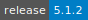](https://cloud.sdu.dk/app/jobs/create?app=knime&version=5.1.2)

* **Operating System:** 
* **Terminal:**  
* **Shell:**   
* **Editor:**  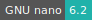 
* **Package Manager:**    
* **Programming Language:**   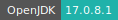  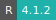
* **Database:** 
* **Utility:**  
* **Extension:** 

:::

::: {tab-item} 4.7.7

[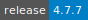](https://cloud.sdu.dk/app/jobs/create?app=knime&version=4.7.7)

* **Operating System:** 
* **Terminal:**  
* **Shell:**   
* **Editor:**   
* **Package Manager:**    
* **Programming Language:**   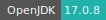  
* **Database:** 
* **Utility:**  
* **Extension:** 

:::

::: {tab-item} 4.6.3

[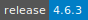](https://cloud.sdu.dk/app/jobs/create?app=knime&version=4.6.3)

* **Operating System:** 
* **Shell:** 
* **Editor:**   
* **Package Manager:** 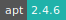 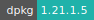 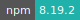 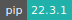
* **Programming Language:** 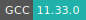 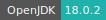  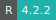
* **Database:** 

:::

::: {tab-item} 4.1.4

[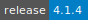](https://cloud.sdu.dk/app/jobs/create?app=knime&version=4.1.4)

* **Operating System:** 
* **Shell:** 
* **Editor:**  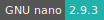 
* **Package Manager:**   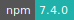 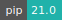
* **Programming Language:**   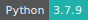  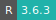
* **Database:** 

:::

::: {tab-item} 4.0.2

[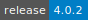](https://cloud.sdu.dk/app/jobs/create?app=knime&version=4.0.2-6)

* **Operating System:** 
* **Shell:** 
* **Editor:**   
* **Package Manager:** 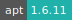  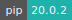
* **Programming Language:**   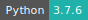  
* **Database:** 

:::

::::

KNIME Analytics Platform is an open source software for creating data science.
KNIME integrates various components for machine learning and data mining
through its modular data pipelining concept. A graphical user interface
allows assembly of nodes blending different data sources,
including preprocessing (ETL), for modeling, data analysis and visualization without, or with only minimal, programming.

KNIME Analytics Platform is well suited for the following:
- ETL processes
- Machine learning
- Deep Learning
- Natural Language processing
- Multiple API integrations
- Interactive visual analytics

For more information, check [here](https://www.knime.com/knime-analytics-platform).
