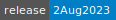
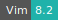
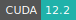
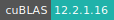
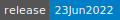
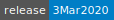
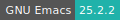
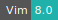
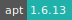

# LAMMPS

:::: {tab-set}

::: {tab-item} 2Aug2023

[](https://cloud.sdu.dk/app/jobs/create?app=lammps&version=2Aug2023)


* **Operating System:** 
* **Terminal:**  
* **Shell:**   
* **Editor:**   
* **Package Manager:**  
* **Programming Language:**   
* **NVIDIA Libraries:** 
* **Extension:** 

:::

::: {tab-item} 23Jun2022

[](https://cloud.sdu.dk/app/jobs/create?app=lammps&version=23Jun2022)


* **Operating System:** 
* **Terminal:** 
* **Shell:** 
* **Editor:**   
* **Package Manager:**  
* **Programming Language:**   

:::

::: {tab-item} 3Mar2020

[](https://cloud.sdu.dk/app/jobs/create?app=lammps&version=3Mar2020-3b)


* **Operating System:** 
* **Shell:** 
* **Editor:**   
* **Package Manager:**  
* **Programming Language:**  

:::

::::

Large-scale Atomic/Molecular Massively Parallel Simulator (LAMMPS) is a molecular dynamics program from Sandia National Laboratories.

LAMMPS focus on material modeling and has potentials for solid-state materials and soft matter and coarse-grained or mesoscopic systems.
For more information, check [here](https://lammps.sandia.gov/).

## Batch mode (default)

The app receives two mandatory parameters:

- *Input folder*: the directory with the data and the source code. Here the LAMMPS output files will be saved.
- *Input file*: the main input file for LAMMPS.

The optional parameter _-var_ allows to specify a variable that will be defined for substitution purposes when the input script is read.
The user needs to write the name of the variable and the new value.
In the input file the chosen variable should be defined accordingly.

For example, in order to change the number of steps for the run, from the default value of 10000 to 50000, the user can select the *-var* option, write in the field the variable name and value
<br>


<br>
and  include in the input file the lines:

```text
variable run index 10000
...
...
run ${run}
```

Defining an index variable as a command-line argument overrides any setting for the same index variable in the input script, since index variables cannot be re-defined.

The optional parameter **-n** allows to specify the number of processors. If the parameter is not used, the value will be setted to the number of cores corresponding to the selected machine.

## Interactive mode

By selecting the *interactive mode*, the user can open a terminal window
available on the progress view page of the job and run LAMMPS from command line, e.g. by typing:

```console
mpirun -n 4 lmp -in input.file
```

## GPU support

```{note}
The GPU support for LAMMPS is only available through the interactive mode.
```

LAMMPS is compiled with the [Kokkos](https://docs.lammps.org/Speed_kokkos.html) package enabled for GPU.

LAMMPS with Kokkos is compiled with the target architecture set to VOLTA70.
The Volta architecture corresponds to the `u1-gpu` on UCloud.

An example of how to utilize the GPU support is by using the following input file:

```text
# 3d Lennard-Jones melt
variable        x index 60
variable        y index 60
variable        z index 60
variable        t index 100

variable        xx equal 1*$x
variable        yy equal 1*$y
variable        zz equal 1*$z

variable        interval equal $t/2

units           lj
atom_style      atomic

lattice         fcc 0.8442
region          box block 0 ${xx} 0 ${yy} 0 ${zz}
create_box      1 box
create_atoms    1 box
mass            1 1.0

velocity        all create 1.44 87287 loop geom

pair_style      lj/cut 2.5
pair_coeff      1 1 1.0 1.0 2.5

neighbor        0.3 bin
neigh_modify    delay 0 every 20 check no

fix             1 all nve

thermo          ${interval}
thermo_style custom step time  temp press pe ke etotal density
run             $t
```

and then running the following command:

```console
lmp -in in.lj -k on g 1 -sf kk -pk kokkos cuda/aware off
```

More indepth tutorial of how to use the GPU support can be found [here](http://www.hpc-carpentry.org/tuning_lammps/).
