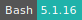
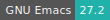
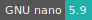

# LibreOffice

:::: {tab-set}

::: {tab-item} 7.2.2.2

* **Operating System:** 
* **Terminal:** 
* **Shell:** 
* **Editor:**   
* **Package Manager:** 

:::

::: {tab-item} 6.4.6.2

:::

::::

LibreOffice is an office productivity software suite,
which includes programs for word processing, spreadsheets, presentations, vector graphics and flowcharts, databases, and formulae editing.

For more information, check [here](https://libreoffice.org/).

The UI includes **Xterm** terminal, **Firefox** browser and **Nautilus** file manager, accessible by clicking on the icons in the *Taskbar*.

A **GNOME** terminal is accessible by right-clicking on the desktop and selecting the item from *Terminals*.
