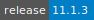
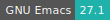
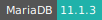
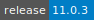
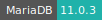
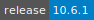
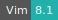
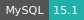

# MariaDB Server

:::: {tab-set}

::: {tab-item} 11.1.3
[](https://cloud.sdu.dk/app/jobs/create?app=mariadb&version=11.1.3)


* **Operating System:** 
* **Terminal:** 
* **Shell:**   
* **Editor:**   
* **Package Manager:**  
* **Programming Language:** 
* **Database:** 

:::

::: {tab-item} 11.0.3
[](https://cloud.sdu.dk/app/jobs/create?app=mariadb&version=11.0.3)


* **Operating System:** 
* **Terminal:** 
* **Shell:**   
* **Editor:**   
* **Package Manager:**  
* **Programming Language:** 
* **Database:** 

:::

::: {tab-item} 10.6.1
[](https://cloud.sdu.dk/app/jobs/create?app=mariadb&version=10.6.1)


* **Operating System:** 
* **Terminal:** 
* **Shell:** 
* **Editor:**   
* **Package Manager:**  
* **Database:** 

:::

::::

MariaDB is a community-developed fork of the [MySQL](mysql.md) relational database management system.

For more information, check the official documentation [here](https://mariadb.com/kb/en/documentation/).

``` {note}
11.0 serie, unlike previous version, no longer includes mysql named compatible executable symlinks inside the container.
```

## Create a new server

The app requires to set the *Database* parameter, which is used to import the MariaDB database folder from a UCloud workspace. If the folder is empty, a new database will be initialized. In this case, after the initialization procedure is completed, the following lines will be displayed in the output logs:

```xml
2023-08-03 08:42:22+02:00 [Note] [Entrypoint]: GENERATED ROOT PASSWORD: <root_temporary_password>
    ⋮
2023-08-03  8:42:22 0 [Note] Server socket created on IP: '0.0.0.0'.
2023-08-03  8:42:22 0 [Note] Server socket created on IP: '::'.
2023-08-03  8:42:22 0 [Note] mariadbd: ready for connections.
Version: '11.0.2-MariaDB-1:11.0.2+maria~ubu2204'  socket: '/run/mysqld/mysqld.sock'  port: 3306  mariadb.org binary distribution
```

where `<root_temporary_password>` is a random alphanumeric string which must be used to log in to the database for the first time. In order to change the password, the user should open the app [terminal interface](../guide/submitting.md#job-running) and access the database with the command:

```console
$ mariadb -u root -p
```

``` {tip}
Enter password:
```

The login administrator password `<root_temporary_password>` must be copied from the output logs, as in the example above, and pasted in the terminal. Once inside the MariaDB console, a new password should be created with the command:

```sql
MariaDB [(none)]> ALTER USER 'root'@'localhost' IDENTIFIED BY 'AdminPassword';
```

``` {tip}
Query OK, 0 rows affected (0.20 sec)
```

This password will be used to access the database next time the server is deployed.

``` {note}
A custom root password can also be assigned before submitting the job using the parameter *Password* or *Password file*. In this case it is not necessary to reset the password after the first log in.
```

## Connect to the server

As discussed above, the user can access the MariaDB console directly from the app terminal interface. However, it is also possible to connect to the server using an external client application. In this case, one has to grant remote access to the database user, e.g., using the following commands from the MariaDB console:

```sql
MariaDB [(none)]> GRANT ALL ON *.* to 'root'@'%' IDENTIFIED BY 'AdminPassword' WITH GRANT OPTION;
```

``` {tip}
Query OK, 0 rows affected (0.00 sec)
```

and

```sql
MariaDB [(none)]> FLUSH PRIVILEGES;
```

``` {tip}
Query OK, 0 rows affected (0.36 sec)
```

In this example the database user coincides with the server administrator. Connections from _any_ external host are allowed. In order to restrict access to the server from _only_ one specific host, it is necessary to replace the `%` in the command above with the corresponding host IP address.

On the one hand, if the client application runs within another interactive app available on UCloud, one can connect directly to the MariaDB server, as outlined [here](./general_settings.md#connect-to-other-jobs). In this case the server *hostname* is configured as an external parameter via the option *Connect to other jobs*.

On the other hand, if the MariaDB client is a third-party application, which is not deployed on UCloud, it is necessary to assign a [static IP address](./general_settings.md#attach-public-ip-addresses) to the server, using the corresponding option *Public IP*.

``` {note}
By default remote access to the MariaDB server is established over the TCP port ``3306``. The same port should be open on the network firewall of the public IP address.
```

## Use option files

A customized server configuration can be specified using the parameter *Configuration*. An example is shown below:

```ini
[client-server]
port=3306
socket = /run/mysqld/mysqld.sock

[mysqld]
port=3306
socket = /run/mysqld/mysqld.sock
key_buffer_size=16M
max_allowed_packet=128M
bind-address=0.0.0.0
```

To check the global configuration variables from the MariaDB console, use the commands:

```sql
MariaDB [(none)]> SELECT @@GLOBAL.innodb_data_file_path;
```

``` {tip}
+--------------------------------+
<br>
| @@GLOBAL.innodb_data_file_path |
<br>
+--------------------------------+
<br>
| ibdata1:12M:autoextend &nbsp;&nbsp;&nbsp;&nbsp;&nbsp;&nbsp;&nbsp; |
<br>
+--------------------------------+
<br>
1 row in set (0.00 sec)
````

and

```sql
MariaDB [(none)]> SHOW VARIABLES;
```

For more information about option files, check the official documentation [here](https://mariadb.com/kb/en/configuring-mariadb-with-option-files/).
