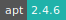
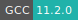

# Mathematica

:::: {tab-set}

::: {tab-item} 13.3.1

* **Operating System:** 
* **Terminal:**  
* **Shell:**   
* **Editor:**   
* **Package Manager:**    
* **Programming Language:**    
* **Database:** 
* **Utility:**  
* **Extension:** 

:::

::: {tab-item} 13.1.0

* **Operating System:** 
* **Terminal:** 
* **Shell:** 
* **Editor:**   
* **Package Manager:**   
* **Programming Language:**   
* **Database:** 

:::

::::

Wolfram Mathematica is a modern technical computing system spanning most areas of technical computing — including neural networks, machine learning, image processing, geometry, data science, visualizations, and others. The system is used in many technical, scientific, engineering, mathematical, and computing fields.

For more information check [here](https://www.wolfram.com/mathematica/)

In order to use Mathematica it is necessary to select an active *network license* from the job submission page. In addition, the user needs to provide the name whitelisted for the specific license through the *Username* option.
