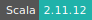
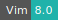

# NetLogo

:::: {tab-set}

::: {tab-item} 6.3.0

* **Operating System:** 
* **Terminal:**  
* **Shell:**   
* **Editor:**   
* **Package Manager:**    
* **Programming Language:**      
* **Database:** 
* **Utility:** 
* **Extension:**  

:::

::: {tab-item} 6.2.2

* **Operating System:** 
* **Terminal:** 
* **Shell:** 
* **Editor:**   
* **Package Manager:**    
* **Programming Language:**        
* **Database:** 
* **Utility:**  

:::

::: {tab-item} 6.1.1

* **Operating System:** 
* **Shell:** 
* **Editor:**   
* **Package Manager:**   
* **Programming Language:**    
* **Database:** 

:::

::::

NetLogo is a multi-agent programmable modeling environment used by  students, teachers, and researchers worldwide.

For more information, check [here](https://ccl.northwestern.edu/netlogo/).

## Getting started

NetLogo, NetLogo3D, HubNet Client and Behavior Search can be started by double-clicking on the corresponding desktop icons. They can also be started directly from the command line by typing `NetLogo`, `NetLogo3D`, `HubNetClient` or `Behaviorsearch`, respectively.
