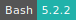
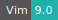
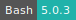
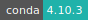
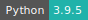
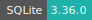

# Nextflow

:::: {tab-set}

::: {tab-item} 23.10.0

[](https://cloud.sdu.dk/app/jobs/create?app=nextflow&version=23.10.0)


* **Operating System:** 
* **Terminal:**  
* **Shell:**   
* **Editor:**   
* **Package Manager:**     
* **Programming Language:**  
* **Utility:**  
* **Extension:** 

:::

::: {tab-item} 23.04.4

[](https://cloud.sdu.dk/app/jobs/create?app=nextflow&version=23.04.4)


* **Operating System:** 
* **Terminal:**  
* **Shell:**   
* **Editor:**   
* **Package Manager:**     
* **Programming Language:**   
* **Utility:**  
* **Extension:** 

:::

::: {tab-item} 22.10.7

[](https://cloud.sdu.dk/app/jobs/create?app=nextflow&version=22.10.7)


* **Operating System:** 
* **Shell:** 
* **Editor:**   
* **Package Manager:**    
* **Programming Language:**   

:::

::: {tab-item} 21.10.0

[](https://cloud.sdu.dk/app/jobs/create?app=nextflow&version=21.10.0)


* **Operating System:** 
* **Shell:** 
* **Editor:**   
* **Package Manager:**    
* **Programming Language:**    
* **Database:** 

:::

::: {tab-item} 20.01.0

[](https://cloud.sdu.dk/app/jobs/create?app=nextflow&version=20.01.0)


:::

::::

Nextflow is a bioinformatics workflow management system that enables the development of scalable and reproducible scientific workflows. It supports deploying workflows on a variety of execution platforms. It allows the adaptation of pipelines written in the most common scripting languages.

For more information check [here](https://www.nextflow.io) and [here](https://www.nextflow.io/docs/latest/index.html).

## Select input parameters

To run a pipeline the user must set two parameters:
- *Input folder*: It mounts the folder containing source code and input files.
- *Pipeline script*: It selects the Nextflow pipeline script, which is a `.nf` file containing the workflow instructions.

## Initialization

For information on how to use the *Initialization* parameter, please refer to the [Initialization - Bash script](../hands-on/init-sh.md), [Initialization - Conda packages](../hands-on/init-conda.md), and [Initialization - pip packages](../hands-on/init-pip.md) section of the documentation.

### Create a Conda environment

The user can also install the required software dependencies via [Conda](https://www.nextflow.io/docs/latest/conda.html?highlight=conda) by specifying the packages or the path(s) to the configuration YAML file(s) directly in the pipeline script. In this case the user must use the option `-with-conda`.

## Import a configuration file

The parameter *Configuration* is used to upload a Nextflow configuration file. The latter is a simple text file containing a set of properties defined using the syntax:

```bash
name = value
```

More information about configuration settings in Nextflow can be found in the official [documentation](https://www.nextflow.io/docs/latest/config.html?highlight=configuration).

## Interactive mode

The _Interactive mode_ parameter is used to start an interactive job session where the user can open a terminal window from the job progress page and execute shell commands.
