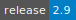

# nf-core

:::: {tab-set}

::: {tab-item} 2.10

[](https://cloud.sdu.dk/app/applications?tag=nf-core&itemsPerPage=100&page=0)


* **Operating System:** 
* **Terminal:**  
* **Shell:**   
* **Editor:**   
* **Package Manager:**     
* **Programming Language:**  
* **Utility:**  
* **Extension:** 

:::

::: {tab-item} 2.9

[](https://cloud.sdu.dk/app/applications?tag=nf-core&itemsPerPage=100&page=0)


* **Operating System:** 
* **Terminal:**  
* **Shell:**   
* **Editor:**   
* **Package Manager:**     
* **Programming Language:**  
* **Utility:**  
* **Extension:** 

:::

::: {tab-item} 2.8

[](https://cloud.sdu.dk/app/applications?tag=nf-core&itemsPerPage=100&page=0)


* **Operating System:** 
* **Shell:**   
* **Editor:**   
* **Package Manager:**  
 
* **Programming Language:**   
:::

::: {tab-item} 2.7.2

[](https://cloud.sdu.dk/app/applications?tag=nf-core&itemsPerPage=100&page=0)


* **Operating System:** 
* **Shell:**   
* **Editor:**   
* **Package Manager:**    
* **Programming Language:**   
:::

::::

`nf-core` is a collection of analysis pipelines built using Nextflow.

For more information, check [here](https://nf-co.re/).

## Supported pipelines

| **Pipeline** | **Release** | **nf-core** | **Description** |
|---|---|---|---|
| ``airrflow`` | [](https://cloud.sdu.dk/app/jobs/create?app=nf-core-airrflow&version=3.0) [](https://cloud.sdu.dk/app/jobs/create?app=nf-core-airrflow&version=3.1.0) |   | Define where the pipeline should find input data and save output data. |
| ``ampliseq`` | [](https://cloud.sdu.dk/app/jobs/create?app=nf-core-ampliseq&version=2.6.1) [](https://cloud.sdu.dk/app/jobs/create?app=nf-core-ampliseq&version=2.7.1) |   | Bioinformatics analysis pipeline used for amplicon sequencing. |
| ``atacseq`` | [](https://cloud.sdu.dk/app/jobs/create?app=nf-core-atacseq&version=2.0) [](https://cloud.sdu.dk/app/jobs/create?app=nf-core-atacseq&version=2.1.2) |   | Bioinformatics analysis pipeline used for ATAC-seq data. |
| ``bacass`` | [](https://cloud.sdu.dk/app/jobs/create?app=nf-core-bacass&version=2.0.0) [](https://cloud.sdu.dk/app/jobs/create?app=nf-core-bacass&version=2.1.0) |   | Bioinformatics best-practice analysis pipeline for simple bacterial assembly and annotation. |
| ``bamtofastq`` | [](https://cloud.sdu.dk/app/jobs/create?app=nf-core-bamtofastq&version=2.0.0) [](https://cloud.sdu.dk/app/jobs/create?app=nf-core-bamtofastq&version=2.1.0) |   | Workflow designed to convert one or multiple bam/cram files into fastq format. |
| ``chipseq`` | [](https://cloud.sdu.dk/app/jobs/create?app=nf-core-chipseq&version=2.0.0) |  | Bioinformatics analysis pipeline used for Chromatin ImmunopreciPitation sequencing (ChIP-seq) data. |
| ``circdna`` | [](https://cloud.sdu.dk/app/jobs/create?app=nf-core-circdna&version=1.0.4) |  | Bioinformatics best-practice analysis pipeline for the identification of extrachromosomal circular DNAs (ecDNAs) in eukaryotic cells. |
| ``crisprseq`` | [](https://cloud.sdu.dk/app/jobs/create?app=nf-core-crisprseq&version=1.0) [](https://cloud.sdu.dk/app/jobs/create?app=nf-core-crisprseq&version=2.0.0) [](https://cloud.sdu.dk/app/jobs/create?app=nf-core-crisprseq&version=2.1.0) |    | Bioinformatics best-practice analysis pipeline for the analysis of CRISPR edited next generation sequencing (NGS) data, it allows the evaluation of the quality of gene editing experiments using targeted NGS data. |
| ``cutandrun`` | [](https://cloud.sdu.dk/app/jobs/create?app=nf-core-cutandrun&version=3.1) [](https://cloud.sdu.dk/app/jobs/create?app=nf-core-cutandrun&version=3.2.1) |   | Best-practice bioinformatic analysis pipeline for CUT&RUN and CUT&Tag experimental protocols that were developed to study protein-DNA interactions and epigenomic profiling. |
| ``differentialabundance`` | [](https://cloud.sdu.dk/app/jobs/create?app=nf-core-differentialabundance&version=1.1.1) [](https://cloud.sdu.dk/app/jobs/create?app=nf-core-differentialabundance&version=1.2.0) [](https://cloud.sdu.dk/app/jobs/create?app=nf-core-differentialabundance&version=1.3.1) |    | Bioinformatics pipeline that can be used to analyze data represented as matrices, comparing groups of observations to generate differential statistics and downstream analyses. The initial feature set is built around RNA-seq, but we anticipate rapid expansion to include other platforms.  |
| ``epitopeprediction`` | [](https://cloud.sdu.dk/app/jobs/create?app=nf-core-epitopeprediction&version=2.2.1) |  | Bioinformatics best-practice analysis pipeline for epitope prediction and annotation. |
| ``fetchngs`` | [](https://cloud.sdu.dk/app/jobs/create?app=nf-core-fetchngs&version=1.10.1) [](https://cloud.sdu.dk/app/jobs/create?app=nf-core-fetchngs&version=1.11.0) |   | Bioinformatics best-practice analysis pipeline to fetch metadata and raw FastQ files from both public and private databases. At present, the pipeline supports SRA / ENA / DDBJ / GEO / Synapse ids. |
| ``funcscan`` | [](https://cloud.sdu.dk/app/jobs/create?app=nf-core-funcscan&version=1.1.4) |  | Bioinformatics pipeline for efficient and parallelised screening of long nucleotide sequences such as contigs for antimicrobial peptide genes, antimicrobial resistance genes, and biosynthetic gene clusters. |
| ``hgtseq`` | [](https://cloud.sdu.dk/app/jobs/create?app=nf-core-hgtseq&version=1.1.0) |  | Bioinformatics best-practice analysis pipeline built to investigate horizontal gene transfer from NGS data. |
| ``hic`` | [](https://cloud.sdu.dk/app/jobs/create?app=nf-core-hic&version=2.1.0) |  | Bioinformatics best-practice analysis pipeline for Analysis of Chromosome Conformation Capture data (Hi-C). |
| ``hicar`` | [](https://cloud.sdu.dk/app/jobs/create?app=nf-core-hicar&version=1.0.0) |  | Bioinformatics best-practice analysis pipeline for HiC on Accessible Regulatory DNA (HiCAR) data, a robust and sensitive assay for simultaneous measurement of chromatin accessibility and cis-regulatory chromatin contacts. |
| ``hlatyping`` | [](https://cloud.sdu.dk/app/jobs/create?app=nf-core-hlatyping&version=2.0.0) |  | Bioinformatics best-practice analysis pipeline for Precision HLA typing from next-generation sequencing data. |
| ``isoseq`` | [](https://cloud.sdu.dk/app/jobs/create?app=nf-core-isoseq&version=1.1.5) |  | Bioinformatics best-practice analysis pipeline for Isoseq gene annotation with uLTRA and TAMA. |
| ``mag`` | [](https://cloud.sdu.dk/app/jobs/create?app=nf-core-mag&version=2.3.2) [](https://cloud.sdu.dk/app/jobs/create?app=nf-core-mag&version=2.4.0) [](https://cloud.sdu.dk/app/jobs/create?app=nf-core-mag&version=2.5.1)|    | Bioinformatics best-practise analysis pipeline for assembly, binning and annotation of metagenomes. |
| ``methylseq`` | [](https://cloud.sdu.dk/app/jobs/create?app=nf-core-methylseq&version=2.4.0) [](https://cloud.sdu.dk/app/jobs/create?app=nf-core-methylseq&version=2.5.0) |   | Bioinformatics analysis pipeline used for Methylation (Bisulfite) sequencing data. It pre-processes raw data from FastQ inputs, aligns the reads and performs extensive quality-control on the results. |
| ``mhcquant`` | [](https://cloud.sdu.dk/app/jobs/create?app=nf-core-mhcquant&version=2.4.1) [](https://cloud.sdu.dk/app/jobs/create?app=nf-core-mhcquant&version=2.5.0) |   | Bioinformatics analysis pipeline used for quantitative processing of data dependent (DDA) peptidomics data. |
| ``nanostring`` | [](https://cloud.sdu.dk/app/jobs/create?app=nf-core-nanostring&version=1.1.1) [](https://cloud.sdu.dk/app/jobs/create?app=nf-core-nanostring&version=1.2.0) |   | Bioinformatics pipeline that can be used to analyze NanoString data. The performed analysis steps include quality control and data normalization. |
| ``nascent`` | [](https://cloud.sdu.dk/app/jobs/create?app=nf-core-nascent&version=2.1.1) |  | Bioinformatics best-practice analysis pipeline for nascent transcript (NT) and Transcriptional Start Site (TSS) assays. |
| ``pangenome`` | [](https://cloud.sdu.dk/app/jobs/create?app=nf-core-pangenome&version=1.0.0) |  | Bioinformatics best-practice analysis pipeline for pangenome graph construction. The pipeline renders a collection of sequences into a pangenome graph. |
| ``phyloplace`` | [](https://cloud.sdu.dk/app/jobs/create?app=nf-core-phyloplace&version=1.0.0) |  | Bioinformatics best-practice analysis pipeline that performs phylogenetic placement with EPA-NG. |
| ``proteinfold`` | [](https://cloud.sdu.dk/app/jobs/create?app=nf-core-proteinfold&version=1.0.0) |  | Bioinformatics best-practice analysis pipeline for Protein 3D structure prediction pipeline. |
| ``quantms`` | [](https://cloud.sdu.dk/app/jobs/create?app=nf-core-quantms&version=1.1.2) [](https://cloud.sdu.dk/app/jobs/create?app=nf-core-quantms&version=1.2.0) |   | Bioinformatics best-practice analysis pipeline for Quantitative Mass Spectrometry (MS). Currently, the workflow supports three major MS-based analytical methods: (i) Data dependant acquisition (DDA) label-free and Isobaric quantitation (e.g. TMT, iTRAQ); (ii) Data independent acquisition (DIA) label-free quantification. |
| ``rnafusion`` | [](https://cloud.sdu.dk/app/jobs/create?app=nf-core-rnaseq&version=2.3.4) [](https://cloud.sdu.dk/app/jobs/create?app=nf-core-rnaseq&version=2.4.0) |   | Bioinformatics best-practice analysis pipeline for RNA sequencing analysis pipeline with curated list of tools for detecting and visualizing fusion genes. |
| ``rnaseq`` | [](https://cloud.sdu.dk/app/jobs/create?app=nf-core-rnaseq&version=3.11.2) [](https://cloud.sdu.dk/app/jobs/create?app=nf-core-rnaseq&version=3.12.0) [](https://cloud.sdu.dk/app/jobs/create?app=nf-core-rnaseq&version=3.13.1) |    | Bioinformatics pipeline that can be used to analyze RNA sequencing data obtained from organisms with a reference genome and annotation. |
| ``sarek`` | [](https://cloud.sdu.dk/app/jobs/create?app=nf-core-sarek&version=3.2.3) [](https://cloud.sdu.dk/app/jobs/create?app=nf-core-sarek&version=3.3.2) [](https://cloud.sdu.dk/app/jobs/create?app=nf-core-sarek&version=3.4.0) |    | Workflow designed to detect variants on whole genome or targeted sequencing data. Initially designed for Human, and Mouse, it can work on any species with a reference genome. Sarek can also handle tumour / normal pairs and could include additional relapses. |
| ``scrnaseq`` | [](https://cloud.sdu.dk/app/jobs/create?app=nf-core-scrnaseq&version=2.3.2) [](https://cloud.sdu.dk/app/jobs/create?app=nf-core-scrnaseq&version=2.4.1) |   | Bioinformatics best-practice analysis pipeline for processing 10x Genomics single-cell RNA-seq data. |
| ``smrnaseq`` | [](https://cloud.sdu.dk/app/jobs/create?app=nf-core-smrnaseq&version=2.2.4) |  | Bioinformatics best-practice analysis pipeline for Small RNA-Seq. |
| ``taxprofiler`` | [](https://cloud.sdu.dk/app/jobs/create?app=nf-core-taxprofiler&version=1.0.1) [](https://cloud.sdu.dk/app/jobs/create?app=nf-core-taxprofiler&version=1.1.2) |   | Analysis pipeline for taxonomic classification and profiling of shotgun metagenomic data. It allows for in-parallel taxonomic identification of reads or taxonomic abundance estimation with multiple classification and profiling tools against multiple databases, produces standardised output tables. |

## Batch mode

Nextflow has built-in support for Conda that allows the configuration of workflow dependencies using Conda recipes and environment files.

In batch mode all pipelines are run by default with the option *-profile conda*.
In addition, for each pipeline, the necessary Conda environments are *pre-installed* in the app container.
The Conda cache directory is set as ``$NXF_CONDA_CACHEDIR=/home/ucloud/.cache/nextflow``.

``` {note}
On UCloud is not possible to use *singularity* or *docker* profiles.
However most of the pipelines support Conda/Mamba.
```

## Interactive mode

The _Interactive mode_ parameter is used to start an interactive job session where the user can open a terminal interface from the job progress page and execute shell commands.

Pipelines are executed as follows:

```console
$ nextflow run nf-core/<pipeline> -r <release> <options>
```

## Pipeline testing

In interactive mode you can test any nf-core pipeline with the following commands:

```console
$ nextflow run nf-core/<pipeline_name> -r <release> -profile test,conda
```

or

```console
$ nextflow run nf-core/<pipeline_name> -r <release> -profile test,mamba
```
