# PyTorch

:::: {tab-set}

::: {tab-item} 23.10

[](https://cloud.sdu.dk/app/jobs/create?app=pytorch-te&version=23.10)


* **Operating System:** 
* **Terminal:**   
* **Shell:**   
* **Editor:**   
* **Package Manager:**    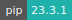
* **Programming Language:**   
* **Database:** 
* **NVIDIA Libraries:**    
* **Extension:**   

:::

::: {tab-item} 23.09

[](https://cloud.sdu.dk/app/jobs/create?app=pytorch-te&version=23.09)


* **Operating System:** 
* **Terminal:**   
* **Shell:**   
* **Editor:**   
* **Package Manager:**    
* **Programming Language:**   
* **Database:** 
* **NVIDIA Libraries:**    
* **Extension:**   

:::

::: {tab-item} 23.08

[](https://cloud.sdu.dk/app/jobs/create?app=pytorch-te&version=23.08)


* **Operating System:** 
* **Terminal:**   
* **Shell:**   
* **Editor:**   
* **Package Manager:**    
* **Programming Language:**   
* **Database:** 
* **NVIDIA Libraries:**    
* **Extension:**   

:::

::: {tab-item} 23.07

[](https://cloud.sdu.dk/app/jobs/create?app=pytorch-te&version=23.07)


* **Operating System:** 
* **Terminal:**   
* **Shell:**   
* **Editor:**   
* **Package Manager:**    
* **Programming Language:** 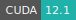  
* **Database:** 
* **NVIDIA Libraries:** 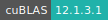   
* **Extension:**   

:::

::: {tab-item} 2.0.1

[](https://cloud.sdu.dk/app/jobs/create?app=pytorch-te&version=2.0.1)


* **Operating System:** 
* **Terminal:**  
* **Shell:**   
* **Editor:**   
* **Package Manager:**    
* **Programming Language:**   
* **Database:** 
* **NVIDIA Libraries:**    
* **Extension:** 

:::


::: {tab-item} 1.14.0

[](https://cloud.sdu.dk/app/jobs/create?app=pytorch-te&version=1.14.0)


* **Operating System:** 
* **Terminal:**   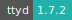
* **Shell:**   
* **Editor:**   
* **Package Manager:** 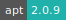   
* **Programming Language:**    
* **Database:** 
* **NVIDIA Libraries:** 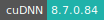   
* **Extension:** 

:::

::: {tab-item} 1.13.0-1

[](https://cloud.sdu.dk/app/jobs/create?app=pytorch-te&version=1.13.0-1)


* **Operating System:** 
* **Terminal:**   
* **Shell:**   
* **Editor:**   
* **Package Manager:**     
* **Programming Language:**    
* **Database:** 
* **NVIDIA Libraries:**     
* **Extension:** 

:::

::: {tab-item} 1.11.0-1

[](https://cloud.sdu.dk/app/jobs/create?app=pytorch-te&version=1.11.0-1)


* **Operating System:** 
* **Terminal:**   
* **Shell:**   
* **Editor:**   
* **Package Manager:**    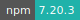 
* **Programming Language:**    
* **Database:** 
* **NVIDIA Libraries:**     
* **Extension:** 

:::

::: {tab-item} 1.7.0-1

[](https://cloud.sdu.dk/app/jobs/create?app=pytorch-te&version=1.7.0-1)


* **Operating System:** 
* **Terminal:** 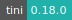  
* **Shell:**  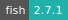 
* **Editor:**   
* **Package Manager:**    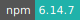 
* **Programming Language:**    
* **Database:** 
* **NVIDIA Libraries:**     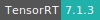
* **Extension:** 

:::

::: {tab-item} 1.5.0-1

[](https://cloud.sdu.dk/app/jobs/create?app=pytorch-te&version=1.5.0-1)


* **Operating System:** 
* **Terminal:**   
* **Shell:**   
* **Editor:**   
* **Package Manager:**     
* **Programming Language:**    
* **Database:** 
* **NVIDIA Libraries:**     
* **Extension:** 

:::

::::

[PyTorch](https://pytorch.org/) is a GPU accelerated tensor computational framework with a Python front end. Functionality can be easily extended with common Python libraries such as NumPy, SciPy, and Cython. Automatic differentiation is done with a tape-based system at both a functional and neural network layer level.

For basic usage of the Notebook environment, check the [JupyterLab](jupyter-lab.md) application.

For basic usage of the console environment, check the [Terminal](terminal.md) application.

## Initialization

For information on how to use the *Initialization* parameter, please refer to the [Initialization - Bash script](../hands-on/init-sh.md) and [Initialization - pip packages](../hands-on/init-pip.md) section of the documentation.

## Batch mode

Use this option to submit a Bash script (`*.sh`), which will be executed
after the job starts.
The job will stop after the execution of the program.

## Run on GPU nodes

GPU partitions can be selected from the application frontend page using the [Machine type](general_settings.md#machine-type) parameter.

The NVIDIA System Management Interface program, `nvidia-smi`, can be used to monitor the usage of the GPU resources:

```console
$ watch -n 0.5 nvidia-smi
```
