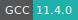
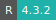
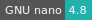
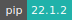
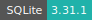
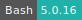
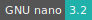
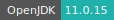

# RStudio

:::::: {tab-set}

::::: {tab-item} Default

:::: {tab-set}

::: {tab-item} 4.3.2

[](https://cloud.sdu.dk/app/jobs/create?app=rstudio&version=4.3.2)


* **Operating System:** 
* **Terminal:** 
* **Shell:**   
* **Editor:**   
* **Package Manager:**   
* **Programming Language:**     
* **Database:** 
* **NVIDIA Libraries:**   
* **Extension:** 

:::

::: {tab-item} 4.2.3

[](https://cloud.sdu.dk/app/jobs/create?app=rstudio&version=4.2.3)


* **Operating System:** 
* **Terminal:** 
* **Shell:** 
* **Editor:**   
* **Package Manager:**   
* **Programming Language:**    
* **Database:** 

:::

::: {tab-item} 4.2.1

[](https://cloud.sdu.dk/app/jobs/create?app=rstudio&version=4.2.1)


* **Operating System:** 
* **Terminal:** 
* **Shell:** 
* **Editor:**   
* **Package Manager:**   
* **Programming Language:**     
* **Database:** 

:::

::: {tab-item} 4.1.2

[](https://cloud.sdu.dk/app/jobs/create?app=rstudio&version=4.1.2)


* **Operating System:** 
* **Shell:** 
* **Editor:**   
* **Package Manager:**   
* **Programming Language:**     
* **Database:** 

:::

::: {tab-item} 4.0.5

[](https://cloud.sdu.dk/app/jobs/create?app=rstudio&version=4.0.5)


* **Operating System:** 
* **Shell:** 
* **Editor:** 
* **Package Manager:**   
* **Programming Language:**      
* **Database:** 

:::

::: {tab-item} 4.0.3

[](https://cloud.sdu.dk/app/jobs/create?app=rstudio&version=4.0.3)


* **Operating System:** 
* **Shell:** 
* **Editor:** 
* **Package Manager:**   
* **Programming Language:**      
* **Database:** 

:::

::: {tab-item} 3.6.3

[](https://cloud.sdu.dk/app/jobs/create?app=rstudio&version=3.6.3)


* **Operating System:** 
* **Shell:** 
* **Editor:**  
* **Package Manager:**  
* **Programming Language:**    

:::

::: {tab-item} 3.6.2

[](https://cloud.sdu.dk/app/jobs/create?app=rstudio&version=3.6.2-5)


* **Operating System:** 
* **Shell:** 
* **Editor:**  
* **Package Manager:**  
* **Programming Language:**     

:::

::::

:::::

::::: {tab-item} Intel MKL

:::: {tab-set}

::: {tab-item} 4.3.2-mkl

[](https://cloud.sdu.dk/app/jobs/create?app=rstudio&version=4.3.2-mkl)


* **Operating System:** 
* **Terminal:**  
* **Shell:**   
* **Editor:**   
* **Package Manager:**    
* **Programming Language:**     
* **Utility:**  
* **Extension:**  

:::

::: {tab-item} 4.2.3-mkl

[](https://cloud.sdu.dk/app/jobs/create?app=rstudio&version=4.2.3-mkl)


* **Operating System:** 
* **Shell:** 
* **Editor:**   
* **Package Manager:**  
* **Programming Language:**    
* **CRAN Packages:**  
* **Extension:** 

:::

::: {tab-item} 4.2.1-mkl

[](https://cloud.sdu.dk/app/jobs/create?app=rstudio&version=4.2.1-mkl)


* **Operating System:** 
* **Shell:** 
* **Editor:**   
* **Package Manager:**  
* **Programming Language:**     
* **CRAN Packages:**  
* **Extension:** 

:::

::: {tab-item} 4.1.2-mkl

[](https://cloud.sdu.dk/app/jobs/create?app=rstudio&version=4.1.2-mkl)


* **Operating System:** 
* **Shell:** 
* **Editor:**   
* **Package Manager:**  
* **Programming Language:**     
* **Extension:** 

:::

::::

:::::

::::::

[RStudio](https://rstudio.com/products/rstudio/features/) is an integrated development environment for [R](https://www.r-project.org/about.html), a programming language for statistical computing and graphics.

Introductory tutorials can be found [here](https://support.rstudio.com/hc/en-us/sections/200107586-Using-the-RStudio-IDE).

## Initialization

For information on how to use the *Initialization* parameter, please refer to the [Initialization - Bash script](../hands-on/init-sh.md) section of the documentation.

## Configure SSH access

The app provides optional [support for SSH access](general_settings.md#configure-ssh-access) from an external client. An SSH *public key* must be uploaded using the corresponding panel in *Resources* section of the UCloud side menu.

By checking on *Enable SSH server* a random port is opened for connection. The connection command is shown in the job progress view page.


## Batch mode

This option can be used to submit scripts which will be executed after the job starts.
The job will stop after the execution of the program.

Allowed file formats are: Bash script (`*.sh`) and R script (`*.R`).
These are some working examples:


:::: {tab-set}

::: {tab-item} script.sh

```shell
#!/bin/bash
sudo apt-get update
sudo apt-get install -y libssl-dev liblzma-dev libbz2-dev libicu-dev libxml2-dev
sudo apt-get clean

Rscript /work/script.R
```

:::

::: {tab-item} script.R

```R
# Histogram of Random Normal Numbers
install.packages("pacman")

pacman::p_load(ggplot2, tidyr, dplyr, devtools, formatR)

data = data.frame(gender = c("M", "M", "F"),
                  age = c(20, 60, 30),
                  height = c(180, 200, 150))
data

# number of observations
num_obs <- 1000

# reading arguments ('mean' and 'sd')
args <- commandArgs(trailingOnly = TRUE)

if (length(args) == 0) {
        x <- rnorm(num_obs)
} else {
	if (is.missing(args[1])) {
	  mean <- 0
	} else {
	  mean <- as.numeric(args[1])
	}
	if (is.na(args[2])) {
	  sd <- 1
	} else {
	  sd <- as.numeric(args[2])
	}
	  x <- rnorm(num_obs, mean = mean, sd = sd)
}

print('Plotting histogram')

png('normal-histogram.png', pointsize = 18)
hist(x, las = 1, col = '#437899')
dev.off()
```

:::

::::


## R project environment

It is possible to create isolated and portable environments for R projects using the `renv` package, which is integrated with RStudio.

### Create a new project

An existing folder, say `/work/my_project`, can be converted into an R project by running the following commands from the RStudio console:

```R
setwd('/work/my_project')
renv::init()
Sys.setenv(RENV_PATHS_CACHE = '/work/my_project/renv/cache')
```

where the last command sets the `renv` cache directory inside the project root folder for convenience.
After the job is canceled, `my_project`  will be available in the [job output folder](../guide/submitting.md). The latter can moved to a different location and shared with collaborators.

The project can be activated in a new RStudio instance, by mounting its root folder and running the command:

```R
renv::load(project = '/work/my_project')
```

``` {note}
In order to install new packages within an existing R project, it is necessary to set up again the environmental variable ``RENV_PATHS_CACHE``, as shown above.
```

### Autoload an existing project

Activation of an existing R project can be automated via a Bash script, which is submitted using the optional *Dependencies* parameter. For example:

```shell
#!/bin/bash

echo "Sys.setenv(RENV_PATHS_CACHE = '/work/my_project/renv/cache')" > ~/.Rprofile
echo "renv::load(project = '/work/my_project')" >> ~/.Rprofile
```

where `my_project` is R project environment folder.

## Parallel computing in R

Multicore processing and multi-threaded performance are enabled in the app container via the  Basic Linear Algebra Subroutines (BLAS) library or the Intel Math Kernel Library (MKL). By default, an optimum number of threads is chosen by the program, which usually corresponds to the number of cores available in the computing node.
The number of threads can also be controlled by setting the environmental variable  `OMP_NUM_THREADS` for BLAS, or `MKL_NUM_THREADS` in case R was built using the Intel MKL.

Multi-threading is used to optimize basic linear algebra operations, such as dot product, matrix-vector multiplication, and matrix-matrix multiplication. However, it could interfere with some parallel operations, such as parallel `foreach`, `parapply`, `sfClusterApply`, etc. In this case, the user should make R use only one thread (core) for basic linear algebra operation, by setting

```R
Sys.setenv(OMP_NUM_THREADS = 1)
```

or

```R
Sys.setenv(MKL_NUM_THREADS = 1)
```

for R built against Intel MKL. These variables can also be loaded by adding them in the file `/home/ucloud/.Renviron` and restarting the R session.

In addition, it is possible to control the number of threads on BLAS (Aka 'GotoBLAS', 'ACML', and 'MKL') and the number of threads in OpenMP by installing the `RhpcBLASctl` [R package](https://rdrr.io/cran/RhpcBLASctl/man/RhpcBLASctl-package.html).

For example:

```R
install.packages("RhpcBLASctl")
library(RhpcBLASctl)
blas_set_num_threads(number of threads)
```
