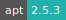
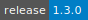
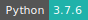

# Salmon

:::: {tab-set}

::: {tab-item} 1.10.2

* **Operating System:** 
* **Terminal:**  
* **Shell:**   
* **Editor:**   
* **Package Manager:**     
* **Programming Language:**    
* **Utility:** 
* **Extension:** 

:::

::: {tab-item} 1.3.0

* **Operating System:** 
* **Shell:** 
* **Editor:** 
* **Package Manager:**   
* **Programming Language:**   
* **Database:** 

:::

::: {tab-item} 0.12.0

* **Operating System:** 
* **Shell:** 
* **Editor:** 
* **Package Manager:**    
* **Programming Language:**   
* **Database:** 

:::

::::

Salmon is a wicked-fast program to produce a highly-accurate, transcript-level
quantification estimates from RNA-seq data. Salmon achieves its accuracy and speed
via a number of different innovations, including the use of quasi-mapping (accurate
but fast-to-compute proxies for traditional read alignments), and massively-parallel
stochastic collapsed variational inference. The result is a versatile tool that
fits nicely into many different pipelines.

For more information, check [here](https://salmon.readthedocs.io/en/latest/).

  
Salmon utilities

- 
- 
- 
- 
- 

