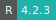
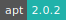
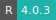

# Shiny

:::: {tab-set}

::: {tab-item} 4.3.2

* **Operating System:** 
* **Terminal:**  
* **Shell:**   
* **Editor:**   
* **Package Manager:**   
* **Programming Language:**   

:::

::: {tab-item} 4.2.3

* **Operating System:** 
* **Terminal:** 
* **Shell:** 
* **Editor:**   
* **Package Manager:**  
* **Programming Language:**   

:::

::: {tab-item} 4.1.2

* **Operating System:** 
* **Terminal:** 
* **Shell:** 
* **Editor:**   
* **Package Manager:**  
* **Programming Language:**   

:::

::: {tab-item} 4.0.3

* **Operating System:** 
* **Shell:** 
* **Editor:** 
* **Package Manager:**  
* **Programming Language:**   

:::

::::

Shiny allows to deploy apps and interactive documents with Shiny Server.

For more information check [here](https://shiny.rstudio.com/).

## Input folder

The app receives a mandatory parameter, *Input Folder*, namely the directory with the source codes including the main file `app.R`,  or the files `ui.R` and `server.R`.

## Initialization

For information on how to use the *Initialization* parameter, please refer to the [Initialization - Bash script](../hands-on/init-sh.md) section of the documentation.
