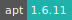
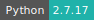

# SIESTA

[](https://cloud.sdu.dk/app/jobs/create?app=siesta&version=4.1-b3-1)


* **Operating System:** 
* **Shell:** 
* **Editor:**   
* **Package Manager:**   
* **Programming Language:**    
* **Database:** 
---

SIESTA is a density-functional theory code which allows to perform efficient electronic structure calculations and ab initio molecular dynamics simulations of molecules and solids with the use of a basis set of strictly-localized atomic orbitals.

More informations can be found [here](https://departments.icmab.es/leem/siesta/Documentation/index.md).

## Getting Started

Open the terminal and access your project directory in `/work`, where you have the required files, namely the input file and a pseudopotential file (`.vps` or `.psf`) for every atomic species included in the input file.

Run the code:

```console
$ siesta < file.fdf > file.out
```

or to run in parallel:

```console
$ mpirun -np <number> siesta < file.fdf > file.out
```

Example `.fdf` and pseudopotential files can be found in `$SIESTA_DIR/siesta-4.1-b3/Examples` and ready-to-run examples in `$SIESTA_DIR/siesta-4.1-b3/Tests`.
