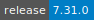
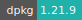
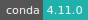

# Snakemake

:::: {tab-set}

::: {tab-item} 7.32.4

[](https://cloud.sdu.dk/app/jobs/create?app=snakemake&version=7.32.4)


* **Operating System:** 
* **Terminal:**  
* **Shell:**   
* **Editor:**   
* **Package Manager:**     
* **Programming Language:**   
* **Utility:**  
* **Extension:** 

:::

::: {tab-item} 7.31.0

[](https://cloud.sdu.dk/app/jobs/create?app=snakemake&version=7.31.0)


* **Operating System:** 
* **Terminal:**  
* **Shell:**   
* **Editor:**   
* **Package Manager:**     
* **Programming Language:**    
* **Utility:** 
* **Extension:** 

:::

::: {tab-item} 7.30.2

[](https://cloud.sdu.dk/app/jobs/create?app=snakemake&version=7.30.2)


* **Operating System:** 
* **Terminal:**  
* **Shell:**   
* **Editor:**   
* **Package Manager:**     
* **Programming Language:**    
* **Utility:** 
* **Extension:** 

:::

::: {tab-item} 7.29.0

[](https://cloud.sdu.dk/app/jobs/create?app=snakemake&version=7.29.0)


* **Operating System:** 
* **Terminal:** 
* **Shell:**   
* **Editor:**   
* **Package Manager:**    
* **Programming Language:**  

:::

::: {tab-item} 7.28.1

[](https://cloud.sdu.dk/app/jobs/create?app=snakemake&version=7.28.1)


* **Operating System:** 
* **Terminal:** 
* **Shell:**   
* **Editor:**   
* **Package Manager:**    
* **Programming Language:**  

:::

::: {tab-item} 7.26.0

[](https://cloud.sdu.dk/app/jobs/create?app=snakemake&version=7.26.0)


* **Operating System:** 
* **Terminal:** 
* **Shell:** 
* **Editor:**   
* **Package Manager:**    
* **Programming Language:**  

:::

::: {tab-item} 6.15.0

[](https://cloud.sdu.dk/app/jobs/create?app=snakemake&version=6.15.0)


* **Operating System:** 
* **Terminal:** 
* **Shell:** 
* **Editor:**   
* **Package Manager:**    
* **Programming Language:**  
* **Database:** 

:::

::: {tab-item} 5.31.1

[](https://cloud.sdu.dk/app/jobs/create?app=snakemake&version=5.31.1)


:::

::: {tab-item} 5.10.0

[](https://cloud.sdu.dk/app/jobs/create?app=snakemake&version=5.10.0)


:::

::::

The [Snakemake](https://snakemake.readthedocs.io/en/stable/) workflow management system is a tool to create reproducible and
scalable data analyses. Workflows are described via a human readable,
Python based language. They can be seamlessly scaled to server, cluster,
grid and cloud environments, without the need to modify the workflow definition.
Finally, Snakemake workflows can entail a description of required software,
which will be automatically deployed to any execution environment.

## Select input parameters

The app has two mandatory parameters:

- *Input folder:* it mounts the folder containing source code and input files.
- *Snakefile:* it selects the principal `Snakefile` file with the workflow instructions. The `Snakefile` is located inside the input folder and must have a unique name (this is relevant in case there are multiple `Snakefile` files linked together).

## Initialization

For information on how to use the *Initialization* parameter, please refer to the [Initialization - Bash script](../hands-on/init-sh.md), [Initialization - Conda packages](../hands-on/init-conda.md), and [Initialization - pip packages](../hands-on/init-pip.md) section of the documentation.

### Create a Conda environment

The user can also install the required software dependencies via Conda by specifying the path(s) to the configuration YAML file(s) directly in the `Snakefile`. In this case the user must use the option `--use-conda`. For more information about how to manage Conda environments in Snakemake, check the official [Snakemake documentation](https://snakemake.readthedocs.io/en/stable/snakefiles/deployment.html#integrated-package-management).

## Interactive mode

The _Interactive mode_ parameter is used to start an interactive job session where the user can open a terminal window from the job progress page and execute shell commands.

## Snakemake GUI

By selecting the option `-g`, an HTML-based user interface is accessible through the button

{{ btn_open_interface }}

``` {note}
It is strongly recommended to avoid usage of the `--use-conda` option of Snakemake and GUI simultaneously. Instead, the `Initialization` parameter should be used to install software dependencies with Conda.
```
