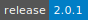
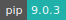

# Space Ranger

[](https://cloud.sdu.dk/app/applications?tag=Space%20Ranger&itemsPerPage=25&page=0)


* **Operating System:** 
* **Terminal:**  
* **Shell:**   
* **Editor:**   
* **Package Manager:**     
* **Programming Language:**    
* **Utility:** 

Visium Spatial Gene Expression is a molecular profiling solution for classifying tissue based on total mRNA.
Space Ranger is a set of analysis pipelines that process Visium Spatial Gene Expression data with brightfield and fluorescence microscope images. Space Ranger allows users to map the whole transcriptome in formalin fixed paraffin embedded (FFPE) and fresh-frozen tissues to discover novel insights into normal development, disease pathology, and clinical translational research.

For more information, check [here](https://support.10xgenomics.com/spatial-gene-expression/software/pipelines/latest/what-is-space-ranger).

<details>
<summary><b>Space Ranger Utilities</b></summary>

- [](https://cloud.sdu.dk/app/jobs/create?app=spaceranger-aggr&version=2.0.1)
- [](https://cloud.sdu.dk/app/jobs/create?app=spaceranger-count&version=2.0.1)
- [](https://cloud.sdu.dk/app/jobs/create?app=spaceranger-mat2csv&version=2.0.1)
- [](https://cloud.sdu.dk/app/jobs/create?app=spaceranger-mkfastq&version=2.0.1)
- [](https://cloud.sdu.dk/app/jobs/create?app=spaceranger-mkgtf&version=2.0.1)
- [](https://cloud.sdu.dk/app/jobs/create?app=spaceranger-mkref&version=2.0.1)
- [](https://cloud.sdu.dk/app/jobs/create?app=spaceranger-targeted-compare&version=2.0.1)
- [](https://cloud.sdu.dk/app/jobs/create?app=spaceranger-targeted-depth&version=2.0.1)
- [](https://cloud.sdu.dk/app/jobs/create?app=spaceranger-terminal&version=2.0.1)
- [](https://cloud.sdu.dk/app/jobs/create?app=spaceranger-testrun&version=2.0.1)
</details>

## Terminal session

The _Space Ranger: terminal_ utility allows the user run the different Space Ranger pipelines via command line by clicking

{{ btn_open_terminal }}

## User interface

When available, the `--uiport=3600` option enables the pipeline's visual user interface (UI), accessible through the button

{{ btn_open_interface }}

``` {note}
The UI port must be ``3600``.
```
