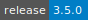
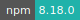
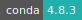

# Spark Cluster

:::: {tab-set}

::: {tab-item} 3.5.0

[](https://cloud.sdu.dk/app/jobs/create?app=spark-cluster&version=3.5.0)
[](interactive_apps.md)

* **Operating System:** 
* **Terminal:**  
* **Shell:**   
* **Editor:**   
* **Package Manager:**     
* **Programming Language:**     
* **Database:** 
* **Utility:**  
* **Extension:**  

:::

::: {tab-item} 3.4.1

[](https://cloud.sdu.dk/app/jobs/create?app=spark-cluster&version=3.4.1)
[](interactive_apps.md)

* **Operating System:** 
* **Terminal:**  
* **Shell:**   
* **Editor:**   
* **Package Manager:**     
* **Programming Language:**     
* **Database:** 
* **Utility:** 
* **Extension:**  

:::

::: {tab-item} 3.3.2

[](https://cloud.sdu.dk/app/jobs/create?app=spark-cluster&version=3.3.2)
[](interactive_apps.md)

* **Operating System:** 
* **Shell:** 
* **Editor:**   
* **Package Manager:**     
* **Programming Language:**      
* **Database:** 

:::

::: {tab-item} 3.2.2

[](https://cloud.sdu.dk/app/jobs/create?app=spark-cluster&version=3.2.2)
[](interactive_apps.md)

* **Operating System:** 
* **Shell:** 
* **Editor:**   
* **Package Manager:**     
* **Programming Language:**      
* **Database:** 

:::

::: {tab-item} 3.1.3

[](https://cloud.sdu.dk/app/jobs/create?app=spark-cluster&version=3.1.3)
[](interactive_apps.md)

* **Operating System:** 
* **Shell:** 
* **Editor:**   
* **Package Manager:**     
* **Programming Language:**     
* **Database:** 

:::

::: {tab-item} 3.0.0

[](https://cloud.sdu.dk/app/jobs/create?app=spark-cluster&version=3.0.0-1)
[](interactive_apps.md)

* **Operating System:** 
* **Shell:** 
* **Editor:** 
* **Package Manager:**    
* **Programming Language:**    
* **Database:** 

:::

::: {tab-item} 2.4.5

[](https://cloud.sdu.dk/app/jobs/create?app=spark-cluster&version=2.4.5-11)
[](interactive_apps.md)

* **Operating System:** 
* **Shell:** 
* **Editor:** 
* **Package Manager:**    
* **Programming Language:**    
* **Database:** 

:::

::::

This application deploys a [Spark standalone cluster](https://spark.apache.org/docs/latest/spark-standalone.html).

## Cluster architecture


&nbsp;&nbsp;&nbsp;&nbsp;&nbsp;&nbsp;&nbsp;&nbsp;&nbsp;&nbsp;&nbsp;&nbsp;&nbsp;&nbsp;&nbsp;&nbsp;&nbsp;&nbsp;&nbsp;&nbsp;&nbsp;&nbsp;&nbsp;&nbsp;&nbsp;&nbsp;&nbsp;&nbsp;&nbsp;&nbsp;Apache Spark standalone cluster architecture in client mode

The cluster architecture encompasses one _master_ node (`node1`), which acts as the cluster manager, and one or more _worker_ nodes. By default, one worker always runs on `node1`.
The cluster resources are specified using the parameters *Number of nodes* and *Machine type*.

The _master_ process accepts the applications to be run and schedules the _worker_ resources (available CPU cores and memory) among them. _Worker_ processes execute the job's tasks. Applications are submitted either from the `node1` _terminal interface_ or from another UCloud client app _connected to_ `node1`, which also runs Apache Spark (see, e.g., [JupyterLab](jupyter-lab.md#submit-a-spark-application)). Finally, the Spark _driver_ is the program that creates the `SparkContext`, connecting to the _master_ node.

The standalone Spark cluster supports two deploy modes:

- In `client` mode (default), the Spark driver is launched in the same process as the client that submits the application (see, e.g., the figure above).

- In `cluster` mode the driver is launched from one of the _worker_ processes inside the cluster, and the client process exits as soon as it fulfills its responsibility of submitting the application without waiting for the application to finish.

The deploy mode is specified via the property parameter `spark.submit.deployMode`. The complete list of all application properties available for a Spark standalone cluster is reported [here](https://spark.apache.org/docs/latest/configuration.html#application-properties).

## Monitoring

Information about completed and ongoing Spark applications is accessible via the app _web interface_, by clicking on the button

{{ btn_open_interface }}

### Spark UI

The Spark web user interface (UI) is used to monitor all the applications submitted to the cluster. The _master_ and each _worker_ has its own web UI that shows cluster and job statistics.

For each application the Spark UI includes:

- A list of scheduler stages and tasks.
- A summary of RDD sizes and memory usage.
- Environmental information.
- Information about the running executors.

``` {note}
This information is only available for the duration of the Spark application.
```

### Spark history server

The Spark history logs are saved in `/work/spark_logs`, which is created by default when the job starts. A different directory can be specified using the parameter _Spark history_.

The Spark history server can be accessed by running the following command from the `node1` terminal interface:

```console
$ display_spark_history
```

The history server is accessible _only_ from the `node1` web interface.
<br>


<br>

``` {note}
If the client runs in another UCloud app, the same logs folder must be mounted on both cluster and client apps.
```

## Import data

The mandatory parameter *Input folder* is used to mount the data directory on all the cluster nodes.

``` {note}
If the client runs in another UCloud app, the same data folder must be mounted on both cluster and client apps.
```

## Initialization

Additional packages may be installed on all the _worker_ nodes using the *Initialization* optional parameter.

For information on how to use this parameter, please refer to the [Initialization - Bash script](../hands-on/init-sh.md), [Initialization - Conda packages](../hands-on/init-conda.md), and [Initialization - pip packages](../hands-on/init-pip.md) section of the documentation.

``` {note}
The same packages must be installed on a client node *connected to* the Spark cluster.
```

## Run in batch mode

The parameter _Batch processing_ is used to submit Spark applications via a Bash script, running on the _master_ node.

``` {note}
The job is terminated after the script is executed, independently of the script exit status.
```
