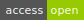
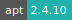
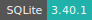

# Streamlit

:::: {tab-set}

::: {tab-item} 1.28.2

[](https://cloud.sdu.dk/app/jobs/create?app=streamlit&version=1.28.2)


* **Operating System:** 
* **Terminal:**  
* **Shell:**   
* **Editor:**   
* **Package Manager:**     
* **Programming Language:**   
* **Utility:**  
* **Extension:** 

:::

::: {tab-item} 1.27.2

[](https://cloud.sdu.dk/app/jobs/create?app=streamlit&version=1.27.2)


* **Operating System:** 
* **Terminal:**  
* **Shell:**   
* **Editor:**   
* **Package Manager:**     
* **Programming Language:**   
* **Utility:**  
* **Extension:** 

:::

::: {tab-item} 1.26.0

[](https://cloud.sdu.dk/app/jobs/create?app=streamlit&version=1.26.0)


* **Operating System:** 
* **Terminal:**  
* **Shell:**   
* **Editor:**   
* **Package Manager:**     
* **Programming Language:**    
* **Utility:** 
* **Extension:** 

:::

::: {tab-item} 1.25.0

[](https://cloud.sdu.dk/app/jobs/create?app=streamlit&version=1.25.0)


* **Operating System:** 
* **Terminal:**  
* **Shell:**   
* **Editor:**   
* **Package Manager:**     
* **Programming Language:**    
* **Utility:**  
* **Extension:** 

:::

::: {tab-item} 1.24.1

[](https://cloud.sdu.dk/app/jobs/create?app=streamlit&version=1.24.1)


* **Operating System:** 
* **Terminal:**  
* **Shell:**   
* **Editor:**   
* **Package Manager:**     
* **Programming Language:**   
* **Utility:**  
* **Extension:** 

:::

::: {tab-item} 1.24.0

[](https://cloud.sdu.dk/app/jobs/create?app=streamlit&version=1.24.0)


* **Operating System:** 
* **Terminal:**  
* **Shell:**   
* **Editor:**   
* **Package Manager:**     
* **Programming Language:**    
* **Utility:** 
* **Extension:** 

:::

::: {tab-item} 1.23.1

[](https://cloud.sdu.dk/app/jobs/create?app=streamlit&version=1.23.1)


* **Operating System:** 
* **Terminal:** 
* **Shell:**   
* **Editor:**   
* **Package Manager:**    
* **Programming Language:** 

:::

::: {tab-item} 1.22.0

[](https://cloud.sdu.dk/app/jobs/create?app=streamlit&version=1.22.0)


* **Operating System:** 
* **Terminal:** 
* **Shell:**   
* **Editor:**   
* **Package Manager:**    
* **Programming Language:** 

:::

::: {tab-item} 1.20.0

[](https://cloud.sdu.dk/app/jobs/create?app=streamlit&version=1.20.0)


* **Operating System:** 
* **Terminal:** 
* **Shell:** 
* **Editor:**   
* **Package Manager:**    
* **Programming Language:** 
* **Database:** 

:::

::: {tab-item} 1.10.0

[](https://cloud.sdu.dk/app/jobs/create?app=streamlit&version=1.10.0)


* **Operating System:** 
* **Terminal:** 
* **Shell:** 
* **Editor:**   
* **Package Manager:**    
* **Programming Language:** 
* **Database:** 

:::

::: {tab-item} 1.1.0

[](https://cloud.sdu.dk/app/jobs/create?app=streamlit&version=1.1.0)


* **Operating System:** 
* **Terminal:** 
* **Shell:** 
* **Editor:**   
* **Package Manager:**    
* **Programming Language:** 
* **Database:** 

:::

::: {tab-item} 0.88.0

[](https://cloud.sdu.dk/app/jobs/create?app=streamlit&version=0.88.0)


* **Operating System:** 
* **Shell:** 
* **Package Manager:**    
* **Programming Language:**   
* **Database:** 

:::

::: {tab-item} 0.64.0

[](https://cloud.sdu.dk/app/jobs/create?app=streamlit&version=0.64.0)


* **Operating System:** 
* **Shell:** 
* **Package Manager:**    
* **Programming Language:**   
* **Database:** 

:::

::::

[Streamlit](https://www.streamlit.io/) is an open-source Python library that makes it easy to build beautiful custom web-apps for machine learning and data science.

## Select input parameters

The app receives two mandatory parameters:

- *Input folder:* the directory with the data and the source code
- *App:* the main source file for the app

``` {note}
The app must be deployed on the Streamlit standard port ``8051``.
```

Additional arguments of the app main file can be specified via the optional parameter: *App arguments*.

## Initialization

For information on how to use the *Initialization* parameter, please refer to the [Initialization - Bash script](../hands-on/init-sh.md), [Initialization - Conda packages](../hands-on/init-conda.md), and [Initialization - pip packages](../hands-on/init-pip.md) section of the documentation.
