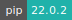
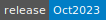
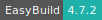
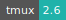
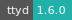
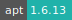
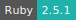

# Terminal

:::::: {tab-set}

::::: {tab-item} Terminal Ubuntu

:::: {tab-set}

::: {tab-item} Nov2023

[](https://cloud.sdu.dk/app/jobs/create?app=terminal-ubuntu&version=Nov2023)


* **Operating System:** 
* **Terminal:**   
* **Shell:**   
* **Editor:**   
* **Package Manager:**     
* **Programming Language:**   
* **Database:**  
* **Job Scheduler:** 
* **Utility:**  
* **Extension:** 

:::

::: {tab-item} Oct2023

[](https://cloud.sdu.dk/app/jobs/create?app=terminal-ubuntu&version=Oct2023)


* **Operating System:** 
* **Terminal:**   
* **Shell:**   
* **Editor:**   
* **Package Manager:**     
* **Programming Language:**   
* **Database:**  
* **Job Scheduler:** 
* **Utility:**  
* **Extension:** 

:::

::: {tab-item} Sep2023

[](https://cloud.sdu.dk/app/jobs/create?app=terminal-ubuntu&version=Sep2023)


* **Operating System:** 
* **Terminal:**   
* **Shell:**   
* **Editor:**   
* **Package Manager:**     
* **Programming Language:**   
* **Database:**  
* **Job Scheduler:** 
* **Utility:**  
* **Extension:** 

:::

::: {tab-item} Aug2023

[](https://cloud.sdu.dk/app/jobs/create?app=terminal-ubuntu&version=Aug2023)


* **Operating System:** 
* **Terminal:**   
* **Shell:**   
* **Editor:**   
* **Package Manager:**     
* **Programming Language:**   
* **Database:**  
* **Job Scheduler:** 
* **Utility:**  
* **Extension:** 

:::

::: {tab-item} Jul2023

[](https://cloud.sdu.dk/app/jobs/create?app=terminal-ubuntu&version=Jul2023)


* **Operating System:** 
* **Terminal:**   
* **Shell:**   
* **Editor:**   
* **Package Manager:**     
* **Programming Language:**   
* **Database:**  
* **Job Scheduler:** 
* **Utility:**  
* **Extension:** 

:::

::: {tab-item} Jun2023

[](https://cloud.sdu.dk/app/jobs/create?app=terminal-ubuntu&version=Jun2023)


* **Operating System:** 
* **Terminal:**   
* **Shell:**   
* **Editor:**   
* **Package Manager:**     
* **Programming Language:**    
* **Database:** 
* **Job Scheduler:** 
* **Utility:**  
* **Extension:** 

:::

::: {tab-item} 0.22.0

[](https://cloud.sdu.dk/app/jobs/create?app=terminal-ubuntu&version=0.22.0)


* **Operating System:** 
* **Terminal:**   
* **Shell:**   
* **Editor:**   
* **Package Manager:**     
* **Programming Language:**    
* **Database:** 
* **Job Scheduler:** 
* **Utility:**  
* **Extension:** 

:::

::: {tab-item} 0.21.0

[](https://cloud.sdu.dk/app/jobs/create?app=terminal-ubuntu&version=0.21.0)


* **Operating System:** 
* **Terminal:**   
* **Shell:**   
* **Editor:**   
* **Package Manager:**     
* **Programming Language:**    
* **Database:** 
* **Job Scheduler:** 
* **Utility:**  
* **Extension:** 

:::

::: {tab-item} 0.20.0

[](https://cloud.sdu.dk/app/jobs/create?app=terminal-ubuntu&version=0.20.0)


* **Operating System:** 
* **Terminal:**   
* **Shell:**   
* **Editor:**   
* **Package Manager:**     
* **Programming Language:**    
* **Database:** 
* **Job Scheduler:** 
* **Utility:**  
* **Extension:** 

:::

::: {tab-item} 0.19.0

[](https://cloud.sdu.dk/app/jobs/create?app=terminal-ubuntu&version=0.19.0)


* **Operating System:** 
* **Terminal:**   
* **Shell:**   
* **Editor:**   
* **Package Manager:**     
* **Programming Language:**    
* **Database:** 
* **Job Scheduler:** 
* **Utility:**  

:::

::: {tab-item} 0.18.1

[](https://cloud.sdu.dk/app/jobs/create?app=terminal-ubuntu&version=0.18.1)


* **Operating System:** 
* **Terminal:**   
* **Shell:**   
* **Editor:**   
* **Package Manager:**     
* **Programming Language:**    
* **Database:** 
* **Job Scheduler:** 
* **Utility:**  

:::

::: {tab-item} 0.17.0

[](https://cloud.sdu.dk/app/jobs/create?app=terminal-ubuntu&version=0.17.0)


* **Operating System:** 
* **Terminal:**   
* **Shell:**   
* **Editor:**   
* **Package Manager:**     
* **Programming Language:**    
* **Database:** 
* **Job Scheduler:** 
* **Utility:**  

:::

::: {tab-item} 0.16.1

[](https://cloud.sdu.dk/app/jobs/create?app=terminal-ubuntu&version=0.16.1)


* **Operating System:** 
* **Terminal:**   
* **Shell:**   
* **Editor:**   
* **Package Manager:**    
* **Programming Language:**    
* **Database:** 
* **Job Scheduler:** 
* **Utility:**  

:::

::: {tab-item} 0.16.0

[](https://cloud.sdu.dk/app/jobs/create?app=terminal-ubuntu&version=0.16.0)


* **Operating System:** 
* **Terminal:**   
* **Shell:**   
* **Editor:**   
* **Package Manager:**    
* **Programming Language:**    
* **Database:** 
* **Job Scheduler:** 
* **Utility:**  

:::

::: {tab-item} 0.15.0

[](https://cloud.sdu.dk/app/jobs/create?app=terminal-ubuntu&version=0.15.0)


* **Operating System:** 
* **Terminal:**   
* **Shell:**   
* **Editor:**   
* **Package Manager:**    
* **Programming Language:**    
* **Database:** 
* **Job Scheduler:** 
* **Utility:**  

:::

::: {tab-item} 0.4.2

[](https://cloud.sdu.dk/app/jobs/create?app=terminal-ubuntu&version=0.4.2)


* **Operating System:** 
* **Terminal:**   
* **Shell:**   
* **Editor:**   
* **Package Manager:**   
* **Programming Language:**   

:::

::::

:::::

::::: {tab-item} Terminal Debian

:::: {tab-set}

::: {tab-item} Nov2023

[](https://cloud.sdu.dk/app/jobs/create?app=terminal-debian&version=Nov2023)


* **Operating System:** 
* **Terminal:**   
* **Shell:**   
* **Editor:**   
* **Package Manager:**    
* **Programming Language:**  
* **Utility:**  
* **Extension:** 

:::

::: {tab-item} Oct2023

[](https://cloud.sdu.dk/app/jobs/create?app=terminal-debian&version=Oct2023)


* **Operating System:** 
* **Terminal:**   
* **Shell:**   
* **Editor:**   
* **Package Manager:**    
* **Programming Language:**  
* **Utility:**  
* **Extension:** 

:::

::: {tab-item} Sep2023

[](https://cloud.sdu.dk/app/jobs/create?app=terminal-debian&version=Sep2023)


* **Operating System:** 
* **Terminal:**   
* **Shell:**   
* **Editor:**   
* **Package Manager:**    
* **Programming Language:**  
* **Utility:**  
* **Extension:** 

:::

::: {tab-item} Aug2023

[](https://cloud.sdu.dk/app/jobs/create?app=terminal-debian&version=Aug2023)


* **Operating System:** 
* **Terminal:**   
* **Shell:**   
* **Editor:**   
* **Package Manager:**    
* **Programming Language:**  
* **Utility:**  
* **Extension:** 

:::

::: {tab-item} Jul2023

[](https://cloud.sdu.dk/app/jobs/create?app=terminal-debian&version=Jul2023)


* **Operating System:** 
* **Terminal:**   
* **Shell:**   
* **Editor:**   
* **Package Manager:**    
* **Programming Language:**  
* **Utility:**  
* **Extension:** 

:::

::: {tab-item} Jun2023

[](https://cloud.sdu.dk/app/jobs/create?app=terminal-debian&version=Jun2023)


* **Operating System:** 
* **Terminal:**   
* **Shell:**   
* **Editor:**   
* **Package Manager:**    
* **Programming Language:**   
* **Utility:**  

:::

::: {tab-item} 0.11.0

[](https://cloud.sdu.dk/app/jobs/create?app=terminal-debian&version=0.11.0)


* **Operating System:** 
* **Terminal:**   
* **Shell:**   
* **Editor:**   
* **Package Manager:**    
* **Programming Language:**   
* **Utility:**  

:::

::: {tab-item} 0.10.0

[](https://cloud.sdu.dk/app/jobs/create?app=terminal-debian&version=0.10.0)


* **Operating System:** 
* **Terminal:**   
* **Shell:**   
* **Editor:**   
* **Package Manager:**    
* **Programming Language:**   
* **Utility:**  

:::

::: {tab-item} 0.9.0

[](https://cloud.sdu.dk/app/jobs/create?app=terminal-debian&version=0.9.0)


* **Operating System:** 
* **Terminal:**   
* **Shell:**   
* **Editor:**   
* **Package Manager:**    
* **Programming Language:**   
* **Utility:**  

:::

::: {tab-item} 0.8.0

[](https://cloud.sdu.dk/app/jobs/create?app=terminal-debian&version=0.8.0)


* **Operating System:** 
* **Terminal:**   
* **Shell:**   
* **Editor:**   
* **Package Manager:**    
* **Programming Language:**   
* **Utility:**  

:::

::: {tab-item} 0.7.0

[](https://cloud.sdu.dk/app/jobs/create?app=terminal-debian&version=0.7.0)


* **Operating System:** 
* **Terminal:**   
* **Shell:**   
* **Editor:**   
* **Package Manager:**    
* **Programming Language:**  
* **Utility:**  

:::

::::

:::::

::::: {tab-item} Terminal AlmaLinux

:::: {tab-set}

::: {tab-item} Nov2023

[](https://cloud.sdu.dk/app/jobs/create?app=terminal-almalinux&version=Nov2023)


* **Operating System:** 
* **Terminal:**   
* **Shell:**   
* **Editor:**   
* **Package Manager:**     
* **Programming Language:**    
* **Utility:**  

:::

::: {tab-item} Oct2023

[](https://cloud.sdu.dk/app/jobs/create?app=terminal-almalinux&version=Oct2023)


* **Operating System:** 
* **Terminal:**   
* **Shell:**   
* **Editor:**   
* **Package Manager:**     
* **Programming Language:**    
* **Utility:**  

:::

::: {tab-item} Sep2023

[](https://cloud.sdu.dk/app/jobs/create?app=terminal-almalinux&version=Sep2023)


* **Operating System:** 
* **Terminal:**   
* **Shell:**   
* **Editor:**   
* **Package Manager:**     
* **Programming Language:**    
* **Utility:**  

:::

::: {tab-item} Aug2023

[](https://cloud.sdu.dk/app/jobs/create?app=terminal-almalinux&version=Aug2023)


* **Operating System:** 
* **Terminal:**   
* **Shell:**   
* **Editor:**   
* **Package Manager:**     
* **Programming Language:**    
* **Utility:**  

:::

::: {tab-item} Jul2023

[](https://cloud.sdu.dk/app/jobs/create?app=terminal-almalinux&version=Jul2023)


* **Operating System:** 
* **Terminal:**   
* **Shell:**   
* **Editor:**   
* **Package Manager:**     
* **Programming Language:**    
* **Utility:**  

:::

::: {tab-item} Jun2023

[](https://cloud.sdu.dk/app/jobs/create?app=terminal-almalinux&version=Jun2023)


* **Operating System:** 
* **Terminal:**   
* **Shell:**   
* **Editor:**   
* **Package Manager:**     
* **Programming Language:**   
* **Utility:**  

:::

::: {tab-item} 0.1.0

[](https://cloud.sdu.dk/app/jobs/create?app=terminal-almaalinux&version=0.1.0)


* **Operating System:** 
* **Terminal:**   
* **Shell:**   
* **Editor:**   
* **Package Manager:**     
* **Programming Language:**   
* **Utility:**  

:::

::::

:::::

::::: {tab-item} Terminal CentOS

:::: {tab-set}

::: {tab-item} 0.8.0

[](https://cloud.sdu.dk/app/jobs/create?app=terminal-centos&version=0.8.0)


* **Operating System:** 
* **Terminal:**   
* **Shell:**  
* **Editor:**   
* **Package Manager:**     
* **Programming Language:**   
* **Utility:**  

:::

::: {tab-item} 0.6.14

[](https://cloud.sdu.dk/app/jobs/create?app=terminal-centos&version=0.6.14)


* **Operating System:** 
* **Terminal:**   
* **Shell:**  
* **Editor:**   
* **Package Manager:**    
* **Programming Language:**    
* **Utility:**  

:::

::: {tab-item} 0.4.2

[](https://cloud.sdu.dk/app/jobs/create?app=terminal-centos&version=0.4.2)


* **Operating System:** 
* **Terminal:**   
* **Shell:**  
* **Editor:**   
* **Package Manager:**    
* **Programming Language:**  

:::

::::

:::::

::::::

Web terminal interface based on the [ttyd](https://github.com/tsl0922/ttyd) command-line tool.
This interactive app can be used to install new software and to run scripts.

## Basic features

### Install new software

The default user inside the application container is `ucloud`, which has also superuser account privileges.
Therefore, full read, write, and execute permissions are enabled using `sudo` in front of any command, without entering an administrator password.

Before installing new software, it is always recommended to update the system libraries.
For example, to install the GCC compiler one should run the commands:

```console
$ sudo yum update -y
$ sudo yum install -y gcc
```

for the AlmaLinux/CentOS releases, and

```console
$ sudo apt-get update -y
$ sudo apt-get install -y gcc
```

for the Debian/Ubuntu releases.

### Initialization

For information on how to use the *Initialization* parameter, please refer to the [Initialization - Bash script](../hands-on/init-sh.md) section of the documentation.

### Run a script in batch mode

The optional parameter *Batch processing* is used to run a Bash script (`.sh`) when the job starts.
In this case, the job ends immediately after executing the program.

### Configure SSH access

The app provides optional [support for SSH access](general_settings.md#configure-ssh-access) from an external client. An SSH *public key* must be uploaded using the corresponding panel in *Resources* section of the UCloud side menu.

By checking on *Enable SSH server* a random port is opened for connection. The connection command is shown in the job progress view page.

### Attach a public IP

The app supports deployment with a static [IP address](general_settings.md#attach-public-ip-addresses).

``` {note}
Public IPs are not currently supported with multiple nodes.
```

### Change the default shell

```{eval-rst}
.. toggle-header::
    :header: **Keyboard shortcuts**

    - *Restart the session* : ``Ctrl-d``
    - *Clear the screen* : ``Ctrl-l``
    - *Stop the currently running command* : ``Ctrl-c``
    - *Move to the beginning of line* : ``Ctrl-a``
    - *Move to the end of line* : ``Ctrl-e``
    - *Move backward one character* : ``Ctrl-b``
    - *Move forward one character* : ``Ctrl-f``
    - *Move backward one word* : ``Esc-b``
    - *Move forward one word* : ``Esc-f``
    - *Swap the last two words* : ``Esc-t``
    - *Delete one character before the cursor* : ``Ctrl-h``
    - *Delete all characters after the cursor* : ``Ctrl-k``
    - *Delete all characters before the cursor* : ``Ctrl-u``
    - *Display the previous line in command history* : ``Ctrl-p``
    - *Reverse search* : ``Ctrl-r``
    - *Swap the last two characters* : ``Ctrl-t``
    - *Delete the words before the cursor* : ``Ctrl-w``
    - *Retrieve last deleted item* : ``Ctrl-y``
    - *Stop the current command* : ``Ctrl-z``
```

<br>

The shell type can be selected at the job startup by using the option *Shell* available in the app front-end page. By default the app starts a `bash` shell. The pre-configured shell types may depend on the Linux distribution.

Once logged into the terminal window interface, the name of the working folder is displayed next to the default user. In case of a Git repository, the name of the current branch is highlighted, as shown below.
<br>


<br>
Advanced features of the default shell prompt are listed [here](https://starship.rs/config/).

### Start a tmux session

```{eval-rst}
.. toggle-header::
    :header: **Key bindings**

    - *List keyboard shortcuts* : ``Ctrl-a ?``
    - *Rotate panels* : ``Ctrl-a o``
    - *Move to left panel* : ``Ctrl-a h`` or ``Ctrl-a <Left>``
    - *Move to lower panel* : ``Ctrl-a j`` or ``Ctrl-a <Down>``
    - *Move to upper panel* : ``Ctrl-a k`` or ``Ctrl-a <Up>``
    - *Move to right panel* : ``Ctrl-a l`` or ``Ctrl-a <Right>``
    - *Move to last panel* : ``Ctrl-a ;``
    - *Zoom selected panel* : ``Ctrl-a +``
    - *Change panels arrangement* : ``Ctrl-a <Space>``
    - *Horizontal split* : ``Ctrl-a |``
    - *Vertical split* : ``Ctrl-a -``
    - *Detach session* : ``Ctrl-a d``
    - *Create new window* : ``Ctrl-a c``
    - *Move to next window* : ``Ctrl-a n``
    - *Move to previous window* : ``Ctrl-a p``
    - *Close panel/window* : ``Ctrl-a &`` or ``Ctrl-d``
    - *Select window* : ``Ctrl-a <0-9>``
    - *Synchronize panels* : ``Ctrl-a Shift-e``
    - *Open configuration file* : ``Ctrl-a e``
    - *Enable vertical scrolling* : ``Ctrl-a [`` or ``Ctrl-a PgUp``
    - *Enable mouse support:* ``Ctrl-a m``
    - *Switch session* : ``Ctrl-a s``
```

<br>

[tmux](https://wiki.archlinux.org/index.php/tmux) is a terminal multiplexer, that is it allows to open multiple windows inside the same session. It makes easy to switch between multiple programs in one terminal window, detach them and reattach them to a different terminal.

A new tmux session is started with the command:

```console
$ tmux new -s session_name
```

Alternatively, one can use the optional parameter *Enable tmux*, which will automatically start a new tmux session within the selected shell type.

An example is shown in the figure below. In this case the current session contains five windows, with the active one divided into five panels. To move between different windows and panels, one should use the key bindings listed above.
<br>


<br>
The list of all the active tmux sessions is given by:

```console
$ tmux list-sessions
```

An active tmux session can be attached to multiple browsers with the command:

```console
$ tmux attach -t <session_name>
```

This is useful to resume a session previously running in another window. The current session can be detached using the key combination: `Ctrl-a d` . Alternatively, from a new browser window, run the command:

```console
$ tmux detach-client -s <session_name>
```

## Advanced features

These features are available only in few releases of the Terminal app.

### Environment modules

The [Lmod](https://lmod.readthedocs.io/en/latest/010_user.html) environment module system is used to configure and load environment settings with modulefiles as well as manage multiple versions of the same software.

To see a list of available software modules run the command:

```console
$ module avail
```

or

```console
$ module spider
```

To load a module, use the command: `module load <module_name>`. The default version will automatically be loaded. To select a particular version, use instead: `module load <module_name>/<module_version>`.

The list of currently loaded modules is shown with the command:

```console
$ module list
```

To unload a specific module, use the command: `module unload <module_name>`. This command will automatically unload all its dependencies as well.
To unload everything, use:

```console
$ module purge
```

More commands can be read in the [official documentation](https://lmod.readthedocs.io/en/latest/010_user.html#user-s-tour-of-the-module-command).

### EasyBuild

[EasyBuild](https://docs.easybuild.io/en/latest/Introduction.html) is a software build and installation framework written in Python, which allows to deploy and manage many scientific applications and tools on HPC systems. The EasyBuild module is loaded by default when the terminal session starts:

```console
$ module list
```

``` {tip}
Currently Loaded Modules:
<br>
&nbsp;\1) EasyBuild/4.3.3
```

The dependencies and build parameters of each software release are specified in the corresponding EasyBuild [easyconfig files](https://github.com/easybuilders/easybuild-easyconfigs).

To search for all available easyconfig files, use the option ``--search`` (or ``-S``). For example:

```console
$ eb -S '^Python-3.6.6-*'
```

``` {tip}
CFGS1=/opt/easybuild/easyconfigs/p/Python
<br>
&nbsp;\* $CFGS1/Python-3.6.6-foss-2018b.eb
<br>
&nbsp;\* $CFGS1/Python-3.6.6-fosscuda-2018b.eb
<br>
&nbsp;\* $CFGS1/Python-3.6.6-intel-2018b.eb
<br>
&nbsp;\* $CFGS1/Python-3.6.6-iomkl-2018b.eb
```

Each file specifies the installation parameters for a [compiler toolchain](https://docs.easybuild.io/common-toolchains/).

The `eb` command is used to install new software from the corresponding easyconfig file. To check all the software dependencies, use the option `--dry-run` (or `-D`). For example:

```console
$ eb Python-3.10.4-GCCcore-11.3.0.eb -D
```

``` {tip}
== temporary log file in case of crash /tmp/eb-9rE3Ix/easybuild-yWJqtE.log
Dry run: printing build status of easyconfigs and dependencies
<br>
CFGS=/opt/easybuild/easyconfigs
<br>
&nbsp;\* [ ] $CFGS/m/M4/M4-1.4.19.eb (module: M4/1.4.19)
<br>
&nbsp;\* [ ] $CFGS/p/pkgconf/pkgconf-1.8.0.eb (module: pkgconf/1.8.0)
<br>
&nbsp;\* [ ] $CFGS/o/OpenSSL/OpenSSL-1.1.eb (module: OpenSSL/1.1)
<br>
&nbsp;\* [ ] $CFGS/b/Bison/Bison-3.8.2.eb (module: Bison/3.8.2)
<br>
&nbsp; {{ ellipsis }}
<br>
&nbsp;\* [ ] $CFGS/p/Python/Python-3.10.4-GCCcore-11.3.0.eb (module: Python/3.10.4-GCCcore-11.3.0)
<br>
== Temporary log file(s) /tmp/eb-9rE3Ix/easybuild-yWJqtE.log\* have been removed.
<br>
== Temporary directory /tmp/eb-9rE3Ix has been removed.
```

All the dependencies marked with ``[ ]`` will be installed recursively with the option `--robot` (or `-r`).
By default, new software is installed in `$EASYBUILD_INSTALLPATH`.

In order to export on UCloud new modules installed with EasyBuild, it is necessary to specify a different installation path within the _default work tree_. For example:

```console
$ eb --installpath=/work/easybuild Python-3.10.4-GCCcore-11.3.0.eb -r
```

In this case the software and its dependencies will be installed in the folder `/work/easybuild`, which is saved in the [job output folder](../guide/submitting.md#job-completed). To load the software modules when submitting a new job, the user should select the `easybuild` folder using the optional parameter *Modules path*. This will update the default `MODULEPATH` environment variable within the shell configuration.

Alternatively, the user can mount it as any other folder and run the following command within a terminal session:

```console
$ module use /work/easybuild/modules/all
```

For more advanced use of EasyBuild, check out the [official documentation](https://docs.easybuild.io/en/latest/).

### Create a Slurm cluster

Some releases of the Terminal app are configured for multi-node deployment.
In this case the number of nodes is specified using the corresponding parameter in the app front-end page.

The [Slurm workload manager](https://slurm.schedmd.com/quickstart.html) is installed and configured in the app to allow for the job scheduling and resource distribution on multiple nodes. A *Slurm cluster* can be instantiated using the corresponding optional parameter. Alternatively, one can use the command:

```console
$ init_slurm_cluster
```

The controller node is always `node0`, which is also used as a compute node. Therefore, Slurm can also be run on a single node. All additional nodes are named sequentially. For example, a cluster consisting of three full `u1-standard` nodes is configured as follows:

```console
$ sinfo -N -l
```

``` {tip}
NODELIST &nbsp;  NODES PARTITION &nbsp; &nbsp;      STATE CPUS  &nbsp;  S:C:T MEMORY
<br>
node0 &nbsp; &nbsp; &nbsp; &nbsp; 1 &nbsp; &nbsp;   CLOUD\* &nbsp; &nbsp;       idle  &nbsp; 64 &nbsp; 1:64:1 385024
<br>
node1 &nbsp; &nbsp; &nbsp; &nbsp; 1 &nbsp; &nbsp;    CLOUD\* &nbsp; &nbsp;       idle &nbsp; 64  &nbsp; 1:64:1 385024
<br>
node2 &nbsp; &nbsp; &nbsp; &nbsp; 1 &nbsp; &nbsp;    CLOUD\* &nbsp; &nbsp;       idle &nbsp; 64  &nbsp; 1:64:1 385024
```

Jobs can be submitted with either one of the following commands: `srun`, `salloc` or `sbatch`. For example:

```console
$ sbatch my_script.sh
```

A minimal Slurm script is reported below.

```bash
#!/bin/bash
#SBATCH --nodes 1                 # number of nodes
#SBATCH --ntasks-per-node 1       # number of cores per node
#SBATCH --time 2:00:00            # max time (HH:MM:SS)

for i in {1..10000}; do
echo $RANDOM >> random.txt
done

sort random.txt
```

```{note}
A Slurm script can also be submitted in batch mode using the *Batch processing* optional parameter.
```

More configuration options and tutorials can be found [here](https://hpc-wiki.info/hpc/SLURM).
