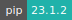

# Transcriptomics Sandbox


:::: {tab-set}

::: {tab-item} 2023-03

[](https://cloud.sdu.dk/app/jobs/create?app=transcriptomics&version=2023.03)


* **Operating System:** 
* **Shell:** 
* **Editor:**   
* **Package Manager:**   
* **Programming Language:**   

:::

::: {tab-item} 2022-09

[](https://cloud.sdu.dk/app/jobs/create?app=transcriptomics&version=2022.09)


* **Operating System:** 
* **Shell:** 
* **Editor:**   
* **Package Manager:**   
* **Programming Language:**   

:::

::::

In this app you will find transcriptomics related courses you can learn from, and datasets and tools you can work with for your own research/learning purposes. The included materials and tools are organized by the **[Health Data Science sandbox](https://hds-sandbox.github.io)**.

Most items of this sandbox are currently based on [Rstudio Server](https://www.rstudio.com/). Rstudio is a web-based integrated development environment for R programming language, including R Markdown, code, and data. Typically, each item includes a dedicated webpage with additional information, guides, and material.

## Available Items

Items are periodically added to this app and can be chosen from the menu. Each item can be a course, a setup to work with specific software, a research example and comes with all necessary packages installed, eventual notebooks with computer code and explanations, and a dedicated webpage with additional material (notes, slides, recordings, ...).

The available tools are:

| **Tool Name** | **Description** | **Links**   | **Programming Language** |
| ------------- | --------------- | :---------: | ------------------------ |
| **RNAseq in <br/> Rstudio**  | <div style="text-align: left"> Rstudio session with common bulk and single cell RNAseq packages such as `DESeq2`, `Seurat` and `clusterProfiler`. </div> | [Webpage](https://posit.co/) | R, Rstudio |
| **Cirrocumulus**  | <div style="text-align: left"> Cirrocumulus is an interactive visualization tool for large-scale single-cell genomics data. </div> | [Webpage](https://cirrocumulus.readthedocs.io/en/latest/) | Python, JavaScript |

### Packages for RNAseq in Rstudio
A few R packages have been installed in order to work with RNAseq data. Other packages and dependencies might be installed but are not shown here.

| **CRAN**        | **Bioconductor**   | **Remotes**       |
| --------        | ----------------   | -----------       |
| `BiocManager`   | `GenomeInfoDb`     | `seurat-wrappers` |
| `tidyverse`     | `clusterProfiler`  | `seurat-data`     |
| `RColorBrewer`  | `DOSE`             | `annotables`      |
| `pheatmap`      | `org.Hs.eg.db`     | `seurat-disk`     |
| `ggrepel`       | `org.Mm.eg.db`     |                   |
| `cowplot`       | `org.Dm.eg.db`     |                   |
| `Seurat`        | `pathview`         |                   |
| `patchwork`     | `DEGreport`        |                   |
| `sctransform`   | `tximport`         |                   |
| `DESeq2`        | `AnnotationHub`    |                   |
| `Signac`        | `ensembldb`        |                   |
|                 | `apeglm`           |                   |
|                 | `ggnewscale`       |                   |
|                 | `rhdf5`            |                   |
|                 | `slingshot`        |                   |
|                 | `gprofiler2`       |                   |

## Courses

The available courses are:

| **Course Title**                         | **Course Code**     | **Description** | **Links** | **Programming Language** |
| ---------------------------------------- | ------------------- | --------------- | :-------: | ------------------------ |
| **Introduction to <br/> bulk RNAseq <br/> analysis** | Intro_to_bulkRNAseq |<div style="text-align: left"> A 3-day course to introduce bulk RNAseq analysis, from data alignment to bioinformatics analysis </div> | [Webpage](https://hds-sandbox.github.io/bulk_RNAseq_course/) | R, Bash, Nextflow |
| **Introduction to <br/>single cell RNAseq  <br/> analysis** | Intro_to_scRNAseq_R |<div style="text-align: left"> A 2-day course to introduce single cell RNAseq analysis in R </div> | [Webpage](https://hds-sandbox.github.io/scRNASeq_course/) | R |


``` {note}
Course materials will automatically be downloaded unless you import a folder called `Intro_to_bulkRNAseq` or `Intro_to_scRNAseq_R`, respectively, in the job submission page.
```

## Save your work

Everything saved in the `/work` folder will be saved in your personal folder after you finish your job in UCloud.

## Additional options

Before submitting the app, you can choose the amount of resources you need. Additionally, you can add folders so that they will be visible when using the app. Adding folders is useful if:

- You want to use a folder containing **your own data and code**, with which you want to perform analysis with the Transcriptomics tools of a course/module.

- You want to continue working on the material **from a previous session** of the Transcriptomics Sandbox. In such a case, add the folder containing the material using the *Add folder* optional parameter.
