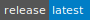
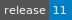
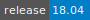

# Virtual Machine

:::::: {tab-set}

::::: {tab-item} Arch Linux

:::: {tab-set}

::: {tab-item} Latest

[](https://cloud.sdu.dk/app/jobs/create?app=arch-linux&version=latest)


* **Operating System:** 

:::

::::

:::::

::::: {tab-item} CentOS

:::: {tab-set}

::: {tab-item} Latest

[](https://cloud.sdu.dk/app/jobs/create?app=centos-aau&version=latest)


* **Operating System:** 

:::

::::

:::::

::::: {tab-item} Debian

:::: {tab-set}

::: {tab-item} 11

[](https://cloud.sdu.dk/app/jobs/create?app=debian-aau&version=11)


* **Operating System:** 

:::

::::

:::::

::::: {tab-item} Ubuntu

:::: {tab-set}

::: {tab-item} 22.04

[](https://cloud.sdu.dk/app/jobs/create?app=ubuntu-aau&version=22.04)


* **Operating System:** 

:::

::: {tab-item} 20.04

[](https://cloud.sdu.dk/app/jobs/create?app=ubuntu-aau&version=20.04)


* **Operating System:** 

:::

::: {tab-item} 18.04

[](https://cloud.sdu.dk/app/jobs/create?app=ubuntu-aau&version=18.04)


* **Operating System:** 

:::

::::

:::::

::::: {tab-item} Ubuntu (CUDA)

:::: {tab-set}

::: {tab-item} 20.04

[](https://cloud.sdu.dk/app/jobs/create?app=ubuntu-aau&version=20.04)


* **Operating System:** 

:::

::: {tab-item} 18.04

[](https://cloud.sdu.dk/app/jobs/create?app=ubuntu-aau&version=18.04)


* **Operating System:** 

:::

::::

:::::

::::: {tab-item} Ubuntu (CUDA + Jupyter)

:::: {tab-set}

::: {tab-item} 20.04

[](https://cloud.sdu.dk/app/jobs/create?app=ubuntu-aau&version=20.04)


* **Operating System:** 

:::

::: {tab-item} 18.04

[](https://cloud.sdu.dk/app/jobs/create?app=ubuntu-aau&version=18.04)


* **Operating System:** 

:::

::::

:::::

::::::

Use this application to start a Linux [Virtual Machine](https://cloud.sdu.dk/app/applications?tag=Virtual%20Machines&itemsPerPage=25&page=0).

On the job submission page, users need to paste a valid [SSH public key](https://en.wikipedia.org/wiki/Ssh-keygen), which will be used to access the Virtual Machine.

``` {important}
Data must be transferred via SSH from the Virtual Machine before stopping the job, otherwise it will be lost.
```
