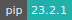
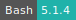
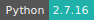
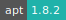
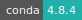

# Voilà

:::: {tab-set}

::: {tab-item} 0.5.5

[](https://cloud.sdu.dk/app/jobs/create?app=voila&version=0.5.5)


* **Operating System:** 
* **Terminal:**  
* **Shell:**   
* **Editor:**   
* **Package Manager:**     
* **Programming Language:**   
* **Utility:**  
* **Extension:** 

:::

::: {tab-item} 0.4.3

[](https://cloud.sdu.dk/app/jobs/create?app=voila&version=0.4.3)


* **Operating System:** 
* **Terminal:**  
* **Shell:**   
* **Editor:**   
* **Package Manager:**     
* **Programming Language:**    
* **Utility:** 
* **Extension:** 

:::

::: {tab-item} 0.3.5

[](https://cloud.sdu.dk/app/jobs/create?app=voila&version=0.3.5)


* **Operating System:** 
* **Terminal:** 
* **Shell:** 
* **Editor:**   
* **Package Manager:**     
* **Programming Language:**  
* **Database:** 

:::

::: {tab-item} 0.2.14

[](https://cloud.sdu.dk/app/jobs/create?app=voila&version=0.2.14)


* **Operating System:** 
* **Shell:** 
* **Editor:**   
* **Package Manager:**     
* **Programming Language:**   
* **Database:** 

:::

::: {tab-item} 0.1.23

[](https://cloud.sdu.dk/app/jobs/create?app=voila&version=0.1.23)


* **Operating System:** 
* **Shell:** 
* **Editor:**   
* **Package Manager:**     
* **Programming Language:**   
* **Database:** 

:::

::::

[Voilà](https://github.com/voila-dashboards/voila/tree/stable) converts a Jupyter Notebook into an interactive dashboard that allows you to share your work with others. It is secure and customizable, giving you control over what your readers experience.

## Deployment mode

The application is served in two modes:
- *Development*: as a Jupyter Lab extension (default).
- *Production*: as a standalone application, by specifying a Jupyter Notebook via the **Notebook** parameter.

## Initialization

For information on how to use the *Initialization* parameter, please refer to the [Initialization - Bash script](../hands-on/init-sh.md), [Initialization - Conda packages](../hands-on/init-conda.md), and [Initialization - pip packages](../hands-on/init-pip.md) section of the documentation.

## Add a template

Voilà uses `nbconvert` to convert Jupyter notebooks into an HTML dashboard. `nbconvert` has a rich templating system that allows to customize the way in which the notebook is converted into HTML.

A new Voilà template project can be generated using [Cookiecutter](https://github.com/voila-dashboards/voila-template-cookiecutter). The template directory must be mounted inside the application and copied in ``$VOILA_TEMPLATE_DIR``, e.g. by
running a Bash script imported via the *Initialization* parameter.

``` {note}
The template can be selected in production mode by setting the _Configuration_ parameter: ``template=mytemplate``.
```

## Add multiple settings

The *Configuration* parameter allows the user to implement multiple Voilà configuration settings at the same time. By default this parameter accepts a single string in the format:

`<config-key>=<config-value>`.

This is equivalent to set the option: `--VoilaConfiguration.<config-key>=<config-value>`. This can be generalized by appending additional configuration options to the first string.
For example, the following values of the *Configuration* parameter provide the same settings:

`file_allowlist=['.*'] --template mytemplate`

or

`file_allowlist=['.*'] --VoilaConfiguration.template=mytemplate`

or

`template=mytemplate --VoilaConfiguration.file_allowlist=['.*']` .
