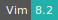
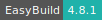
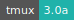

# Voyant Server

:::: {tab-set}

::: {tab-item} 2.6.10

[](https://cloud.sdu.dk/app/jobs/create?app=voyantserver&version=2.6.10)
[](interactive_apps.md)

* **Operating System:** 
* **Terminal:**  
* **Shell:**   
* **Editor:**   
* **Package Manager:**    
* **Programming Language:**   
* **Utility:**  
* **Extension:** 

:::

::: {tab-item} 2.5.3

[](https://cloud.sdu.dk/app/jobs/create?app=voyantserver&version=2.5.3)
[](interactive_apps.md)

* **Operating System:** 
* **Terminal:** 
* **Shell:** 
* **Editor:**   
* **Package Manager:**  
* **Programming Language:** 

:::

::::

Voyant Server is a standalone version of the Voyant Tools server, i.e. a web-based text reading and analysis environment. It is a scholarly project that is designed to facilitate reading and interpretive practices for digital humanities students and scholars as well as for the general public.

For more information, check [here](https://voyant-tools.org/docs/#!/guide)

## Select the data folder

By default the data folder is a temporary directory.

However, through the option *DATA_DIR* it is possible to specify the path to an existing directory.

``` {note}
In this case the default example data (currently the Shakespeare, Austen's Novels and Mary Shelley's Frankenstein corpora) are not accessible, if not present in your data folder.
```

If the folder selected with the *DATA_DIR* option is empty, the default example directory can be included with the option *-e*.

## Add corpora to the drop down menu

The option *-c* (used in combination with *DATA_DIR*) defines which corpora appear in the drop-down menu.
If this option is not selected then the default value is used (currently the Austen and Shakespeare corpora).

Corpora are defined using a special syntax and multiple corpora are separated by semi-colon. For instance, by writing the string:

```console
mycorpora1:title1;mycorpora2:title2
```

*mycorpora1* and *mycorpora2* correspond to the folder names in the `trombone5_2/corpora` subdirectory of the *DATA_DIR* path, while *title1* and *title2* correspond to the menu items.

## Access a Spyral Notebook

A *Spyral Notebook* is accessible by adding `/spyral` to the web page URL.

Spyral Notebooks are dynamic documents that combine writing, code and data in service of reading, analyzing and interpreting digital texts.
