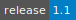
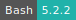
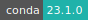

# Whisper Transcription

- **Operating System:** 
- **Terminal:**  
- **Shell:**   
- **Editor:**   
- **Package Manager:**     
- **Programming Language:**    
- **Utility:** 
- **Extension:** 

---

This utility is used to make a transcription of a voice or video recording, using the
[Whisper](https://openai.com/research/whisper) large language model from [OpenAI](http://openai.com/).

## Input format

The app can process `.mp3`, `.mp4`, `.m4a`, `.wav` and `.mpg` files.

## Output format

- CSV: \
  Contains every parameter outputted from the whisper model.

- DOTE: \
  [DOTE](https://www.dote.aau.dk/) Transcription software developed by the [BigSoftVideo](https://www.dote.aau.dk/about) team at AAU

- DOCX: \
  [Office Open XML Document](https://en.wikipedia.org/wiki/Office_Open_XML_file_formats) (Microsoft Word)

- JSON: \
  JavaScript Object Notation

- SRT: \
  [SubRip file format](https://en.wikipedia.org/wiki/.srt), widely adopted subtitle format

- TSV: \
  [Tab-separated value](https://en.wikipedia.org/wiki/Tab-separated_values) file contain start, end and text

- TXT: \
  Pure text file with the transcription

- VTT: \
  [Web Video Text Tracks](https://en.wikipedia.org/wiki/WebVTT) format

- ZIP: \
  Archive with all of the output files. If Archive Password is set, then the archive is encrypted with [AES](https://en.wikipedia.org/wiki/Advanced_Encryption_Standard)

## Output Folder

By default the transcript files are saved in `/Jobs/Whisper Transcription/<job-id>/out`. The user can select an other directory using the corresponding optional parameter.

## Interactive mode

The _Interactive mode_ parameter is used to start an interactive job session where the user can either select "Open terminal" or "Open interface". The latter gives access to a JupyterLab workspace to run notebooks.
