# ANSYS

:::::: {tab-set}

::::: {tab-item} General Platform

:::: {tab-set}

::: {tab-item} 2023R2

[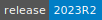](https://cloud.sdu.dk/app/jobs/create?app=ansys&version=2023.R2)

* **Operating System:** 
* **Terminal:**  
* **Shell:**   
* **Editor:**   
* **Package Manager:**     
* **Programming Language:**    
* **Database:** 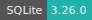
* **Utility:** `CDF Post`, `CFX`, `Fluent`, `Mechanical APDL`, `Workbech`

:::

::: {tab-item} 2023R1

[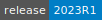](https://cloud.sdu.dk/app/jobs/create?app=ansys&version=2023.R1)

* **Operating System:** 
* **Terminal:**  
* **Shell:**   
* **Editor:**   
* **Package Manager:**     
* **Programming Language:**    
* **Database:** 
* **Utilities:** `CDF Post`, `CFX`, `Fluent`, `Mechanical APDL`, `Workbech`

:::

::: {tab-item} 2022R2

[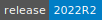](https://cloud.sdu.dk/app/jobs/create?app=ansys&version=2022.R2-1)

* **Operating System:** 
* **Shell:** 
* **Editor:**   
* **Package Manager:**   
* **Programming Language:**   
* **Database:** 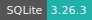
* **Utilities:** `CDF Post`, `CFX`, `Fluent`, `Mechanical APDL`, `Workbech`

:::

::: {tab-item} 2021R2

[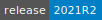](https://cloud.sdu.dk/app/jobs/create?app=ansys&version=2021.R2)

* **Operating System:** 
* **Shell:** 
* **Editor:**   
* **Package Manager:**   
* **Programming Language:**   
* **Database:** 
* **Utilities:** `CDF Post`, `CFX`, `Fluent`, `Mechanical APDL`, `Workbech`

:::

::: {tab-item} 2020R2

[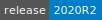](https://cloud.sdu.dk/app/jobs/create?app=ansys&version=2020.R2-1)

* **Operating System:** 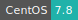
* **Shell:** 
* **Editor:**   
* **Package Manager:** 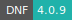   
* **Programming Language:**   
* **Database:** 

:::

::: {tab-item} 2019R2

[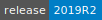](https://cloud.sdu.dk/app/jobs/create?app=ansys&version=2019.R2-11)

* **Operating System:** 
* **Shell:** 
* **Editor:**   
* **Package Manager:**   
* **Programming Language:**   
* **Database:** 

:::

:::::

::::: {tab-item} Electronics Desktop

:::: {tab-set}

::: {tab-item} 2023R2

* **Operating System:** 
* **Terminal:**  
* **Shell:**   
* **Editor:**   
* **Package Manager:**     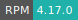
* **Programming Language:**    
* **Database:** 
* **Utilities:** `HFSS`, `HFSS 3D Layout Design`, `HFSS-IE`, `Q3D Extractor`, `2D Extractor`, `Circuit Design`, `Circuit Netlist`, `Maxwell 3D`, `Maxwell 2D`, `RMxprt`, `Maxwell Circuit`, `Icepak`

:::

::: {tab-item} 2022R2

* **Operating System:** 
* **Terminal:** 
* **Shell:** 
* **Editor:**   
* **Package Manager:**    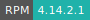 
* **Programming Language:**   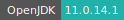    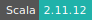
* **Database:** 
* **Utilities:** `HFSS`, `HFSS 3D Layout Design`, `HFSS-IE`, `Q3D Extractor`, `2D Extractor`, `Circuit Design`, `Circuit Netlist`, `Maxwell 3D`, `Maxwell 2D`, `RMxprt`, `Maxwell Circuit`, `Icepak`

:::

::: {tab-item} 2021R1

[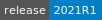](https://cloud.sdu.dk/app/jobs/create?app=ansys-el&version=2021.R1)

* **Operating System:** 
* **Shell:** 
* **Editor:**   
* **Package Manager:**   
* **Programming Language:**    
* **Database:** 
* **Utilities:** `HFSS`, `HFSS 3D Layout Design`, `HFSS-IE`, `Q3D Extractor`, `2D Extractor`, `Circuit Design`, `Circuit Netlist`, `Maxwell 3D`, `Maxwell 2D`, `RMxprt`, `Maxwell Circuit`, `Icepak`

:::

::: {tab-item} 2020R2

* **Operating System:** 
* **Shell:** 
* **Editor:**   
* **Package Manager:**   
* **Programming Language:**    
* **Database:** 

:::

:::::

::::::

ANSYS is a general nonlinear multiphysics software offering structural and
thermodynamic analysis, continuum flow analysis, analysis of electrostatic and electromagnetic fields and acoustic analysis.

For more information, check [here](https://www.ansys.com/).

## License server

A software license is required in order to run this app within a project workspace. Project admins can add one of the available licenses to the active project by means of a [grant application](../guide/resources-grant.md).
