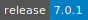
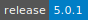

# Cell Ranger

:::: {tab-set}

::: {tab-item} 7.1.0

[](https://cloud.sdu.dk/app/applications?tag=Cell%20Ranger&itemsPerPage=25&page=0)


* **Operating System:** 
* **Terminal:**  
* **Shell:**   
* **Editor:**   
* **Package Manager:**     
* **Programming Language:**    
* **Utility:** 

:::

::: {tab-item} 7.0.1

[](https://cloud.sdu.dk/app/applications?tag=Cell%20Ranger&itemsPerPage=25&page=0)


:::

::: {tab-item} 6.1.1

[](https://cloud.sdu.dk/app/applications?tag=Cell%20Ranger&itemsPerPage=25&page=0)


:::

::: {tab-item} 5.0.1

[](https://cloud.sdu.dk/app/applications?tag=Cell%20Ranger&itemsPerPage=25&page=0)


:::

::: {tab-item} 3.1.0

[](https://cloud.sdu.dk/app/applications?tag=Cell%20Ranger&itemsPerPage=25&page=0)


:::

::::

Cell Ranger is a toolset of analysis pipelines from [10X Genomics](https://www.10xgenomics.com/) that process Chromium single-cell RNA-seq output to align reads, generate feature-barcode matrices and perform clustering and gene expression analysis.

For more information, check [here](https://support.10xgenomics.com/single-cell-gene-expression/software/pipelines/latest/what-is-cell-ranger).

<details>
<summary><b>Cell Ranger Utilities</b></summary>

- [](https://cloud.sdu.dk/app/jobs/create?app=cellranger-aggr&version=7.0.1)
- [](https://cloud.sdu.dk/app/jobs/create?app=cellranger-count&version=7.0.1)
- [](https://cloud.sdu.dk/app/jobs/create?app=cellranger-mat2csv&version=7.0.1)
- [](https://cloud.sdu.dk/app/jobs/create?app=cellranger-mkfastq&version=7.0.1)
- [](https://cloud.sdu.dk/app/jobs/create?app=cellranger-mkgtf&version=7.0.1)
- [](https://cloud.sdu.dk/app/jobs/create?app=cellranger-mkref&version=7.0.1)
- [](https://cloud.sdu.dk/app/jobs/create?app=cellranger-mkvdjref&version=7.0.1)
- [](https://cloud.sdu.dk/app/jobs/create?app=cellranger-multi&version=7.0.1)
- [](https://cloud.sdu.dk/app/jobs/create?app=cellranger-reanalyze&version=7.0.1)
- [](https://cloud.sdu.dk/app/jobs/create?app=cellranger-targeted-compare&version=7.0.1)
- [](https://cloud.sdu.dk/app/jobs/create?app=cellranger-terminal&version=7.0.1)
- [](https://cloud.sdu.dk/app/jobs/create?app=cellranger-testrun&version=7.0.1)
- [](https://cloud.sdu.dk/app/jobs/create?app=cellranger-vdj&version=7.0.1)
</details>

## Terminal session

The _Cell Ranger: terminal_ utility allows the user run the different Cell Ranger pipelines via command line by clicking

{{ btn_open_terminal }}

## User interface

When available, the `--uiport=3600` option enables the pipeline's visual user interface (UI), accessible through the button

{{ btn_open_interface }}

``` {note}
The UI port must be ``3600``.
```
