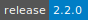
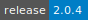
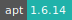
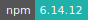

# Charticulator

:::: {tab-set}

::: {tab-item} 2.2.0

[](https://cloud.sdu.dk/app/jobs/create?app=charticulator&version=2.2.0)


* **Operating System:** 
* **Terminal:**  
* **Shell:**   
* **Editor:**   
* **Package Manager:**    
* **Programming Language:**   
* **Utility:** 
* **Extension:** 

:::

::: {tab-item} 2.0.4

[](https://cloud.sdu.dk/app/jobs/create?app=charticulator&version=2.0.4)


* **Operating System:** 
* **Shell:** 
* **Editor:**   
* **Package Manager:**   
* **Programming Language:**  

:::

::::

Charticulator is a new charting tool that allows you to design charts by interactively specifying constraints.

For more information, check [here](https://charticulator.com/).

## Load data

It is possible to link or browse the data from the local PC.

## Import a charticulator template

Clicking the  icon in the toolbar will display a file open dialog so that one can select a template file from the local folders.

## Save to My Charts

Chart designs can be saved to the _My Charts_ list. Please note that the data and charts remain local in the user browser unless downloaded as a chart file.

``` {note}
It is possible to transfer and syncronize local files and directories (including the new generated charts)
with UCloud through [Rsync Server](rsync.md) and [MinIO](minio.md) Apps.
```
