# Coder

:::::: {tab-set}

::::: {tab-item} 1.83.1

[](https://cloud.sdu.dk/app/jobs/create?app=coder&version=1.83.1)


:::: {tab-set}

::: {tab-item} All

* **Operating System:** 
* **Terminal:**  
* **Shell:**   
* **Editor:**   
* **Package Manager:**    
* **Programming Language:**  
* **Utility:**  
* **Extension:** 
* **VSCode Extensions:**  

:::

::: {tab-item} Coder

See *All*.

:::

::: {tab-item} Coder C++

* **Programming Languages:**   
* **VSCode Extensions:** 

:::

::: {tab-item} Coder CUDA

* **Programming Languages:** 
* **Extension:** 
* **VSCode Extensions:**  

:::

::: {tab-item} Coder Java

* **Programming Languages:** 
* **VSCode Extensions:**      

:::

::: {tab-item} Coder Julia

* **Programming Languages:** 
* **VSCode Extensions:** 

:::

::: {tab-item} Coder Python

* **Package Manager:** 
* **VSCode Extensions:** 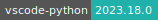 

:::

::::

:::::

::::: {tab-item} 1.82.2

[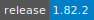](https://cloud.sdu.dk/app/jobs/create?app=coder&version=1.82.2)


:::: {tab-set}

::: {tab-item} All

* **Operating System:** 
* **Terminal:**  
* **Shell:**   
* **Editor:**   
* **Package Manager:**    
* **Programming Language:**  
* **Utility:** 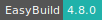 
* **Extension:** 
* **VSCode Extensions:**  

:::

::: {tab-item} Coder

See *All*.

:::

::: {tab-item} Coder C++

* **Programming Languages:**   
* **VSCode Extensions:** 

:::

::: {tab-item} Coder CUDA

* **Programming Languages:** 
* **Extension:** 
* **VSCode Extensions:**  

:::

::: {tab-item} Coder Java

* **Programming Languages:** 
* **VSCode Extensions:**   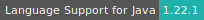   

:::

::: {tab-item} Coder Julia

* **Programming Languages:** 
* **VSCode Extensions:** 

:::

::: {tab-item} Coder Python

* **Package Manager:** 
* **VSCode Extensions:**  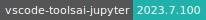

:::

::::

:::::

::::: {tab-item} 1.80.2

[](https://cloud.sdu.dk/app/jobs/create?app=coder&version=1.80.2)


:::: {tab-set}

::: {tab-item} All

* **Operating System:** 
* **Terminal:**  
* **Shell:**   
* **Editor:**   
* **Package Manager:** 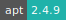   
* **Programming Language:**  
* **Utility:**  
* **Extension:** 
* **VSCode Extensions:**  

:::

::: {tab-item} Coder

See *All*.

:::

::: {tab-item} Coder C++

* **Programming Languages:**   
* **VSCode Extensions:** 

:::

::: {tab-item} Coder CUDA

* **Programming Languages:** 
* **VSCode Extensions:**  

:::

::: {tab-item} Coder Java

* **Programming Languages:** 
* **VSCode Extensions:**      

:::

::: {tab-item} Coder Julia

* **Programming Languages:** 
* **VSCode Extensions:** 

:::

::: {tab-item} Coder Python

* **Package Manager:** 
* **VSCode Extensions:** 

:::

::::

:::::

::::: {tab-item} 1.79.2

[](https://cloud.sdu.dk/app/jobs/create?app=coder&version=1.79.2)


:::: {tab-set}

::: {tab-item} All

* **Operating System:** 
* **Terminal:**  
* **Shell:**  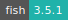 
* **Editor:**   
* **Package Manager:**    
* **Programming Language:**  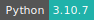 
* **Utility:** 
* **Extension:** 
* **VSCode Extensions:**  
:::

::: {tab-item} Coder

See *All*.

:::

::: {tab-item} Coder C++

* **Programming Languages:**   
* **VSCode Extensions:** 

:::

::: {tab-item} Coder CUDA

* **Programming Languages:** 
* **VSCode Extensions:**  

:::

::: {tab-item} Coder Java

* **Programming Languages:** 
* **VSCode Extensions:**      

:::

::: {tab-item} Coder Julia

* **Programming Languages:** 
* **VSCode Extensions:** 

:::

::: {tab-item} Coder Python

* **VSCode Extensions:** 

:::

::::

:::::

::::: {tab-item} 1.78.2

[](https://cloud.sdu.dk/app/jobs/create?app=coder&version=1.78.2)


:::: {tab-set}

::: {tab-item} All

* **Operating System:** 
* **Terminal:** 
* **Shell:**   
* **Editor:**   
* **Package Manager:**   
* **Programming Language:**   
* **Utility:**  
* **VSCode Extensions:**  
:::

::: {tab-item} Coder

See *All*.

:::

::: {tab-item} Coder C++

* **Programming Languages:**   
* **VSCode Extensions:** 

:::

::: {tab-item} Coder CUDA

* **Programming Languages:**  
* **VSCode Extensions:**  

:::

::: {tab-item} Coder Java

* **Programming Languages:** 
* **VSCode Extensions:**      

:::

::: {tab-item} Coder Julia

* **Programming Languages:** 
* **VSCode Extensions:** 

:::

::: {tab-item} Coder Python

* **VSCode Extensions:**   

:::

::::

:::::

::::: {tab-item} 1.77.3

[](https://cloud.sdu.dk/app/jobs/create?app=coder&version=1.77.3)


:::: {tab-set}

::: {tab-item} All

* **Operating System:** 
* **Terminal:** 
* **Shell:**   
* **Editor:**   
* **Package Manager:**   
* **Programming Language:**   
* **Utility:**  
* **VSCode Extensions:**  
:::

::: {tab-item} Coder

See *All*.

:::

::: {tab-item} Coder C++

* **Programming Languages:**   
* **VSCode Extensions:** 

:::

::: {tab-item} Coder CUDA

* **Programming Languages:**  
* **VSCode Extensions:**  

:::

::: {tab-item} Coder Java

* **Programming Languages:** 
* **VSCode Extensions:**      

:::

::: {tab-item} Coder Julia

* **Programming Languages:** 
* **VSCode Extensions:** 

:::

::: {tab-item} Coder Python

* **VSCode Extensions:**   

:::

::::

:::::

::::: {tab-item} 1.76.1

[](https://cloud.sdu.dk/app/jobs/create?app=coder&version=1.76.1)


:::: {tab-set}

::: {tab-item} All

* **Operating System:** 
* **Terminal:** 
* **Shell:**   
* **Editor:**   
* **Package Manager:**   
* **Programming Language:**  
* **Utility:**  
* **VSCode Extensions:**  
:::

::: {tab-item} Coder

See *All*.

:::

::: {tab-item} Coder C++

* **Programming Languages:**  
* **VSCode Extensions:** 

:::

::: {tab-item} Coder CUDA

* **Programming Languages:**  
* **VSCode Extensions:**  

:::

::: {tab-item} Coder Java

* **Programming Languages:** 
* **VSCode Extensions:**      

:::

::: {tab-item} Coder Julia

* **Programming Languages:** 
* **VSCode Extensions:** 

:::

::: {tab-item} Coder Python

* **VSCode Extensions:**   

:::

::::

:::::

::::: {tab-item} 1.75.1

[](https://cloud.sdu.dk/app/jobs/create?app=coder&version=1.75.1)


:::: {tab-set}

::: {tab-item} All

* **Operating System:** 
* **Terminal:** 
* **Shell:**   
* **Editor:**   
* **Package Manager:**   
* **Programming Language:**  
* **Utility:**  
* **VSCode Extensions:**  
:::

::: {tab-item} Coder

See *All*.

:::

::: {tab-item} Coder C++

* **Programming Languages:**  
* **VSCode Extensions:** 

:::

::: {tab-item} Coder CUDA

* **Programming Languages:**  
* **VSCode Extensions:**  

:::

::: {tab-item} Coder Java

* **Programming Languages:** 
* **VSCode Extensions:**      

:::

::: {tab-item} Coder Julia

* **Programming Languages:** 
* **VSCode Extensions:** 

:::

::: {tab-item} Coder Python

* **VSCode Extensions:**   

:::

::::

:::::

::::: {tab-item} 1.73.1

[](https://cloud.sdu.dk/app/jobs/create?app=coder&version=1.73.1)


:::: {tab-set}

::: {tab-item} All

* **Operating System:** 
* **Terminal:** 
* **Shell:**   
* **Editor:**   
* **Package Manager:**   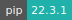
* **Programming Language:**  
* **Utility:**  
* **VSCode Extensions:**  

:::

::: {tab-item} Coder

See *All*.

:::

::: {tab-item} Coder C++

* **Programming Languages:**  
* **VSCode Extensions:** 

:::

::: {tab-item} Coder CUDA

* **Programming Languages:**  
* **VSCode Extensions:**  

:::

::: {tab-item} Coder Java

* **Programming Languages:** 
* **VSCode Extensions:**      

:::

::: {tab-item} Coder Julia

* **Programming Languages:** 
* **VSCode Extensions:** 

:::

::: {tab-item} Coder Python

* **VSCode Extensions:**       

:::

::::

:::::

::::: {tab-item} 1.71.0

[](https://cloud.sdu.dk/app/jobs/create?app=coder&version=1.71.0)


:::: {tab-set}

::: {tab-item} All

* **Operating System:** 
* **Terminal:** 
* **Shell:**   
* **Editor:**   
* **Package Manager:**  
* **Programming Language:**  
* **Utility:** 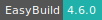 
* **VSCode Extensions:**  

:::

::: {tab-item} Coder

* **Package Manager:** 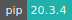

:::

::: {tab-item} Coder C++

* **Package Managers:** 
* **Programming Languages:**  
* **VSCode Extensions:** 

:::

::: {tab-item} Coder Java

* **Package Managers:** 
* **Programming Languages:** 
* **VSCode Extensions:**      

:::

::: {tab-item} Coder Julia

* **Package Managers:** 
* **Programming Languages:** 
* **VSCode Extensions:** 

:::

::: {tab-item} Coder Python

* **Package Managers:** 
* **VSCode Extensions:**      

:::

::::

:::::

::::: {tab-item} 1.66.2

[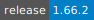](https://cloud.sdu.dk/app/jobs/create?app=coder&version=1.66.2)


:::: {tab-set}

::: {tab-item} All

* **Operating System:** 
* **Terminal:** 
* **Shell:**   
* **Editor:**   
* **Package Manager:**  
* **Programming Language:**  
* **Utility:**  
* **VSCode Extensions:** 

:::

::: {tab-item} Coder

* **Package Managers:** 

:::

::: {tab-item} Coder C++

* **Package Managers:** 
* **Programming Languages:**  
* **VSCode Extensions:** 

:::

::: {tab-item} Coder Java

* **Package Managers:** 
* **Programming Languages:** 
* **VSCode Extensions:**      

:::

::: {tab-item} Coder Julia

* **Package Managers:** 
* **Programming Languages:** 
* **VSCode Extensions:** 

:::

::: {tab-item} Coder Python

* **Package Managers:** 
* **VSCode Extensions:**      

:::

::::

:::::

::::: {tab-item} 1.64.2

[](https://cloud.sdu.dk/app/jobs/create?app=coder&version=1.64.2)


:::: {tab-set}

::: {tab-item} All

* **Operating System:** 
* **Terminal:** 
* **Shell:**   
* **Editor:**   
* **Package Manager:**  
* **Programming Language:**  
* **Utility:**  
* **VSCode Extensions:** 

:::

::: {tab-item} Coder

* **Package Managers:** 

:::

::: {tab-item} Coder C++

* **Package Managers:** 
* **Programming Languages:**  
* **VSCode Extensions:** 

:::

::: {tab-item} Coder Java

* **Package Managers:** 
* **Programming Languages:** 
* **VSCode Extensions:**      

:::

::: {tab-item} Coder Julia

* **Package Manager:** 
* **Programming Language:** 
* **VSCode Extensions:** 

:::

::: {tab-item} Coder Python

* **Package Managers:** 
* **VSCode Extensions:**   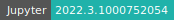   

:::

::::

:::::

::::: {tab-item} 1.48.2

[](https://cloud.sdu.dk/app/jobs/create?app=coder&version=1.48.2)


:::: {tab-set}

::: {tab-item} All

* **Operating System:** 
* **Shell:** 
* **Editor:**  
* **Package Manager:** 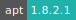 
* **Programming Language:**  
* **VSCode Extensions:** 

:::

::: {tab-item} Coder

See *All*.

:::

::: {tab-item} Coder C++

* **Programming Languages:**    
* **VSCode Extensions:** 

:::

::: {tab-item} Coder Java

* **Programming Language:** 
* **VSCode Extensions:**      

:::

::: {tab-item} Coder Python

* **Package Manager:** 
* **VSCode Extensions:**      

:::

::::

:::::

::::: {tab-item} 1.45.1

[](https://cloud.sdu.dk/app/jobs/create?app=coder&version=1.45.1-1)


:::: {tab-set}

::: {tab-item} All

* **Operating System:** 
* **Shell:** 
* **Editor:**  
* **Package Manager:**  
* **Programming Language:**  

:::

::: {tab-item} Coder

See *All*.

:::

::: {tab-item} Coder C++

* **Programming Languages:**    
* **VSCode Extensions:** 

:::

::: {tab-item} Coder Python

* **Package Manager:** 
* **Extensions:**      
* **Database:** 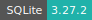

:::

::::

:::::

::::: {tab-item} 1.41.1

[](https://cloud.sdu.dk/app/jobs/create?app=coder&version=1.41.1)


:::: {tab-set}

::: {tab-item} All

* **Operating System:** 
* **Shell:** 
* **Editor:** 
* **Package Manager:**  
* **Programming Language:**  

:::

::: {tab-item} Coder

See *All*.

:::

::: {tab-item} Coder C++

* **Programming Languages:**   
* **VSCode Extensions:** 

:::

::: {tab-item} Coder Python

* **Package Manager:** 
* **Extensions:**      
* **Database:** 

:::

::::

:::::

::::::

Visual Studio [Code Server](https://coder.com).

## Install new software

The default user inside the application container is `coder`, which has also superuser account privileges.
Therefore, full read, write, and execute permissions are enabled using `sudo` in front of any command, without entering an administrator password.

Before installing a new software, it is always recommended to update the system libraries.
For example, to install the Ruby programming language one should run the commands:

```console
$ sudo apt-get --allow-releaseinfo-change update -y
$ sudo apt-get install -y ruby
```

Visual Studio Code extensions are installed by default in the folder `$VSCODE_EXTENSIONS`.

### Environment modules

The app supports an environment module system based on Lmod and EasyBuild. which is used to build, install and load software applications as separate modules.
A brief introduction to EasyBuild is available [here](terminal.md#easybuild).

New software modules should be installed in a directory accessible from the _default working tree_, e.g. `/work/sandbox`. As a result, the `sandbox` software stack will be available in the UCloud workspace once the job is completed. The user should mount this folder as a data volume inside the app and make the new modules available from the command-line interface:

```console
$ module use /work/sandbox/modules/all/
```

To check all available modules, use the command:

```console
$ module avail
```

More commands are listed [here](terminal.md#environment-modules).

``` {note}
Environment modules are loaded automatically when the ``sandbox`` folder is mounted using the optional *Modules path* parameter.
```


## Initialization

For information on how to use the *Initialization* parameter, please refer to the [Initialization - Bash script](../hands-on/init-sh.md) section of the documentation.

## Configure SSH access

The app provides optional [support for SSH access](general_settings.md#configure-ssh-access) from an external client. An SSH *public key* must be uploaded using the corresponding panel in *Resources* section of the UCloud side menu.

By checking on *Enable SSH server* a random port is opened for connection. The connection command is shown in the job progress view page.

## Set default compiler

The default compilers installed in the application container are linked in the folder `/etc/alternatives`.
They can be changed via terminal using the `update-alternative` command.
For example, the following command gives the complete list of the GCC compilers installed in the Coder C++ app:

```console
$ sudo update-alternatives --list gcc
```

``` {tip}
/usr/bin/gcc-10

/usr/bin/gcc-9
```

A new default compiler can be set with the command:

```console
$ sudo update-alternatives --config gcc
```

and selecting the number corresponding to a given release.
The new settings can be verified using:

```console
$ gcc --version
```

## Start Live Share session

Visual Studio Code [Live Share](https://visualstudio.microsoft.com/services/live-share/) enables the user to quickly collaborate on the same codebase without the need to synchronize code or to configure the same development tools, settings, or environment.

The following video shows how to start and share a collaboration session.

<video width=100% controls>
  <source src="../Coder-Live-Share.mov" type="video/mp4">
</video>

``` {note}
The collaboration session is kept active only if the app is deployed with a [public link](general_settings.md#configure-custom-links).
```
