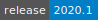
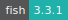
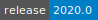

# Dalton

:::: {tab-set}

::: {tab-item} 2020.1

[](https://cloud.sdu.dk/app/jobs/create?app=dalton&version=2020.1)


* **Operating System:** 
* **Terminal:**  
* **Shell:**   
* **Editor:**   
* **Package Manager:**    
* **Programming Language:**  
* **Utility:**  
* **Extension:** 

:::

::: {tab-item} 2020.0

[](https://cloud.sdu.dk/app/jobs/create?app=dalton&version=2020.0)


* **Operating System:** 
* **Shell:** 
* **Editor:**   
* **Package Manager:**  
* **Programming Language:**  

:::

::::

The Dalton program is designed to allow convenient, automated determination of a large number of molecular properties based on an HF, HF-srDFT, DFT, MP2, CC, CI, MCSCF, or MC-srDFT reference wave function.

Homepage for the Dalton program can be found at [daltonprogram.org](https://daltonprogram.org/).
Documentation for the Dalton program can be found [here](https://daltonprogram.org/manuals/dalton2020manual.pdf).

## Batch mode (default)

The app receives the following two *mandatory* parameters:

- *molecule file*: File containing molecular coordinates, molecular charge, and basis-set specifications.
- *dalton input file*: File containing information about electronic-structure methods to be used.

## Interactive mode

By selecting the _interactive mode_, the user can open a terminal window
available on the progress view page of the job and run Dalton from the command line.
All *optional* parameters given through the UCloud interface will be ignored when starting _interactive mode_.
Dalton can be run from the command line by calling `dalton`, e.g.:

```console
dalton -np 4 -dal <filename>.dal -mol <filename>.mol
```

More options can be given when calling the Dalton program from the command line.
See the [Dalton documentation](https://daltonprogram.org/manuals/dalton2020manual.pdf) for additional options.
