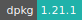

# FEniCSx

:::: {tab-set}

::: {tab-item} 0.7.2

* **Operating System:** 
* **Terminal:**  
* **Shell:**   
* **Editor:**   
* **Package Manager:**   
* **Programming Language:**  
* **Extension:** 

:::

::: {tab-item} 0.6.0

* **Operating System:** 
* **Terminal:**  
* **Shell:** 
* **Editor:**   
* **Package Manager:**   
* **Programming Language:**  
* **Extension:** 

:::

::: {tab-item} 0.5.1

* **Operating System:** 
* **Terminal:** 
* **Shell:** 
* **Editor:**   
* **Package Manager:**   
* **Programming Language:**  

:::

::: {tab-item} 0.4.1

* **Operating System:** 
* **Terminal:** 
* **Shell:** 
* **Editor:**   
* **Package Manager:**   
* **Programming Language:**  

:::

::::

The FEniCSx Project is a collection of free and open-source software components with the common goal of enabling automated solution of differential equations.
The components provide scientific computing tools for working with computational meshes, finite-element variational formulations of ordinary and partial differential equations, and numerical linear algebra with the high-level Python and C++ interfaces.

For more information, check [here](https://fenicsproject.org/).

## Select input parameters

FEniCSx can be run either in batch mode or interactively.
When the *Interactive mode* option is selected, a Jupyter Notebook interface is accessible.

If FEniCSx is executed in batch mode then the following two input parameters must be specified:

- *Input file*: the main source file for the app, namely a script.py file. (Requires to mount the folder which contains the script).

- *Mount* data folder: the directory with the data and the source code. This parameter is optional while running in interactive mode.

Additional packages can be installed inside the application container using the *Initialization* parameter.
The user should provide the list of packages via a text file (`.txt`).
The installation is done via the `pip3` package installer.
