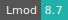
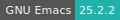

# FreeCAD

:::: {tab-set}

::: {tab-item} 0.20.1

[](https://cloud.sdu.dk/app/jobs/create?app=freecad&version=0.20.1)


* **Operating System:** 
* **Terminal:**  
* **Shell:**   
* **Editor:**   
* **Package Manager:**    
* **Programming Language:**    
* **Database:** 
* **Utility:**  
* **Extension:** 

:::

::: {tab-item} 0.18.4

[](https://cloud.sdu.dk/app/jobs/create?app=freecad&version=0.18.4-1)


* **Operating System:** 
* **Shell:** 
* **Editor:**   
* **Package Manager:**   
* **Programming Language:**    
* **Database:** 
:::

::::

FreeCAD is a general-purpose parametric 3D computer-aided design (CAD) modeler and a building information modeling (BIM) software with finite element method (FEM) support. FreeCAD is intended for mechanical engineering product design but also expands to architecture or electrical engineering. Users can extend the functionality of the software using the Python programming language. Meshing tools include Gmsh and Netgen (netgen-mesher).

For more information, check [here](https://www.freecadweb.org).

## Getting started

FreeCAD, Gmsh and Netgen can be started by double-clicking on the corresponding desktop icons. They can also be started directly from the command line by typing `freecad`, `gmsh` or `netgen`, respectively. This allows to change some of the default startup options.

Current options are available by typing:

```console
$ freecad --help
```

## Running without GUI

FreeCAD can be used in console mode using the `-c` switch from the command line:

```console
$ freecad -c
```

or by using the command:

```console
$ freecadcmd
```

In console mode, no user interface will be displayed, and you will be presented with a Python interpreter prompt.
