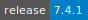
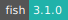
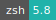
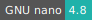
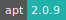
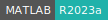
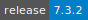
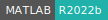

# FreeSurfer

:::: {tab-set}

::: {tab-item} 7.4.1

* **Operating System:** 
* **Terminal:**  
* **Shell:**   
* **Editor:**   
* **Package Manager:**   
* **Programming Language:**   

:::

::: {tab-item} 7.3.2

* **Operating System:** 
* **Terminal:** 
* **Shell:** 
* **Editor:**   
* **Package Manager:**   
* **Programming Language:**   

:::

::::

[FreeSurfer](https://surfer.nmr.mgh.harvard.edu/) is a software package for the analysis and visualization of neuroimaging data from cross-sectional and longitudinal studies.

FreeSurfer provides full processing streams for structural and functional MRI and includes tools for linear and nonlinear registration, cortical and subcortical segmentation, cortical surface reconstruction, statistical analysis of group morphometry, diffusion MRI, PET analysis, and much more.

## Initialization

For information on how to use the *Initialization* parameter, please refer to the [Initialization - Bash script](../hands-on/init-sh.md), [Initialization - Conda packages](../hands-on/init-conda.md), and [Initialization - pip packages](../hands-on/init-pip.md) section of the documentation.

## FreeSurfer license

The user can import a personal license file using the *FreeSurfer license* optional parameter.

## MATLAB network license

Depending on the user institution, it is possible to request access to a license server using the *Select MATLAB license server* optional parameter. The license server must be added to an active project by means of a [grant application](../guide/resources-grant.md).
Project admins can restrict access to the license as discussed [here](../guide/project-overview.md#license-management).

For more information about MATLAB, check the related documentation [here](matlab.md).
