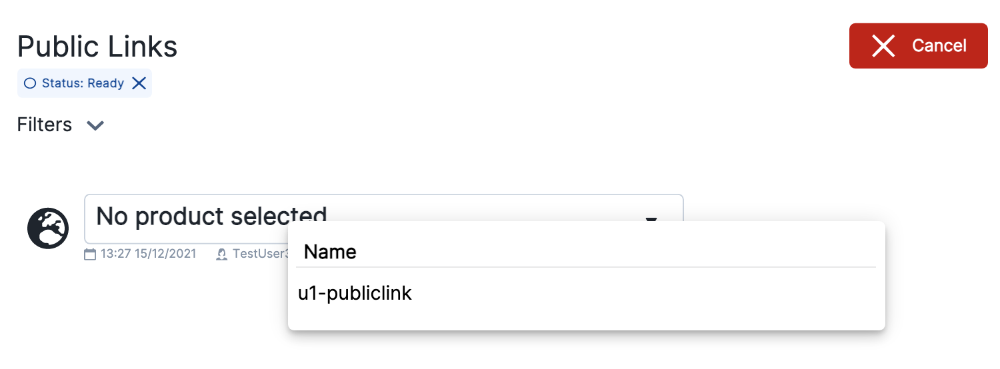
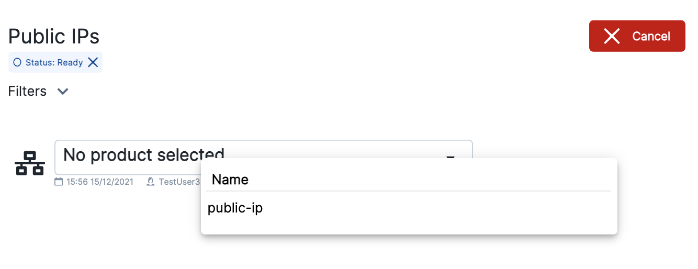
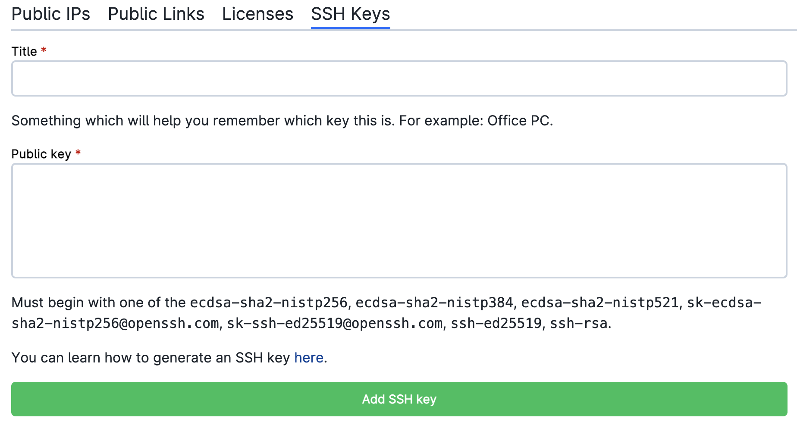

# General Settings

All software applications listed in the UCloud apps catalogue are collected in one or more categories.

Most of these applications are developed for the **DeiC intereactive HPC (AAU, SDU)** provider, whereas software specialized for other providers comes in special categories (e.g. **Type 3**).

The general app configuration settings are summarized below.

## Job lifetime

The user should always estimate the time necessary to complete the run before [submitting a job](../guide/submitting.md). A reliable estimate of the program execution time is important to ensure fast job scheduling and completion.

::: {note}

There is no upper limit to the job lifetime. The time allocation can also be extended at [runtime](../guide/submitting.md#job-running).

:::

## Machine type

Before submitting a job, the user must select a machine type. The latter  depends on the [products](../guide/resources-products.md) available in the active workspace and on the [provider](../guide/providers.md).

::: {note}

Selecting a machine with a large number of resources may result in a longer job scheduling.

:::

## Import data

A folder can be attached as a data volume inside the application container using the button

{{ btn_add_folder }}

in the [front-end  page](../guide/submitting.md#setting-parameter-values) of the app. Data volumes are mounted within the `/work` directory inside the application container. This also corresponds to the _default working tree_ on UCloud.

Data volumes can also be mounted in multiple apps running simultaneously.

::: {important}

Only files and folders located in the *default working tree* are saved after [job completion](../guide/submitting.md#job-completed).

:::

## Multi-node deployment

Distributed computing across multiple cluster nodes is enabled for only a few supported applications of the **DeiC Interactive HPC (SDU)** provider. See the [Spark Cluster](spark-cluster.md) app and the [Terminal](terminal.md#create-a-slurm-cluster) for practical use cases.

## Connect to other jobs

This option is used when it is necessary to use services from other jobs as networking and shared application file systems. By clicking on

{{ btn_connect_to_job }}

the user is able to select the ID of a running job and set a *hostname* parameter, which is used to assign an IP address to the node where the selected job is executed.

## Configure custom links

This option allows to create _public URLs_ to grant external access to the application from a web interface. This feature is available only for interactive apps. It can be used, for example, to share dashboard apps deployed on UCloud. Multiple public URLs can be set during the same job session.

To register a new link, click on

{{ btn_create_public_link }}

and select a _product_, as shown below:
 

 

A string should be added, which will be included in the link name.

Once registered, the public URL is accessible only to project admins.
By clicking on the link name it is possible to
create  a group with access to the public link, or change existing groups permission.
The same operations can be done by selecting the [Resources](../guide/navigation-menu.md) panel
in the side menu.

::: {note}

A public URL will be accessible as long as the job is running.

:::

## Attach public IP addresses

This option is used to attach a static IP address to an app deployed on UCloud. In this way it is possible to access the app via an external client. Public IPs may be used to deploy server applications.

To create a new IP address, click on

{{ btn_create_public_ip }}

and select a _product_, as shown below:
 

 

The IP address is unique: It is not possible to select the same IP for multiple job sessions running at the same time.

Once the IP address is allocated, the user can configure the protocol (TCP/UDP) and the corresponding port number by clicking on the address or selecting _Properties_ from the address side menu.
The protocol can be configured also from the [Resources](../guide/navigation-menu.md) panel in the dashboard side menu.

Project admins can also restrict the usage of specific IPs to a selected group of collaborators.

::: {important}

By enabling this feature, anyone with the IP can contact the application. Actions must be taken to ensure that the application is adequately protected.

:::

## Configure SSH access

Some applications start an SSH server to encrypt and secure data transfer from a remote host, provided that a valid SSH *public key* is added to the active UCloud workspace. The SSH key can be configured using the corresponding panel in the *Resources* section of the UCloud [side menu](../guide/navigation-menu.md):
 

 

Once the application is started, a new panel is shown in job [progress view](../guide/submitting.md#job-running) reporting the SSH login command.
