# Genomics Sandbox


:::: {tab-set}

::: {tab-item} 2023-03-01

[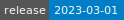](https://cloud.sdu.dk/app/jobs/create?app=genomics&version=2023.03.01)


* **Operating System:** 
* **Terminal:** 
* **Shell:** 
* **Editor:**   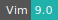
* **Package Manager:**   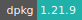 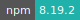 
* **Programming Language:**  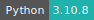

:::

::: {tab-item} 2022-08-01

[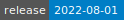](https://cloud.sdu.dk/app/jobs/create?app=genomics&version=2022.08.01)


* **Operating System:** 
* **Terminal:** 
* **Shell:** 
* **Editor:**   
* **Package Manager:**  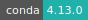  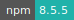 
* **Programming Language:**  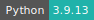

:::

::::

In this app you will find material for the Genomics sandbox of the **[Health Data Science sandbox](https://hds-sandbox.github.io)**. This contains courses you can learn from, datasets and tools you can work with for your own research/learning purposes. Each course item of this sandbox is based on JupyterLab. JupyterLab is a web-based integrated development environment for Jupyter notebooks, code, and data. Usually, each item includes a dedicated webpage with additional information, guides, and material.

## Available material

Items are periodically added to this app and can be chosen from the menu. Each item can a course, a setup to work with specific software, a research example, and comes with all necessary packages already installed, notebooks with code and explanations, and a dedicated webpage with additional material (notes, slides, recordings, ...).

### Courses

 The available courses are:

| **Course Name**   | **Description**   | **Link**   | **Programming Language** |
| ---------------   | ---------------   | :--------: | ------------------------ |
| **Introduction to NGS <br/> Data Analysis**  | <div style="text-align: left"> A one-week course to introduce NGS data, from data alignment to bioinformatics analysis </div> | [Webpage](https://hds-sandbox.github.io/NGS_summer_course_Aarhus/) | Python, R, Bash |
| **Introduction to <br/> Population Genomics**  | <div style="text-align: justify"> A course introducing and applying bioinformatic tools to perform a whole population genomics analysis </div> | [Webpage](https://hds-sandbox.github.io/NGS_summer_course_Aarhus/) | Python, R, Bash |
| **Introduction to GWAS**                 | <div style="text-align: justify">  An introductory course in Genome-Wide Association Studies                                               </div> | [Webpage](https://hds-sandbox.github.io/GWAS_course/) | R, Bash |

### Tools

The available tools are:

| **Tool Name**     | **Description** |  **Links**    | **Programming language** |
| ----------------- | --------------- | ------------- | ------------------------ |
| **Integrative Genomics Viewer**     | <div style="text-align: justify"> A High-performance, easy-to-use, interactive tool for the visual exploration of genomic data. It supports flexible integration of all the common types of genomic data and metadata, investigator-generated or publicly available. </div> | [Official Manual](https://igvteam.github.io/igv-webapp/) | Interactive User Interface |

## Choosing an item

You can choose a course or a tool from the drop down menu accessible in the job submission page (red circle in the figure below).
<br>

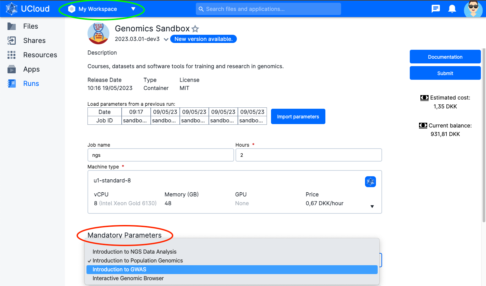

<br>

``` {note}
The App needs to download data and packages. Depending on the selected course/tool, this can take some time. See below how to reuse data and avoid long waiting times (you still need to download data the first time you run the app).
```

### Available options

You can use data and notebooks running in a previous session of the app, otherwise, all the datasets the notebooks will be downloaded every time a new session is started.

To choose the data from previous sessions, click on *Add folder* (red circle in the figure below). Then, you need to select your latest session of the sandbox (inside the folder `Jobs/Genomics Sandbox`, as shown in the example below) and choose the folder you need. Accepted folders are `Data` and `Notebooks` (such as the two folders chosen in the figure below).
<br>

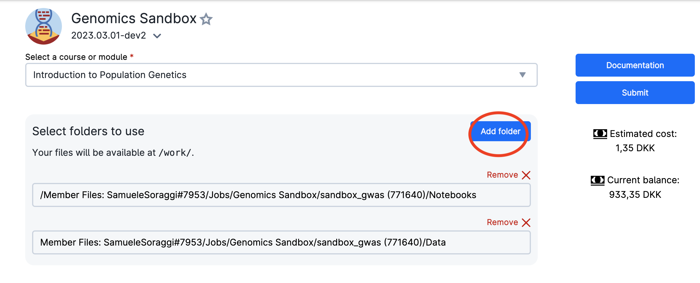

<br>

## Download course data and notebooks

Each course is open-source and the datasets are freely available. Here you have the link to all repositories to download the datasets.

| **Course Name**                          | **Data Repository** |
| ---------------------------------------- | ------------------- |
| **Introduction to NGS Data Analysis**    | [Link](https://zenodo.org/record/7670370)          |
| **Introduction to Population Genomics**  | [Link](https://zenodo.org/record/7670839)          |
| **Introduction to GWAS**                 | [Link](https://github.com/hds-sandbox/GWAS_course)          |

## Download generated data

You can easily download the generated files by right-clicking the selected files in JupyterLab and choosing download (see figure below).
<br>

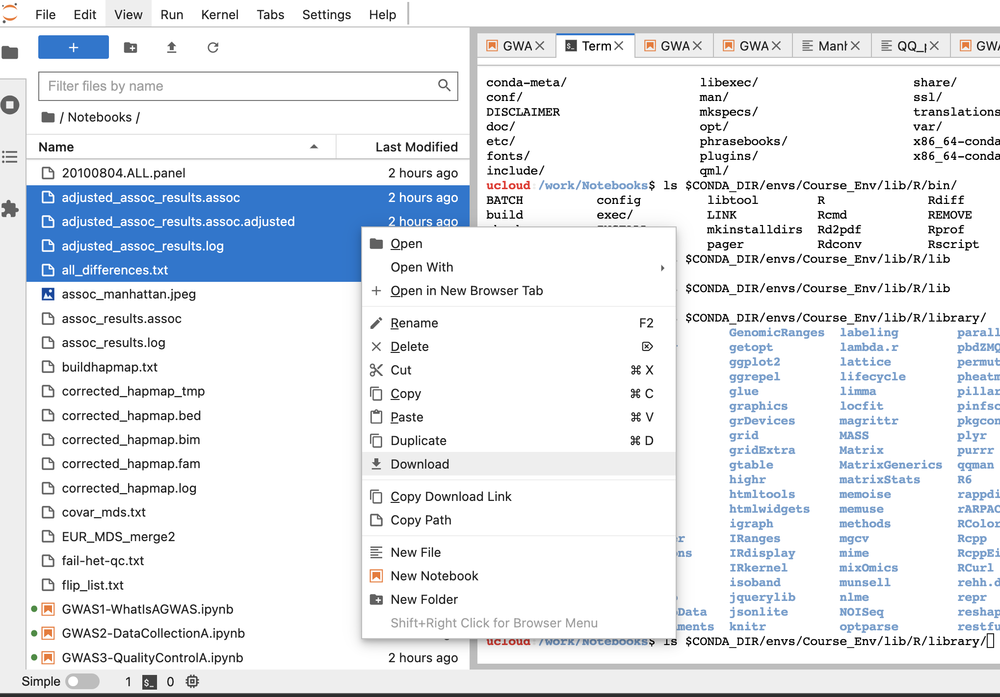

<br>
