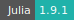
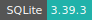
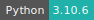
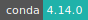
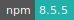
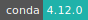
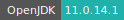
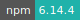
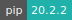
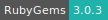

# JupyterLab

:::::: {tab-set}

::::: {tab-item} Lab-4

:::: {tab-set}

::: {tab-item} 4.0.8

[](https://cloud.sdu.dk/app/jobs/create?app=jupyter-all-spark&version=4.0.8)


* **Operating System:** 
* **Terminal:**  
* **Shell:**   
* **Editor:**   
* **Package Manager:**       
* **Programming Language:**         
* **Database:** 
* **Utility:** 
* **Extension:**  

:::

::::

:::::

::::: {tab-item} Lab-3

:::: {tab-set}

::: {tab-item} 3.6.5

[](https://cloud.sdu.dk/app/jobs/create?app=jupyter-all-spark&version=3.6.5)


* **Operating System:** 
* **Terminal:**  
* **Shell:**   
* **Editor:**   
* **Package Manager:**       
* **Programming Language:**         
* **Database:** 
* **Utility:** 
* **Extension:**  

:::

::: {tab-item} 3.6.3

[](https://cloud.sdu.dk/app/jobs/create?app=jupyter-all-spark&version=3.6.3)


* **Operating System:** 
* **Terminal:**  
* **Shell:**   
* **Editor:**   
* **Package Manager:**      
* **Programming Language:**         
* **Database:** 
* **Extension:** 

:::

::: {tab-item} 3.5.1

[](https://cloud.sdu.dk/app/jobs/create?app=jupyter-all-spark&version=3.5.1)


* **Operating System:** 
* **Terminal:**  
* **Shell:** 
* **Editor:**   
* **Package Manager:**      
* **Programming Language:**         
* **Database:** 
* **Extension:** 

:::

::: {tab-item} 3.4.5

[](https://cloud.sdu.dk/app/jobs/create?app=jupyter-all-spark&version=3.4.5)


* **Operating System:** 
* **Terminal:**  
* **Shell:** 
* **Editor:**   
* **Package Manager:**      
* **Programming Language:**         
* **Database:** 
* **Extension:** 

:::

::: {tab-item} 3.3.2

[](https://cloud.sdu.dk/app/jobs/create?app=jupyter-all-spark&version=3.3.2)


* **Operating System:** 
* **Terminal:** 
* **Shell:** 
* **Editor:**   
* **Package Manager:**       
* **Programming Language:**            
* **Database:** 
* **Extension:** 

:::

::: {tab-item} 3.1.4

[](https://cloud.sdu.dk/app/jobs/create?app=jupyter-all-spark&version=3.1.4)


* **Operating System:** 
* **Terminal:** 
* **Shell:** 
* **Editor:**   
* **Package Manager:**       
* **Programming Language:**            
* **Database:** 
* **Extension:** 

:::

::: {tab-item} 3.0.16

[](https://cloud.sdu.dk/app/jobs/create?app=jupyter-all-spark&version=3.0.16)


* **Operating System:** 
* **Terminal:** 
* **Shell:** 
* **Editor:**   
* **Package Manager:**       
* **Programming Language:**            
* **Database:** 
* **Extension:** 

:::

::::

:::::

::::: {tab-item} Lab-2

:::: {tab-set}

::: {tab-item} 2.2.5

[](https://cloud.sdu.dk/app/jobs/create?app=jupyter-all-spark&version=2.2.5)


* **Operating System:** 
* **Terminal:** 
* **Shell:** 
* **Editor:**   
* **Package Manager:**       
* **Programming Language:**          
* **Database:** 
* **Extension:** 

:::

::::

:::::

::::: {tab-item} Lab-1

:::: {tab-set}

::: {tab-item} 1.2.6

[](https://cloud.sdu.dk/app/jobs/create?app=jupyter-all-spark&version=1.2.6-4)


* **Operating System:** 
* **Terminal:** 
* **Shell:** 
* **Editor:**  
* **Package Manager:**       
* **Programming Language:**          
* **Database:**  
* **Extension:** 

:::

::::

:::::

::::::

[JupyterLab](https://jupyterlab.readthedocs.io/en/stable/) is a web-based integrated development environment for Jupyter notebooks, code, and data. JupyterLab is flexible: The user interface can be configured and arranged to support a wide range of workflows in data science, scientific computing, and machine learning.

Several programming language kernels are pre-loaded in the JupyterLab interface.

## Initialization

For information on how to use the *Initialization* parameter, please refer to the [Initialization - Bash script](../hands-on/init-sh.md), [Initialization - Conda packages](../hands-on/init-conda.md), and [Initialization - pip packages](../hands-on/init-pip.md) section of the documentation.

### Installing packages

Other than installing packages via the *Initialization* parameter, packages can be installed using the terminal interface available in all the starting modes.

## Configure SSH access

The app provides optional [support for SSH access](general_settings.md#configure-ssh-access) from an external client. An SSH *public key* must be uploaded using the corresponding panel in *Resources* section of the UCloud side menu.

By checking on *Enable SSH server* a random port is opened for connection. The connection command is shown in the job progress view page.

## Run in batch mode

The parameter _Batch processing_ is used to execute a Bash script in batch mode.

``` {note}
The job is terminated after the script is executed, independently of the script exit status.
```

## Manage environments

### Conda virtual environment

The default Conda environment at the startup is called `base`. The user can create a new environment via the JupyterLab terminal interface:

```console
$ conda create --name myenv
```

This command will create a basic workspace with the default version of Python installed in the app container.
A different version of Python can be specified as follows:

```console
$ conda create --name myenv python="3.9"
```

By default, new environments are created in the folder: `/opt/conda/envs/`. The user can change the environment path to a new folder inside `/work`, so that all the installed packages are exported in the [job output folder](../guide/submitting.md#job-completed) on UCloud, after the job is completed. An example is shown below:

```console
$ conda create --prefix /work/myenv python="3.9"
```

``` {warning}
After job completion, the user should *move* (not copy) ``myenv`` from the corresponding job folder to a new path inside a UCloud workspace.
```

To activate more environments one should first initialize the shell with the command:

```console
$ eval "$(conda shell.bash hook)"
```

``` {tip}
(base) <span style="color: red;"><b>ucloud</b></span>:<span style="color: blue;"><b>/work</b></span>$
```

Then, the new environment can be activated as follows:

```console
$ conda activate myenv
```

``` {tip}
(myenv) <span style="color: red;"><b>ucloud</b></span>:<span style="color: blue;"><b>/work</b></span>$
```

A complete documentation about how to manage Conda environments can be found [here](https://docs.conda.io/projects/conda/en/latest/user-guide/concepts/environments.html).

::: {hint}

In case the installation of very recent packages via ``conda`` fails due to *strict channel priority* settings, run the command:
```console
$ conda config --set channel_priority false
```

:::

### Python virtual environment

A lightweight virtual environment can also be set up using the `venv` module of Python. For example:

```console
$ python -m venv /work/myenv
```

This command will create all the dependencies in the folder `/work/myenv`. The latter is activated as follows:

```console
$ source /work/myenv/bin/activate
```

``` {tip}
(myenv) <span style="color: red;"><b>ucloud</b></span>:<span style="color: blue;"><b>/work</b></span>$
```

New modules are installed via `pip`, e.g.

```console
$ pip install tensorflow-gpu=="2.11.0"
```

The default Python interpreter `/opt/conda/bin/python` is reset with the command:

```console
$ deactivate
```

## Add new kernels

The user can add new kernels in the JupyterLab launcher via command line. These are some working examples:

:::: {tab-set}

::: {tab-item} Python

```console
$ conda create -y --name py39 python="3.9" ipykernel
$ conda env update -n py39 --file environment.yml
$ conda activate py39
$ python -m ipykernel install --user --name ipy39 --display-name "Python (v3.9)"
$ conda deactivate
```

:::

::: {tab-item} R

```console
$ conda create -y --name r362 -c r r-base="3.6.2" r-essentials="3.6.0"
$ conda env update -n r362 --file environment.yml
$ conda activate r362
$ R -e "IRkernel::installspec(name = 'ir362', displayname = 'R (v3.6.2)')"
$ conda deactivate
```

:::

::: {tab-item} Julia

```console
$ conda create -y --name j173 julia="1.7.3"
$ conda activate j173
$ ln -s /etc/ssl/certs/ca-certificates.crt /opt/conda/envs/j173/share/julia/cert.pem
$ julia -e 'import Pkg; Pkg.update(); Pkg.add("IJulia"); Pkg.build("IJulia")'
$ conda deactivate
```

:::

::::

Additional Python/R packages in the above examples are specified in the `environment.yml` file, which is structured as shown [here](../hands-on/init-conda.md).


The list of all the installed environments is given by the command:

```console
$ conda env list
```

``` {tip}
\# conda environments:

\#

base &nbsp; &nbsp; &nbsp; &nbsp; &nbsp; &nbsp; &nbsp; &nbsp; &nbsp; &nbsp; &nbsp; &nbsp; &nbsp; &nbsp; * /opt/conda

j173 &nbsp; &nbsp; &nbsp; &nbsp; &nbsp; &nbsp; &nbsp; &nbsp; &nbsp; &nbsp; &nbsp; &nbsp; &nbsp; &nbsp; &nbsp; /opt/conda/envs/j173

py39 &nbsp; &nbsp; &nbsp; &nbsp; &nbsp; &nbsp; &nbsp; &nbsp; &nbsp; &nbsp; &nbsp; &nbsp; &nbsp; &nbsp; &nbsp; /opt/conda/envs/py39

r362 &nbsp; &nbsp; &nbsp; &nbsp; &nbsp; &nbsp; &nbsp; &nbsp; &nbsp; &nbsp; &nbsp; &nbsp; &nbsp; &nbsp; &nbsp; /opt/conda/envs/r362
```

After the installation, it might be necessary to refresh the web page to visualize the new kernels in the launcher.
<br>


<br>

::: {hint}

A new kernel and the corresponding virtual environment can also be created at startup by submitting a Bash script (``*.sh``) via the *Initialization* parameter. For instance:
```bash
#!/usr/bin/env bash

conda create -y -n tf2 python="3.9" cudatoolkit="11.2" cudnn="8.2" ipykernel
eval "$(conda shell.bash hook)"
conda activate tf2
pip install tensorflow_gpu=="2.5"
python -m ipykernel install --user --name tf2 --display-name "TF v2.5"
```

:::

## Submit a Spark application

A local instance of [Apache Spark](https://spark.apache.org/) is already installed in the app container, within the directory `$SPARK_HOME`. Spark can be used to quickly perform processing tasks on very large datasets.

The user can choose to submit Spark applications either in _local mode_ or in _cluster mode_, depending of the size of the dataset.

### Local deployment

For smaller/sampled datasets it is convenient to run Spark applications in local mode, that is using only the resources allocated to the JupyterLab app. To connect to the local Spark instance, the `SparkContext` should be defined as in the following example:

```python
import os
from pyspark.conf import SparkConf
from pyspark.sql import SparkSession

os.mkdir('/work/spark_logs')

conf = SparkConf().setAll(
    [
        ("spark.master", "local[16]"),
        ("spark.eventLog.enabled", True),
        ("spark.eventLog.dir", "/work/spark_logs"),
        ("spark.history.fs.logDirectory", "/work/spark_logs"),
    ]
)

spark = SparkSession.builder.config(conf=conf).getOrCreate()
sc = spark.sparkContext
```

where it is assumed that the selected machine type has at least 16 cores.

In this mode the applications can be monitored using the [SparkMonitor](https://pypi.org/project/jupyterlab-sparkmonitor/) extension of JupyterLab, which is available in the app container and accessible from the menu on the top. By default, the Spark UI connects to port `4040`.

### Cluster deployment

Spark applications which require distributed computational resources can be submitted directly to a [Spark standalone cluster](spark-cluster.md), which allows to distribute data processing tasks across multiple nodes.
In this case, the JupyterLab app should be connected to a Spark cluster instance using the optional parameter [Connect to other jobs](general_settings.md#connect-to-other-jobs), as shown in the following example:
<br>


<br>

where the *Job* entry is used to select the job ID of the Spark Cluster instance, created in advance. Besides, the *Hostname* parameter is employed to assign the URL of the _master_ node to the `SparkContext`, created in the JupyterLab app. The default port on the _master_ node is `7077`.

An example of a Spark application deployed on a standalone cluster is shown in the code snippet below.

```python
import os
from pyspark.conf import SparkConf
from pyspark.sql import SparkSession

from random import random
from operator import add

os.mkdir('/work/spark_logs')

MASTER_HOST = "spark://my-cluster:7077"

NODES = 3
CLUSTER_CORES_MAX = 63 * NODES  # set cluster total number of cores
CLUSTER_MEMORY_MAX = 371 * NODES  # set cluster total memory in GB

EXECUTOR_CORES = 21  # set cores per executor on worker node
EXECUTOR_MEMORY = int(
    371 / (63 / EXECUTOR_CORES) * 0.5
)  # set executor memory in GB on each worker node

conf = SparkConf().setAll(
    [
        ("spark.master", MASTER_HOST),
        ("spark.cores.max", CLUSTER_CORES_MAX),
        ("spark.executor.cores", EXECUTOR_CORES),
        ("spark.executor.memory", str(EXECUTOR_MEMORY) + "g"),
        ("spark.eventLog.enabled", True),
        ("spark.eventLog.dir", "/work/spark_logs"),
        ("spark.history.fs.logDirectory", "/work/spark_logs"),
        ("spark.deploy.mode", "cluster"),
    ]
)

## check executor memory, taking into accout 10% of memory overhead (minimum 384 MiB)
CHECK = (CLUSTER_CORES_MAX / EXECUTOR_CORES) * (
    EXECUTOR_MEMORY + max(EXECUTOR_MEMORY * 0.10, 0.403)
)

assert (
    int(CHECK) <= CLUSTER_MEMORY_MAX
), "Executor memory larger than cluster total memory!"

spark = SparkSession.builder.config(conf=conf).appName("PI Calc").getOrCreate()
sc = spark.sparkContext

partitions = 100000
n = 100000 * partitions

def f(_):
    x = random()
    y = random()
    return 1 if x ** 2 + y ** 2 <= 1 else 0

count = spark.sparkContext.parallelize(range(1, n + 1), partitions).map(f).reduce(add)

print("Pi is roughly %f" % (4.0 * count / n))

sc.stop()
```

After submitting the application to the cluster, the [Spark UI](spark-cluster.md#monitoring) looks like in the following figure.
<br>


<br>

In this example the cluster consists of 3 *worker* nodes, one of which (`node1`) is also the *master* node.
