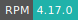
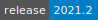

# Maple

:::: {tab-set}

::: {tab-item} 2023.0

* **Operating System:** 
* **Terminal:**  
* **Shell:**   
* **Editor:**   
* **Package Manager:**     
* **Programming Language:**     
* **Database:** 
* **Utility:** 
* **Extension:** 

:::

::: {tab-item} 2021.2

* **Operating System:** 
* **Terminal:** 
* **Shell:** 
* **Editor:**   
* **Package Manager:**    
* **Programming Language:**   
* **Database:** 

:::

::::

Maple is a symbolic and numeric computing environment as well as a multi-paradigm programming language. It covers several areas of technical computing, such as symbolic mathematics, numerical analysis, data processing, visualization, and others.

For more information check [here](https://www.maplesoft.com/support/training/quickstart.aspx)

## Initialization

For information on how to use the *Initialization* parameter, please refer to the [Initialization - Bash script](../hands-on/init-sh.md) section of the documentation.

## License key

Maple can be activated by passing a license activation key via the corresponding (optional) parameter.
