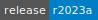
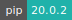
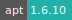

# MATLAB

:::: {tab-set}

::: {tab-item} r2023a

[](https://cloud.sdu.dk/app/jobs/create?app=matlab&version=r2023a)


* **Operating System:** 
* **Terminal:**  
* **Shell:**   
* **Editor:**   
* **Package Manager:**   
* **Programming Language:**   

:::

::: {tab-item} r2022b-2

[](https://cloud.sdu.dk/app/jobs/create?app=matlab&version=r2022b-2)


* **Operating System:** 
* **Terminal:** 
* **Shell:** 
* **Editor:**   
* **Package Manager:**   
* **Programming Language:**  

:::

::: {tab-item} r2022a-2

[](https://cloud.sdu.dk/app/jobs/create?app=matlab&version=r2022a-2)


* **Operating System:** 
* **Terminal:** 
* **Shell:** 
* **Editor:**   
* **Package Manager:**   
* **Programming Language:**  

:::

::: {tab-item} r2021b-2

[](https://cloud.sdu.dk/app/jobs/create?app=matlab&version=r2021b-2)


* **Operating System:** 
* **Shell:** 
* **Editor:**   
* **Package Manager:**   
* **Programming Language:**  

:::

::: {tab-item} r2021a-2

[](https://cloud.sdu.dk/app/jobs/create?app=matlab&version=r2021a-2)


* **Operating System:** 
* **Shell:** 
* **Editor:**   
* **Package Manager:**   
* **Programming Language:**  

:::

::: {tab-item} r2020b-2

[](https://cloud.sdu.dk/app/jobs/create?app=matlab&version=r2020b-2)


* **Operating System:** 
* **Shell:** 
* **Editor:**   
* **Package Manager:**  
* **Programming Language:**   

:::

::: {tab-item} r2020a-2

[](https://cloud.sdu.dk/app/jobs/create?app=matlab&version=r2020a-2)


* **Operating System:** 
* **Shell:** 
* **Editor:**   
* **Package Manager:**  
* **Programming Language:**   

:::

::: {tab-item} r2019b-4

[](https://cloud.sdu.dk/app/jobs/create?app=matlab&version=r2019b-4)


* **Operating System:** 
* **Shell:** 
* **Editor:**   
* **Package Manager:**  
* **Programming Language:**   

:::

::: {tab-item} r2019a-2

[](https://cloud.sdu.dk/app/jobs/create?app=matlab&version=r2019a-2)


* **Operating System:** 
* **Shell:** 
* **Editor:**   
* **Package Manager:**  
* **Programming Language:**   

:::

::::

MATLAB is a programming platform designed for engineers and scientists.
It combines a desktop environment tuned for iterative analysis and design processes
with a programming language that expresses matrix and array mathematics directly.

For more information, check [here](https://se.mathworks.com/products/matlab/getting-started.html).

``` {note}
The software products are accessible with both an individual and a campus-wide license.
```

## Connect to a network license

Depending on the user institution, it is also possible to request access to a license server using the parameter *Select MATLAB license server*.
The license server must be added to an active project by means of a [grant application](../guide/resources-grant.md).
Project admins can restrict access to the license as discussed [here](../guide/project-overview.md#license-management).

## Batch mode

If batch mode is activated the app will execute the provided Matlab input file.
The job will stop after the execution of the program. Using batch mode with MATLAB requires a *network license*.

Mandatory parameters for running batch mode are *Input file for batch mode*, as well as the *Input directory with file for batch mode*.
The input file is of MATLAB file type.

## Install a new toolbox

The installation of MATLAB toolboxes requires to start the application with system privileges.
This is accomplished by launching the terminal emulator, which is located at the bottom of the virtual desktop interface.
Hence, from the console run the command:

```console
$ sudo matlab
```

## Activate a specific license

If your login credentials are not recognized or more than one license is associated with your MathWorks account, you may need to manually activate the MATLAB license.
In this case, from the virtual desktop interface, open the terminal emulator and run the command:

```console
$ unset VARIANTmatlab && sudo matlab
```

After that, you need to use your MathWorks credentials to log in. In this way, you should be able to select a specific license.

## Initialization

For information on how to use the *Initialization* parameter, please refer to the [Initialization - Bash script](../hands-on/init-sh.md) section of the documentation.
