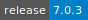
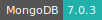

# MongoDB Server

[](https://cloud.sdu.dk/app/jobs/create?app=mongodb&version=7.0.3)


* **Operating System:** 
* **Terminal:** 
* **Shell:** 
* **Editor:**   
* **Package Manager:**    
* **Programming Language:**  
* **Database:** 
* **Extension:** 
---

[MongoDB](https://www.mongodb.com/) is a NoSQL database that stores data in flexible, JSON-like documents.
It is designed for scalability and developer agility.
Unlike relational databases, it allows for dynamic schemas, making data integration easier and faster.

## Initialization

For guidance on utilizing *Initialization* parameter, consult the [Use Cases](../hands-on/use-cases.md) section of the documentation.

## Create a new server

To operate the app, you must define the *Database path* parameter. This is essential for importing the MongoDB database folder from a UCloud workspace.
If the specified folder is empty, a fresh database will be set up.

For added security, users have the option to require authentication for the database. This can be achieved using the *Admin user* and *Admin password* (*Admin password file*) parameters.
For further customization, you can provide additional MongoDB settings through a tailored *Configuration file*.

``` {note}
By default the database is connected to port `27017`. A different port can be chosen using the corresponding optional parameter.
```

## Schedule regular backups

The app provides an option to schedule backups on an hourly basis. Backup folders are timestamped and can be found at `path/to/database/database_dump`.

To create a database dump in MongoDB, you can also use the `mongodump` utility via the app terminal interface. This tool captures binary exports of the contents of a MongoDB instance.
For example:

``` console
$ mongodump --gizip --out /path/to/output/directory --db your_database_name

```
If the `--db` option is omitted, the utility will create a dump of all the databases on the server.

If the MongoDB server requires authentication, you can include the `--username`, `--password`, and `--authenticationDatabase` flags in the command line options.
The default authentication database in MongoDB server is named `admin`.


## Restore a database dump

To restore a database, choose an empty database folder. Then, import the desired backup using the *Restore database* parameter.

The user can also restore a database from command line using the `mongorestore` utility. Here's a basic example:

``` console
$ mongorestore --gzip --db your_database_name /path/to/backup/directory/your_database_name

```
where the backup is generated by `mongodump`.


## Connect to the server


Users can directly access the MongoDB console from the app's terminal interface. e.g.:

``` console
$ mongosh -u <username> -p <password>
```
assuming the database server was started with login credentials. However, there's also the flexibility to connect to the MongoDB server utilizing an external client tool.

If the client tool is part of another interactive app available on UCloud, it's straightforward to establish a connection directly to the MongoDB server as detailed [here](./general_settings.md#connect-to-other-jobs).
Under such circumstances, the server's hostname should be set as an external parameter via the *Connect to other jobs* optional setting.

Conversely, when the MongoDB client is a standalone third-party software, not residing on UCloud, it becomes essential to allocate a [static IP address](./general_settings.md#attach-public-ip-addresses) to the MongoDB server, facilitated by the *Add public IP* feature.

If the MongoDB server is started with a custom configuration file, make sure that it includes the following lines:
``` yaml
net:
  bindIp: 0.0.0.0
  port: 27017

```

This configuration allows connections from all available IP interfaces. The `bindIp` option set to `0.0.0.0` enables MongoDB to listen for connections from any IP address.

``` {note}
The static IP address must listen to the same port to establish a connection.
```
