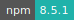
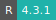
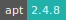
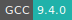

# Nbgrader


:::: {tab-set}

::: {tab-item} 0.9.1

[](https://cloud.sdu.dk/app/jobs/create?app=nbgrader&version=0.9.1)


* **Operating System:** 
* **Terminal:**  
* **Shell:**   
* **Editor:**   
* **Package Manager:**    
* **Programming Language:**   

:::

::: {tab-item} 0.8.4

[](https://cloud.sdu.dk/app/jobs/create?app=nbgrader&version=0.8.4)


* **Operating System:** 
* **Terminal:**  
* **Shell:**   
* **Editor:**   
* **Package Manager:**    
* **Programming Language:**   

:::

::: {tab-item} 0.7.1

[](https://cloud.sdu.dk/app/jobs/create?app=nbgrader&version=0.7.1)


* **Operating System:** 
* **Terminal:** 
* **Shell:** 
* **Editor:**   
* **Package Manager:**    
* **Programming Language:**   

:::

::: {tab-item} 0.6.2

[](https://cloud.sdu.dk/app/jobs/create?app=nbgrader&version=0.6.2)


* **Operating System:** 
* **Terminal:** 
* **Shell:** 
* **Editor:**   
* **Package Manager:**    
* **Programming Language:**    

:::

::::

Nbgrader app is a JupyterHub based application with nbgrader configured in order to facilitate the creation and grading of assignments via Jupyter notebook. It allows instructors to easily create notebook-based assignments that include both coding exercises and written free-responses. Nbgrader also provides a streamlined interface for quickly grading completed assignments.

For more information, check [here](https://nbgrader.readthedocs.io/en/stable/)

## Course directory structure

The instructor username is by default **ucloud**.
From the instructor side, all data is stored in files in the course directory.
The general structure of the course directory is:

```text
{nbgrader_step}/{student_id}/{assignment_id}/{notebook}.ipynb
```

`{nbgrader_step}` indicates the progress of the notebook: *source*, *release*, *submitted*, *autograded*, *feedback*.

## Mandatory parameters

As mandatory parameters the instructor  needs to specify:

- *Course ID*, name of the course directory (e.g. "course123")
- *Course directory path*, path to the directory which includes the course directory
- *Number of students* who have to solve the assignment.

## Default configuration

By setting only the mandatory parameters, the instructor will start the application with default nbgrader configuration files.
As a consequence the exchange directory is `/tmp/exchange` and the assignment files need to be in the `course id/source` directory.

To avoid student access to the source assignment directory `c.CourseDirectory.root = /home/ucloud`.

``` {note}
Once the application is stopped, all course files will be present in the *course directory path*.
```

In addition, if no `jupyterhub_config.py` is present in the *course directory path*,
a default config file will be used.

Instead of using the default settings, customized nbgrader configuration files for instructor and students can be selected via the corresponding optional parameters.

## Login credentials and student access

When the application starts, the file `userlist_pwd.txt ` is created with a random password for the default instructor user (**ucloud**), followed by username and random password for each of the students.
The file can be accessed in the `/work` directory, by opening a terminal window from the job progress view page.

In order to allow students to access the JupyterHub server, the app must be deployed with a [public URL](general_settings.md#configure-custom-links).
This link should be sent to each student along with the corresponding username and password listed in `userlist_pwd.txt` .
Once logged in students can change to the notebook view by replacing *lab* with *tree* in the browser URL,
e.g.

`https://app-linkname.cloud.sdu.dk/user/user5/lab`

with

`https://app-linkname.cloud.sdu.dk/user/user5/tree`

From the server, students can fetch, validate and submit assignments, as well as retrieve the instructor feedback.

``` {important}
The ``nbgrader_config.py`` file should not be renamed.
```
