# Neuroimaging Toolbox

:::: {tab-set}

::: {tab-item} Oct2021

[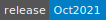](https://cloud.sdu.dk/app/jobs/create?app=neuroimaging&version=Oct2021)


* **Operating System:** 
* **Terminal:** 
* **Shell:** 
* **Editor:**  
* **Package Manager:**  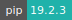 
* **Programming Language:**      
* **Job Scheduler:** 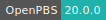
* **Database:** 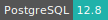 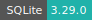
* **Utility:** 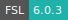 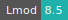

:::

::: {tab-item} Jun2021

[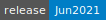](https://cloud.sdu.dk/app/jobs/create?app=neuroimaging&version=Jun2021)


* **Operating System:** 
* **Shell:** 
* **Editor:**   
* **Package Manager:**    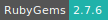
* **Programming Language:**     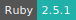 
* **Job Scheduler:** 
* **Database:**  
* **Utility:** 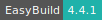  

:::

::::

The Neuroimaging Toolbox is a collection of utilities for the analysis of neuroimaging data. The app is deployed as a [virtual desktop environment](vde_apps.md).

## Job scheduler

The app uses the [OpenPBS](https://www.openpbs.org/) software for job scheduling and workload management.

The PBS server configuration depends on the selected machine type. The server status summary is printed in the job output logs. It can also be displayed from the [app terminal interface](../guide/submitting.md#job-running) with the command:

```console
$ pbsnodes -aS
```

### Submit jobs

The command `qsub` is used to submit batch jobs to PBS.
The job's tasks, resources, and attributes can be specified via a script.
A template example of a job Bash script (`submit.pbs`) is shown here:

```bash
#!/bin/bash -l

## File: submit.pbs

## Assign the job name.
#PBS -N job_name

## Join option that merges the standard error stream with the standard output stream of the job.
#PBS -j oe

## Sets the maximum wall-clock time during which this job can run. (walltime=hh:mm:ss)
#PBS -l walltime=6:00:00

## Sets the maximum amount of memory allocated to the job (in mb or gb).
#PBS -l pmem=2mb

## Sets the number of cores per job on the server node (1-node cluster).
#PBS -l select=1:ncpus=1

## Sets the number of gpus per job. Only for u1-gpu machine types.
#PBS -l ngpus=1

## Indicates that a job should not rerun if it fails.
#PBS -r n

## Exports all environment variables to the job.
#PBS -V

### Makes this job an array job. The array ID is defined by the variable ${PBS_ARRAY_INDEX}.
#PBS -J 1-20

## Load necessary modules
# module load ...

## Execute the program
runprogram()
{
    printf "Task n. ${PBS_ARRAY_INDEX}\n"
    # Add the commands below

}

runprogram
```

This script will generate an array of 20 jobs and assign 1 core and 2 MB of memory per job. The following command will submit the job to PBS:

```console
$ qsub submit.pbs
```

Additional `qsub` parameters can be set from the command line. A complete overview can be found in the corresponding man page:

```console
$ man qsub
```

### Check jobs status

The command `qstat` displays the status of PBS jobs. A detailed view is obtained with the additional options:

```console
$ qstat -answ
```

### Delete jobs

The  `qdel`  command  is used without options to delete queued, running, held, or suspended jobs:

```console
$ qdel <job_ID>
```

where `<job_ID>` is the job identification number.

## Initialization

For information on how to use the *Initialization* parameter, please refer to the [Initialization - Bash script](../hands-on/init-sh.md) section of the documentation.

## FSL analysis tools

The [FMRIB Software Library](https://fsl.fmrib.ox.ac.uk/fsl/fslwiki/) (FSL) is a comprehensive library of analysis tools for FMRI, MRI and DTI brain imaging data. The software tools are loaded using the following commands from the [app terminal interface](../guide/submitting.md#job-running) or the [virtual desktop terminal](vde_apps.md#terminal-window) application:

```console
$ module purge && module load FSL
```

A brief introduction to environment modules is available [here](terminal.md#environment-modules).
The FSL binaries are stored in the directory `${FSLDIR}/bin`. The command `fsl_sub` is optimized to run part of the FSL workflow in parallel and with GPU acceleration.

### Multicore processing

The following FSL tools will use `fsl_sub` to run parts of the workflow in parallel. By default, *all* the cores available in selected [machine type](general_settings.md#machine-type) are employed in the computation.

- [FEAT](https://fsl.fmrib.ox.ac.uk/fsl/fslwiki/FEAT): It runs multiple first-level analyses in parallel if they are setup all together in one GUI setup. At second level, if full FLAME (stages 1+2) is selected then all the slices are processed in parallel.

- [MELODIC](https://fsl.fmrib.ox.ac.uk/fsl/fslwiki/MELODIC): It runs multiple single-session analyses (or single-session preprocessing if a multi-session/subject analysis is being done) in parallel if they are setup all together in one GUI setup.

- [TBSS](https://fsl.fmrib.ox.ac.uk/fsl/fslwiki/TBSS): It runs all registrations in parallel.

- [BEDPOSTX](https://fsl.fmrib.ox.ac.uk/fsl/fslwiki/FDT) (FDT) low-level diffusion processing: It runs all slices in parallel.

- [FSLVBM](https://fsl.fmrib.ox.ac.uk/fsl/fslwiki/FSLVBM): It runs all registrations in parallel, both at the template-creation stage and at the final registrations stage.

- [POSSUM](https://fsl.fmrib.ox.ac.uk/fsl/fslwiki/POSSUM): It processes all slices in parallel.

``` {note}
The number of cores used in the computation can be tuned by assigning a value larger than 1 to the variable ``FSLPARALLEL``. Conversely, parallelization can be disable by setting ``FSLPARALLEL=0``. By default, ``FSLPARALLEL=1``, which implies all available cores are selected.
```

### GPU acceleration

The following FSL tools use GPU acceleration:

- [BEDPOSTX GPU](https://users.fmrib.ox.ac.uk/~moisesf/Bedpostx_GPU/): `bedpostx_gpu`.

- [PROBTRACKX GPU](https://users.fmrib.ox.ac.uk/~moisesf/Probtrackx_GPU/): `probtrackx2_gpu`.

The corresponding binaries were compiled with CUDA v9.1, which must be installed from the terminal interface with the script:

```console
$ /opt/install_cuda.sh
```

``` {note}
These software tools are compatible with the NVIDIA GPU architecture of ``u1-gpu`` nodes.
```

## Additional tools

Additional neuroimaging software tools can be installed and accessed as separate modules using EasyBuild, a build and installation framework for the deployment and management of scientific applications/tools on HPC systems.
A brief introduction to EasyBuild is available [here](terminal.md#easybuild).

All the new modules should be installed in a directory accessible from the _default working tree_, e.g. `/work/toolbox`. As a result, the `toolbox` software stack folder will be available in the UCloud workspace, after the job run is completed. The user should therefore import this folder as a data volume inside the app and make the new modules available from the command-line interface:

```console
$ module use /work/toolbox/modules/all/
```

To check all available modules, use the command:

```console
$ module avail
```

More commands are listed [here](terminal.md#environment-modules).

``` {note}
Environment modules are loaded automatically when the ``toolbox`` folder is mounted using the optional *Modules path* parameter.
```

We report below the EasyBuild installation instructions for some neuroimaging software applications. We assume in these examples that the installation path is the one specified before.

### dcm2niix

[dcm2niix](https://github.com/rordenlab/dcm2niix) is designed to convert neuroimaging data from the DICOM format to the NIfTI format.

#### Install the software

```console
$ module purge && module load EasyBuild
$ eb --installpath=/work/toolbox dcm2niix-1.0.20201102-GCCcore-8.3.0.eb -r
```

#### Load the module

```console
$ module purge && module load dcm2niix
```

### FreeSurfer

[FreeSurfer](https://surfer.nmr.mgh.harvard.edu/) is a set of tools for the analysis and visualization of structural and functional brain imaging data. _FreeSurfer_ contains a fully automatic structural imaging stream for processing cross sectional and longitudinal data.

#### Install the software

```console
$ module purge && module load EasyBuild
$ eb --installpath=/work/toolbox FreeSurfer-7.1.1-centos8_x86_64.eb
```

#### Load the module

```console
$ module purge && module load FreeSurfer
```

### MRIcron

[MRIcron](http://www.mccauslandcenter.sc.edu/mricro/mricron/) allows viewing of medical images. It includes tools to complement SPM and FSL. Native format is NIFTI but includes a conversion program (see dcm2nii) for converting DICOM images. Features layers, ROIs, and volume rendering.

#### Install the software

```console
$ module purge && module load EasyBuild
$ eb --installpath=/work/toolbox MRIcron-1.0.20180614.eb
```

#### Load the module

```console
$ module purge && module load MRIcron
```

### MRtrix

[MRtrix](http://www.brain.org.au/software/index.md#mrtrix) provides a set of tools to perform diffusion-weighted MR white-matter tractography in a manner robust to crossing fibres, using constrained spherical deconvolution (CSD) and probabilistic streamlines.

#### Install the software

```console
$ module purge && module load EasyBuild
$ eb --installpath=/work/toolbox eb --installpath=/work/toolbox/ MRtrix-3.0-rc-20191217-foss-2019b-Python-3.7.4.eb -r
```

#### Load the module

```console
$ module purge && module load MRtrix
```

### NiBabel

[NiBabel](https://nipy.github.io/nibabel) provides read/write access to some common medical and neuroimaging file formats, including: ANALYZE (plain, SPM99, SPM2 and later), GIFTI, NIfTI1, NIfTI2, MINC1, MINC2, MGH and ECAT as well as Philips PAR/REC. It read and write FreeSurfer geometry, and read FreeSurfer morphometry and annotation files.

#### Install the software

```console
$ module purge && module load EasyBuild
$ eb --installpath=/work/toolbox/ NiBabel-3.1.0-foss-2019b-Python-3.7.4.eb -r
```

#### Load the module

```console
$ module purge && module load NiBabel
```

### SPM

The [Statistical Parametric Mapping](https://www.fil.ion.ucl.ac.uk/spm/) (SPM) software package is used to analyze brain imaging data sequences. The sequences can be a series of images from different cohorts, or time-series from the same subject. The current release is designed for the analysis of fMRI, PET, SPECT, EEG and MEG.

#### Install the software

SPM requires the Matlab Compiler Runtime (MCR). This can be added as a separate module:

```console
$ module purge && module load EasyBuild
$ eb --installpath=/work/toolbox/ MCR-R2019b.8.eb
```

After the MCR environment module is created, the SPM software must be installed using the following Bash script:

```shell
#!/bin/bash

set -ex

export MATLAB_RELEASE="2019b"
export SPM12_VERSION="r7771"

cd /tmp && \
curl -fsSL --retry 5 -o /tmp/spm12.zip http://www.fil.ion.ucl.ac.uk/spm/download/restricted/utopia/dev/spm12_${SPM12_VERSION}_Linux_R${MATLAB_RELEASE}.zip && \
unzip -qq /tmp/spm12.zip && \
cp -r spm12/* /work/toolbox/software/MCR/R2019b.8/
```

#### Run the software

```console
$ module purge && module load MCR && spm12
```
