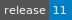
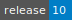
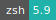
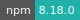
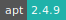

# OpenFOAM

:::::: {tab-set}

::::: {tab-item} Foundation

:::: {tab-set}

::: {tab-item} 11

[](https://cloud.sdu.dk/app/jobs/create?app=openfoam&version=11-7Sep2023)


* **Operating System:** 
* **Terminal:**  
* **Shell:**   
* **Editor:**   
* **Package Manager:**    
* **Programming Language:**    
* **Database:** 
* **Utility:**  
* **Extension:** 

:::

::: {tab-item} 10

[](https://cloud.sdu.dk/app/jobs/create?app=openfoam&version=10)


* **Operating System:** 
* **Terminal:**  
* **Shell:**   
* **Editor:**   
* **Package Manager:**    
* **Programming Language:**    
* **Database:** 
* **Utility:**  
* **Extension:** 

:::

::: {tab-item} 7

[](https://cloud.sdu.dk/app/jobs/create?app=openfoam&version=7)


* **Operating System:** 
* **Shell:** 
* **Editor:**   
* **Package Manager:**   
* **Programming Language:**    
* **Database:** 

:::

::::
<br>
OpenFOAM (Open-source Field Operation And Manipulation) is a C++ toolbox for the development of customized numerical solvers and pre-/post-processing utilities for the solution of continuum mechanics problems, including computational fluid dynamics (CFD). The main post-processing tool provided is a reader module to run with ParaView, a visualization application.

More informations can be found [here](https://openfoam.org/).

:::::

::::: {tab-item} CFD

:::: {tab-set}

::: {tab-item} 2306

[](https://cloud.sdu.dk/app/jobs/create?app=openfoam-cfd&version=2306)


* **Operating System:** 
* **Terminal:**  
* **Shell:**   
* **Editor:**   
* **Package Manager:**    
* **Programming Language:**    
* **Database:** 
* **Utility:**  
* **Extension:** 

:::

::::
<br>
OpenFOAM was first released as open source by OpenCFD Ltd. in 2004. Since that time it has matured to become the leading open source software for Computational Fluid Dynamics.

More informations can be found [here](https://www.openfoam.com/).

:::::

::::::

## Getting Started

Open the terminal and create the project directory in /work :

```console
$ mkdir FOAM_RUN
```

Copy the tutorial examples directory in the OpenFOAM distribution, to the run directory.

Run the first example case of incompressible laminar flow in a cavity:

```console
$ cd FOAM_RUN
$ cp -r $FOAM_TUTORIALS/incompressible/simpleFoam/pitzDaily .
$ cd pitzDaily
$ blockMesh
$ simpleFoam
```

## Paraview

Visualization of OpenFOAM results can be done clicking on the Paraview desktop icon or from terminal with the command

```console
$ paraview
```
